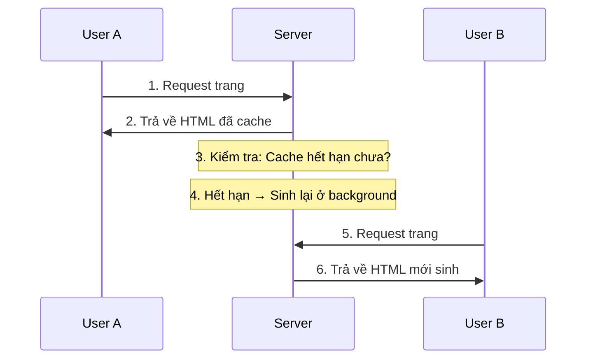

# 2.2.4 Nửa tĩnh nửa động rendering — ISR Incremental Static Regeneration

## Một câu giải thích

ISR kết hợp tốc độ của SSG và độ tươi mới của SSR — trang sinh lúc build, nhưng có thể cập nhật định kỳ ở background mà không cần deploy lại.

## Nguyên lý hoạt động



### Khái niệm quan trọng: Stale-While-Revalidate

1. User request, **trả ngay lập tức nội dung cache** (dù có thể đã hết hạn)
2. Nếu cache hết hạn, **cập nhật bất đồng bộ ở background**
3. User tiếp theo nhận được **nội dung mới**

## Ưu nhược điểm của ISR

| Ưu điểm | Nhược điểm |
|------|------|
| Màn hình đầu cực nhanh (cache) | User đầu tiên có thể thấy dữ liệu cũ |
| Dữ liệu có thể cập nhật | Cập nhật có độ trễ |
| Không cần deploy lại | Cần server runtime |
| Áp lực server nhỏ | Không phù hợp dữ liệu real-time |

## Thực hiện ISR trong Next.js

### Cách dùng cơ bản: revalidate

```typescript
// app/products/page.tsx
async function getProducts() {
  const res = await fetch('https://api.example.com/products', {
    next: { revalidate: 60 }  // Revalidate sau 60 giây
  })
  return res.json()
}

export default async function ProductsPage() {
  const products = await getProducts()

  return (
    <ul>
      {products.map(product => (
        <li key={product.id}>{product.name}</li>
      ))}
    </ul>
  )
}
```

### Revalidate cấp trang

```typescript
// app/news/page.tsx
export const revalidate = 3600  // Toàn bộ trang cập nhật mỗi 1 giờ

export default async function NewsPage() {
  const news = await getNews()
  return <NewsList news={news} />
}
```

### Revalidation theo yêu cầu

```typescript
// app/api/revalidate/route.ts
import { revalidatePath, revalidateTag } from 'next/cache'
import { NextRequest } from 'next/server'

export async function POST(request: NextRequest) {
  const { path, tag, secret } = await request.json()

  // Xác minh secret key
  if (secret !== process.env.REVALIDATE_SECRET) {
    return Response.json({ error: 'Invalid secret' }, { status: 401 })
  }

  // Revalidate theo path
  if (path) {
    revalidatePath(path)
  }

  // Revalidate theo tag
  if (tag) {
    revalidateTag(tag)
  }

  return Response.json({ revalidated: true })
}
```

## Hướng dẫn chọn thời gian revalidate

| Kịch bản | Thời gian đề xuất | Giải thích |
|------|----------|------|
| Bài viết blog | 3600 (1 giờ) | Nội dung ổn định |
| Giá sản phẩm | 60 (1 phút) | Cần tương đối mới |
| Tiêu đề tin tức | 300 (5 phút) | Cân bằng tốc độ và độ tươi |
| Bảng xếp hạng | 600 (10 phút) | Không cần real-time |

## Kịch bản áp dụng

### ✅ Phù hợp với ISR

- **Trang sản phẩm thương mại điện tử**: Giá thay đổi, nhưng không cần real-time
- **Tin tức thông tin**: Nội dung cập nhật, nhưng delay vài phút chấp nhận được
- **Blog user**: Tác giả có thể chỉnh sửa nội dung
- **Nội dung CMS**: Sau khi editor publish tự động cập nhật

### ❌ Không phù hợp với ISR

- **Cổ phiếu real-time**: Cần cập nhật cấp giây
- **Chat online**: Phải real-time
- **Hiển thị tồn kho**: Dữ liệu hết hạn có thể dẫn đến bán quá mức

## Nhận thức: Vấn đề thường gặp của ISR

### 1. Thiết lập revalidate không đúng

```typescript
// ❌ Quá ngắn: Sinh lại thường xuyên, mất ý nghĩa cache
export const revalidate = 1

// ❌ Quá dài: Dữ liệu cũ nghiêm trọng
export const revalidate = 86400  // 1 ngày

// ✅ Chọn thời gian phù hợp theo nghiệp vụ
export const revalidate = 60  // 1 phút, phù hợp trang sản phẩm
```

### 2. Nhầm lẫn revalidate và cache

```typescript
// revalidate: ISR, có cache nhưng sẽ cập nhật
fetch(url, { next: { revalidate: 60 } })

// cache: 'no-store': SSR, không cache
fetch(url, { cache: 'no-store' })

// cache: 'force-cache': SSG, cache vĩnh viễn
fetch(url, { cache: 'force-cache' })
```

## Tổng kết phần này

Giá trị cốt lõi của ISR: **Tốc độ tĩnh + Cập nhật động**.

| Kịch bản | Có phù hợp ISR không |
|------|-------------|
| Trang sản phẩm | ✅ Lựa chọn tốt nhất |
| Danh sách tin tức | ✅ Phù hợp |
| Trang hoàn toàn tĩnh | ❌ Dùng SSG |
| Dữ liệu real-time | ❌ Dùng SSR |
