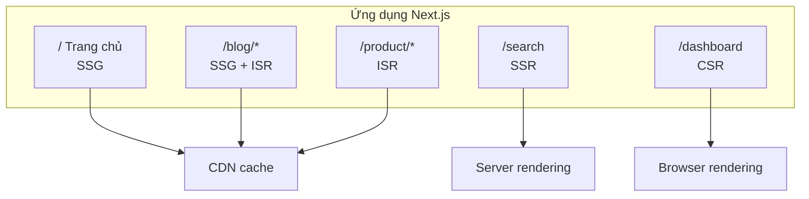
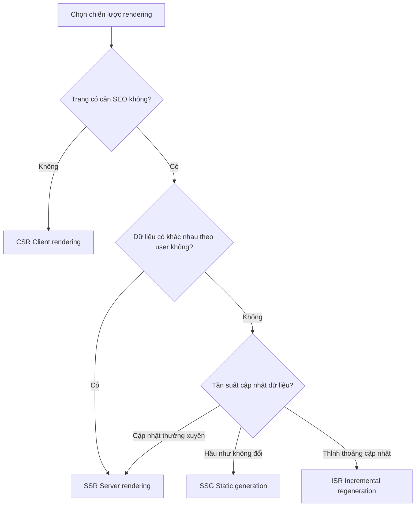

# 2.2.5 Trang cụ thể phân tích cụ thể — Mixed Rendering

## Một câu giải thích

Sức mạnh thực sự của Next.js nằm ở: **Trong cùng một ứng dụng, các trang khác nhau có thể dùng chiến lược rendering khác nhau** — trang chủ dùng SSG, tìm kiếm dùng SSR, Dashboard dùng CSR, trang sản phẩm dùng ISR.

## Kiến trúc mixed rendering



## Chiến lược rendering của website thương mại điện tử điển hình

| Trang | Chiến lược | Lý do |
|------|------|------|
| Trang chủ | SSG | Nội dung cố định, theo đuổi tốc độ tối ưu |
| Trang danh mục | ISR | Sản phẩm sẽ cập nhật, nhưng không thường xuyên |
| Chi tiết sản phẩm | ISR | Giá, tồn kho thỉnh thoảng thay đổi |
| Kết quả tìm kiếm | SSR | Tham số query quyết định nội dung |
| Giỏ hàng | CSR | Dữ liệu user, không cần SEO |
| Trang đơn hàng | CSR | Dữ liệu riêng tư user |

## Ví dụ code

### Trang chủ (SSG)

```typescript
// app/page.tsx
export default async function HomePage() {
  const featured = await getFeaturedProducts()

  return (
    <>
      <Hero />
      <FeaturedProducts products={featured} />
    </>
  )
}
```

### Trang sản phẩm (ISR)

```typescript
// app/products/[id]/page.tsx
export const revalidate = 60  // Cập nhật mỗi 1 phút

export async function generateStaticParams() {
  const products = await getTopProducts(100)  // Pre-render 100 sản phẩm hot
  return products.map(p => ({ id: p.id }))
}

export default async function ProductPage({
  params
}: {
  params: { id: string }
}) {
  const product = await getProduct(params.id)
  return <ProductDetail product={product} />
}
```

### Trang tìm kiếm (SSR)

```typescript
// app/search/page.tsx
export default async function SearchPage({
  searchParams
}: {
  searchParams: { q?: string; category?: string }
}) {
  const results = await searchProducts(searchParams)

  return (
    <div>
      <SearchFilters />
      <ProductGrid products={results} />
    </div>
  )
}
```

### Giỏ hàng (CSR)

```typescript
// app/cart/page.tsx
'use client'

import { useCart } from '@/hooks/use-cart'

export default function CartPage() {
  const { items, total, updateQuantity, removeItem } = useCart()

  return (
    <div>
      <CartItems items={items} />
      <CartSummary total={total} />
    </div>
  )
}
```

## Chiến lược mixed trong cùng một trang

```typescript
// app/product/[id]/page.tsx
import { Suspense } from 'react'

export default async function ProductPage({ params }) {
  const product = await getProduct(params.id)  // ISR

  return (
    <div>
      {/* Phần tĩnh */}
      <ProductInfo product={product} />

      {/* Phần động: Tải streaming */}
      <Suspense fallback={<InventorySkeleton />}>
        <RealtimeInventory productId={params.id} />
      </Suspense>

      {/* Tương tác client */}
      <AddToCartButton product={product} />
    </div>
  )
}

// Tồn kho real-time: SSR
async function RealtimeInventory({ productId }: { productId: string }) {
  const inventory = await getInventory(productId)  // Lấy mỗi request
  return <InventoryBadge count={inventory.count} />
}
```

## Sơ đồ quy trình ra quyết định



## Checklist nghiệm thu

Khi bạn thiết kế chiến lược rendering trang, kiểm tra các vấn đề sau:

- [ ] Trang này có cần công cụ tìm kiếm thu thập không?
- [ ] Nội dung có giống nhau cho tất cả user, hay khác nhau theo người?
- [ ] Dữ liệu cập nhật bao lâu một lần?
- [ ] Trang có yêu cầu cao về tốc độ màn hình đầu không?
- [ ] Server có thể chịu concurrent bao nhiêu?

## Tổng kết phần này

Nguyên tắc cốt lõi của mixed rendering: **Chọn chiến lược phù hợp nhất theo đặc tính trang, không cắt ngang một dao**.

| Nhu cầu | Chiến lược |
|------|------|
| Tốc độ tối ưu + Nội dung cố định | SSG |
| Tốc độ + Thỉnh thoảng cập nhật | ISR |
| SEO + Nội dung động | SSR |
| Dữ liệu user + Tương tác | CSR |
