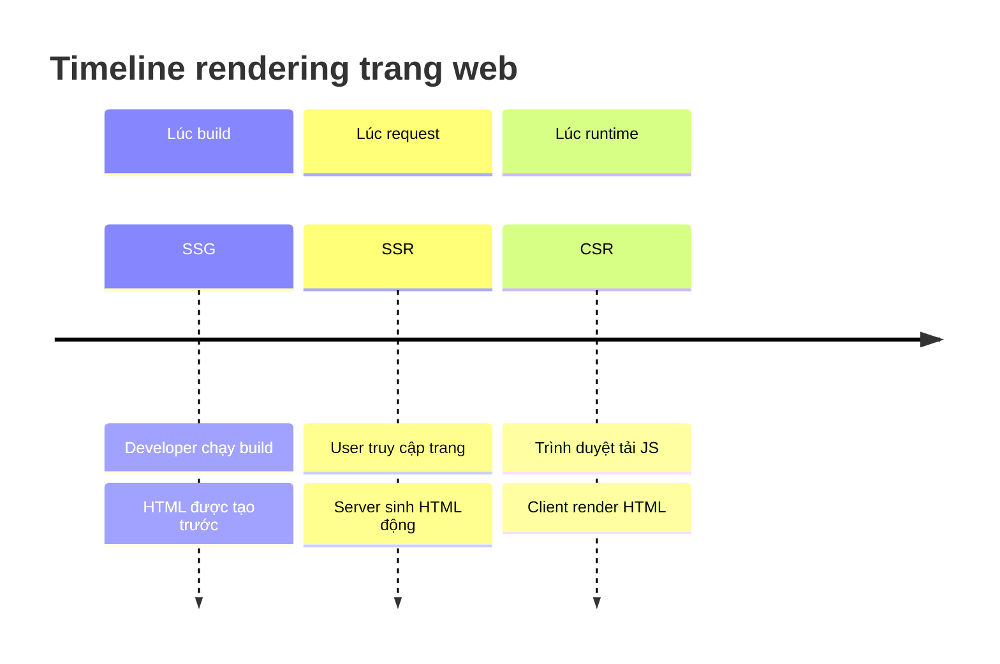
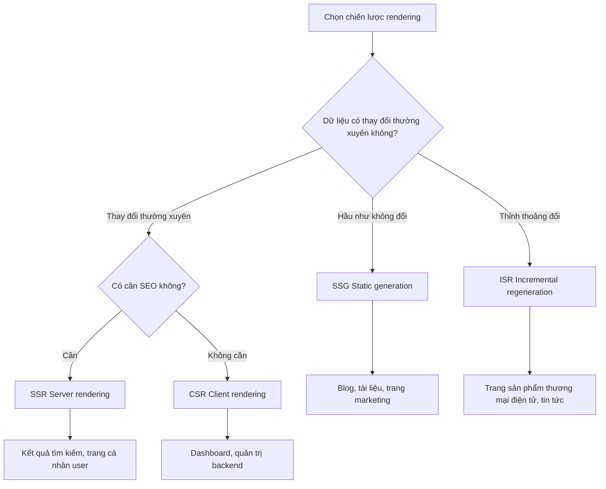

# 2.2 Trang web của bạn được tạo ra khi nào — Toàn cảnh chiến lược rendering của Next.js

## Tái cấu trúc nhận thức

Nội dung HTML của trang web, thực sự được tạo ra vào lúc nào, bởi ai? Câu trả lời cho câu hỏi này chính là bản chất của "chiến lược rendering".



## So sánh 4 chiến lược rendering

| Chiến lược | Thời điểm sinh HTML | Người tạo | Tốc độ màn hình đầu | SEO | Độ tươi mới dữ liệu |
|------|---------------|--------|----------|-----|------------|
| **CSR** | Runtime | Trình duyệt | Chậm | Kém | Real-time |
| **SSR** | Lúc request | Server | Trung bình | Tốt | Real-time |
| **SSG** | Lúc build | Server | Cực nhanh | Tốt | Tĩnh |
| **ISR** | Lúc build + Cập nhật background | Server | Cực nhanh | Tốt | Gần real-time |

## Trực quan hóa cấu trúc

```mermaid
flowchart TB
    subgraph CSR["CSR Client-side rendering"]
        direction LR
        C1["Request từ trình duyệt"] --> C2["Trả về HTML rỗng + JS"]
        C2 --> C3["Thực thi JS"]
        C3 --> C4["Request API"]
        C4 --> C5["Render trang"]
    end

    subgraph SSR["SSR Server-side rendering"]
        direction LR
        S1["Request từ trình duyệt"] --> S2["Server lấy dữ liệu"]
        S2 --> S3["Sinh HTML"]
        S3 --> S4["Trả về HTML hoàn chỉnh"]
    end

    subgraph SSG["SSG Static site generation"]
        direction LR
        G1["Sinh HTML lúc build"] --> G2["Deploy lên CDN"]
        G2 --> G3["Request từ trình duyệt"]
        G3 --> G4["Trả trực tiếp HTML"]
    end

    subgraph ISR["ISR Incremental static regeneration"]
        direction LR
        I1["Lần đầu: Trả HTML tĩnh"] --> I2["Background kiểm tra hết hạn"]
        I2 --> I3["Hết hạn thì sinh lại"]
        I3 --> I4["Request tiếp theo trả HTML mới"]
    end
```



## Làm thế nào để chọn chiến lược rendering?



## Hành vi mặc định trong Next.js

Trong Next.js App Router:

- **Mặc định là tĩnh**: Nếu trang không có lấy dữ liệu động, sẽ sinh lúc build
- **Tự động chuyển sang động**: Dùng `cookies()`, `headers()`, `searchParams` sẽ kích hoạt SSR
- **Có thể kiểm soát tường minh**: Thông qua cấu hình như `export const dynamic = 'force-dynamic'`

```typescript
// Static generation (mặc định)
export default function Page() {
  return <h1>Hello</h1>
}

// Dynamic rendering (tự động phát hiện)
export default function Page({ searchParams }) {
  // Dùng searchParams, tự động chuyển sang SSR
  return <h1>Search: {searchParams.q}</h1>
}

// Bắt buộc dynamic rendering
export const dynamic = 'force-dynamic'
export default function Page() {
  return <h1>Always SSR</h1>
}
```

## Điều hướng chương này

- **2.2.1 CSR**: Kịch bản và hạn chế của client-side rendering
- **2.2.2 SSR**: Server-side rendering và tối ưu SEO
- **2.2.3 SSG**: Best practice của static generation
- **2.2.4 ISR**: Sức mạnh của incremental static regeneration
- **2.2.5 Mixed rendering**: Nhiều chiến lược trong một trang
