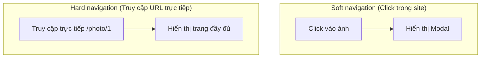

# 2.3.1 Parallel Routes và Intercepting Routes

## Giải thích một câu

Parallel routes cho phép cùng một trang render đồng thời nhiều vùng độc lập, Intercepting routes để soft navigation và hard navigation hiển thị nội dung khác nhau — hai tính năng này kết hợp có thể thực hiện trải nghiệm ưu nhã "popup chính là trang".

## Parallel Routes (Song song routes)

### Parallel routes là gì?

```
app/
├── layout.tsx          # Sử dụng @team và @analytics
├── @team/
│   └── page.tsx        # Vùng team
├── @analytics/
│   └── page.tsx        # Vùng phân tích
└── page.tsx            # Nội dung chính
```

### Cách dùng cơ bản

```typescript
// app/layout.tsx
export default function Layout({
  children,
  team,
  analytics,
}: {
  children: React.ReactNode
  team: React.ReactNode
  analytics: React.ReactNode
}) {
  return (
    <div className="grid grid-cols-2">
      <div>{children}</div>
      <div>
        {team}
        {analytics}
      </div>
    </div>
  )
}
```

### Loading state độc lập

```typescript
// app/@team/loading.tsx
export default function TeamLoading() {
  return <div>Đang tải dữ liệu team...</div>
}

// app/@analytics/loading.tsx
export default function AnalyticsLoading() {
  return <div>Đang tải dữ liệu phân tích...</div>
}
```

## Intercepting Routes (Chặn routes)

### Khái niệm cốt lõi



### Quy ước cấu trúc file

```
(.)   → Match cùng cấp
(..)  → Match cấp trên
(..)(..) → Match lên hai cấp
(...)  → Match thư mục gốc
```

### Thực chiến: Preview ảnh popup

```
app/
├── photos/
│   └── [id]/
│       └── page.tsx      # Trang ảnh đầy đủ
├── @modal/
│   └── (.)photos/
│       └── [id]/
│           └── page.tsx  # Ảnh trong Modal
└── layout.tsx
```

```typescript
// app/layout.tsx
export default function Layout({
  children,
  modal,
}: {
  children: React.ReactNode
  modal: React.ReactNode
}) {
  return (
    <>
      {children}
      {modal}
    </>
  )
}
```

```typescript
// app/@modal/(.)photos/[id]/page.tsx
import { Modal } from '@/components/modal'

export default function PhotoModal({
  params,
}: {
  params: { id: string }
}) {
  return (
    <Modal>
      
    </Modal>
  )
}
```

```typescript
// app/photos/[id]/page.tsx
export default function PhotoPage({
  params,
}: {
  params: { id: string }
}) {
  return (
    <div className="full-screen">
      
      <PhotoDetails id={params.id} />
    </div>
  )
}
```

## Implement Modal component

```typescript
// components/modal.tsx
'use client'

import { useRouter } from 'next/navigation'

export function Modal({ children }: { children: React.ReactNode }) {
  const router = useRouter()

  return (
    <div
      className="fixed inset-0 bg-black/50 flex items-center justify-center"
      onClick={() => router.back()}
    >
      <div
        className="bg-white rounded-lg p-4"
        onClick={e => e.stopPropagation()}
      >
        {children}
      </div>
    </div>
  )
}
```

## Tình huống áp dụng

| Tình huống | Phương án |
|------|------|
| Dashboard nhiều vùng | Parallel routes |
| Preview ảnh/video | Intercepting routes + Modal |
| Popup đăng nhập | Intercepting routes |
| Sidebar chi tiết | Parallel routes |

## Nhận thức: Vấn đề thường gặp

### 1. Vai trò của default.tsx

```typescript
// app/@modal/default.tsx
// Khi không có modal match, trả về null
export default function Default() {
  return null
}
```

### 2. Refresh thì Modal biến mất

Đây là hành vi dự kiến! Refresh là hard navigation, sẽ đi theo route trang đầy đủ.

## Tổng kết mục này

- **Parallel routes**: Nhiều vùng độc lập trong cùng trang, mỗi vùng có loading/error riêng
- **Intercepting routes**: Soft navigation chặn lại, hard navigation bình thường
- **Kết hợp sử dụng**: Thực hiện UX best practice "popup chính là trang"
