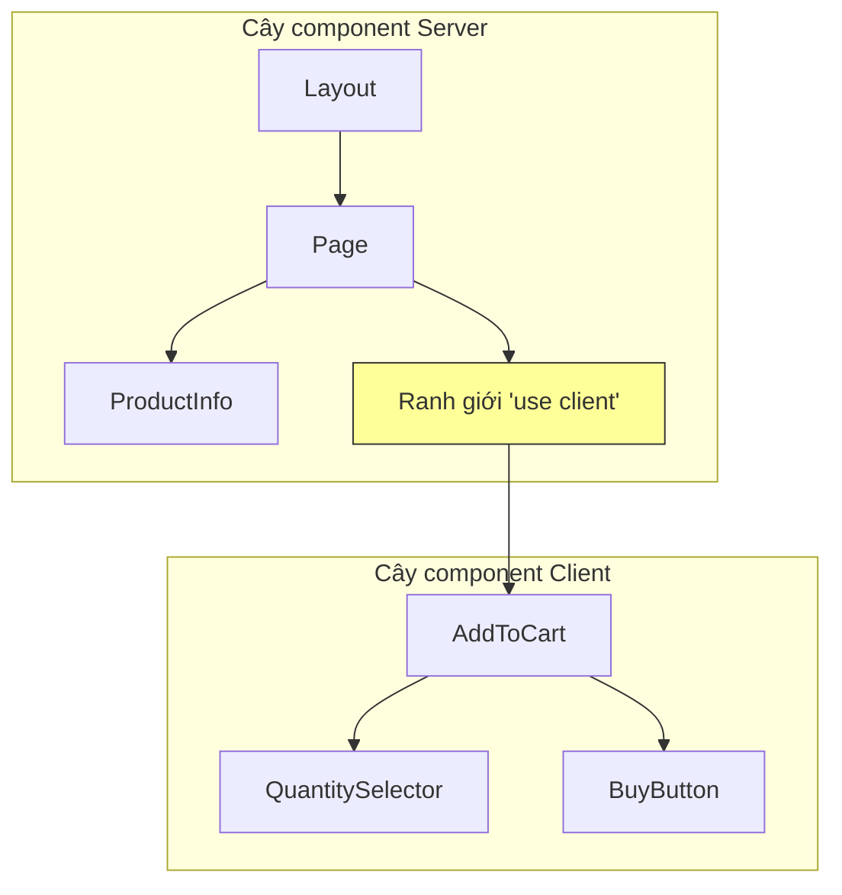

# 2.3.2 Client boundary và Data flow

## Giải thích một câu

`'use client'` không chỉ đơn giản là "để component dùng được useState" — nó vẽ ra một ranh giới, quyết định code nào gửi đến trình duyệt, ảnh hưởng trực tiếp đến hiệu năng và kích thước bundle của ứng dụng.

## Bản chất của boundary



### Quy tắc quan trọng

| Quy tắc | Giải thích |
|------|------|
| Mặc định là server component | Không thêm `'use client'` thì là Server Component |
| Boundary lây lan xuống dưới | Component con của client component cũng là client component |
| Không thể import ngược | Client component không thể import server component |
| Props phải serialize được | Props truyền qua boundary phải JSON serialize được |

## Phân chia boundary đúng

### ❌ Sai: Cả trang đều là client component

```typescript
// app/product/page.tsx
'use client'  // ❌ Khai báo quá sớm!

export default function ProductPage() {
  const [quantity, setQuantity] = useState(1)

  return (
    <div>
      <ProductInfo />      {/* Vốn có thể là server component */}
      <ProductImages />    {/* Vốn có thể là server component */}
      <AddToCart quantity={quantity} setQuantity={setQuantity} />
    </div>
  )
}
```

### ✅ Đúng: Minimize client boundary

```typescript
// app/product/page.tsx
// Không có 'use client', là server component
export default async function ProductPage({ params }) {
  const product = await getProduct(params.id)

  return (
    <div>
      <ProductInfo product={product} />    {/* Server component */}
      <ProductImages images={product.images} />  {/* Server component */}
      <AddToCart product={product} />      {/* Client component */}
    </div>
  )
}
```

```typescript
// components/add-to-cart.tsx
'use client'

export function AddToCart({ product }) {
  const [quantity, setQuantity] = useState(1)

  return (
    <div>
      <QuantitySelector value={quantity} onChange={setQuantity} />
      <BuyButton product={product} quantity={quantity} />
    </div>
  )
}
```

## Children pattern: Vượt qua giới hạn boundary

```typescript
// ❌ Client component không thể import trực tiếp server component
'use client'
import { ServerComponent } from './server-component'  // Lỗi!

// ✅ Truyền qua children
// layout.tsx (server component)
export default function Layout({ children }) {
  return (
    <ClientProvider>  {/* Client component */}
      {children}       {/* Có thể là server component */}
    </ClientProvider>
  )
}
```

```typescript
// client-provider.tsx
'use client'

export function ClientProvider({ children }) {
  const [theme, setTheme] = useState('light')

  return (
    <ThemeContext.Provider value={{ theme, setTheme }}>
      {children}  {/* Server component truyền vào qua children */}
    </ThemeContext.Provider>
  )
}
```

## Vấn đề serialize Props

```typescript
// ❌ Hàm không thể truyền qua boundary
<ClientComponent onSubmit={async (data) => { ... }} />  // Lỗi!

// ✅ Dùng Server Actions
<ClientComponent action={submitAction} />  // Server Action được!
```

```typescript
// ❌ Object phức tạp có thể có vấn đề
<ClientComponent data={new Map()} />  // Map không thể serialize

// ✅ Dùng dữ liệu có thể serialize
<ClientComponent data={Object.fromEntries(map)} />
```

## So sánh hiệu năng

| Phương án | Kích thước JS Bundle | Tốc độ màn hình đầu |
|------|---------------|----------|
| Toàn client | Lớn (bao gồm tất cả component) | Chậm |
| Boundary tối thiểu | Nhỏ (chỉ có interactive component) | Nhanh |

## Nhận thức: Lỗi thường gặp

### 1. `'use client'` không cần thiết

```typescript
// ❌ Component thuần hiển thị không cần 'use client'
'use client'
export function ProductCard({ product }) {
  return <div>{product.name}</div>
}

// ✅ Bỏ 'use client'
export function ProductCard({ product }) {
  return <div>{product.name}</div>
}
```

### 2. Hiểu nhầm "Client component cũng chạy trên server"

```typescript
'use client'
// Component này sẽ pre-render trên server, rồi hydrate trên client
export function Counter() {
  console.log('Dòng này chạy cả ở server và client')
  const [count, setCount] = useState(0)
  return <button onClick={() => setCount(c => c + 1)}>{count}</button>
}
```

## Tổng kết mục này

| Nguyên tắc | Giải thích |
|------|------|
| Mặc định server | Dùng được server component thì dùng server component |
| Boundary tối thiểu | Đặt `'use client'` ở nơi thực sự cần nhất |
| Children pattern | Để server component xuyên qua client boundary |
| Serialize Props | Dữ liệu qua boundary phải serialize được |
