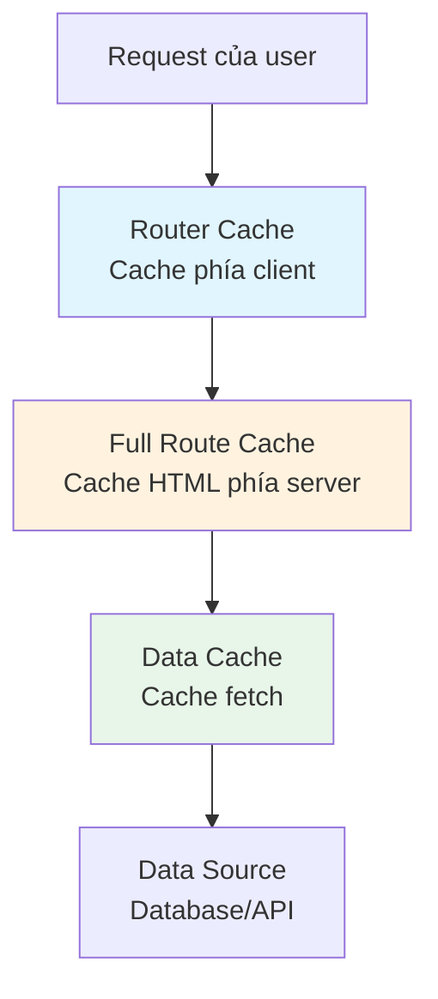

# 2.3.4 Chiến lược cache chi tiết

## Giải thích một câu

Next.js có nhiều tầng cơ chế cache, hiểu cách hoạt động và tùy chọn cấu hình của chúng, là chìa khóa để tránh các vấn đề huyền bí kiểu "dữ liệu không cập nhật".

## Phân tầng cache



| Tầng cache | Vị trí | Tác dụng | Thời gian duy trì |
|--------|------|------|----------|
| Router Cache | Client | Cache trang đã truy cập | Trong phiên |
| Full Route Cache | Server | Cache HTML hoàn chỉnh | Lâu dài (trừ khi revalidate) |
| Data Cache | Server | Cache response fetch | Lâu dài (trừ khi revalidate) |

## Kiểm soát fetch cache

### Cache vĩnh viễn (mặc định)

```typescript
// Hành vi mặc định: cache vĩnh viễn
const data = await fetch('https://api.example.com/data')

// Tương đương
const data = await fetch('https://api.example.com/data', {
  cache: 'force-cache'
})
```

### Không cache (mỗi request)

```typescript
const data = await fetch('https://api.example.com/data', {
  cache: 'no-store'
})
```

### Revalidate định kỳ (ISR)

```typescript
const data = await fetch('https://api.example.com/data', {
  next: { revalidate: 60 }  // Revalidate sau 60 giây
})
```

### Revalidate theo tag

```typescript
// Đánh tag
const data = await fetch('https://api.example.com/posts', {
  next: { tags: ['posts'] }
})

// Revalidate theo tag
import { revalidateTag } from 'next/cache'
revalidateTag('posts')
```

## Kiểm soát cache cấp page

```typescript
// app/posts/page.tsx

// Bắt buộc dynamic rendering (không cache)
export const dynamic = 'force-dynamic'

// Bắt buộc static rendering
export const dynamic = 'force-static'

// Đặt thời gian revalidate
export const revalidate = 60

// Để Next.js tự quyết định (mặc định)
export const dynamic = 'auto'
```

## Cách revalidate

### Theo thời gian

```typescript
// Regenerate mỗi 60 giây
export const revalidate = 60
```

### Revalidate on-demand

```typescript
// app/api/revalidate/route.ts
import { revalidatePath, revalidateTag } from 'next/cache'

export async function POST(request) {
  const { path, tag } = await request.json()

  if (path) {
    revalidatePath(path)  // Revalidate path
  }

  if (tag) {
    revalidateTag(tag)    // Revalidate tag
  }

  return Response.json({ revalidated: true })
}
```

### Revalidate trong Server Action

```typescript
'use server'

import { revalidatePath } from 'next/cache'

export async function createPost(formData) {
  await db.post.create({ ... })

  revalidatePath('/posts')  // Refresh danh sách sau khi tạo
}
```

## Cấu hình theo tình huống thường gặp

| Tình huống | Cấu hình |
|------|------|
| Bài viết blog | `revalidate: 3600` |
| Giá sản phẩm | `revalidate: 60` |
| Dữ liệu user | `cache: 'no-store'` |
| Nội dung tĩnh | Mặc định (cache vĩnh viễn) |

## Nhận thức: Vấn đề thường gặp

### 1. Dữ liệu không cập nhật

```typescript
// ❌ Cache mặc định, dữ liệu không cập nhật
const posts = await fetch('/api/posts')

// ✅ Phương án 1: Tắt cache
const posts = await fetch('/api/posts', { cache: 'no-store' })

// ✅ Phương án 2: Revalidate định kỳ
const posts = await fetch('/api/posts', { next: { revalidate: 60 } })
```

### 2. Hành vi khác nhau giữa môi trường dev và production

```typescript
// Môi trường dev mặc định tắt cache!
// Môi trường production cần cấu hình tường minh
```

### 3. Vấn đề Router Cache

```typescript
// Router Cache phía client có thể khiến thấy dữ liệu cũ
// Giải pháp: Gọi revalidatePath sau Server Action
'use server'
export async function updatePost(id, data) {
  await db.post.update({ where: { id }, data })
  revalidatePath(`/posts/${id}`)
}
```

## Debug cache

```typescript
// In trạng thái cache sau fetch
const res = await fetch(url)
console.log('Cache:', res.headers.get('x-nextjs-cache'))
// HIT = Cache hit
// MISS = Cache miss
// STALE = Cache hết hạn, đang revalidate
```

## Tổng kết mục này

| Loại cache | Cách kiểm soát | Cách revalidate |
|----------|----------|------------|
| fetch cache | `cache` / `next.revalidate` | `revalidateTag` |
| Page cache | `dynamic` / `revalidate` | `revalidatePath` |
| Router cache | Tự động quản lý | Tự động refresh sau Server Action |
