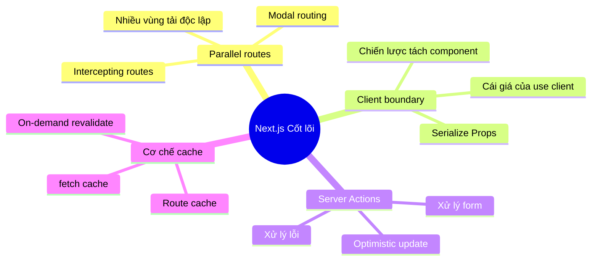
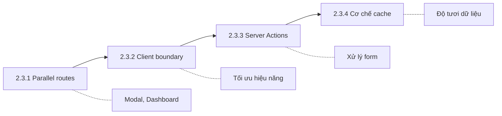

# 2.3 Khái niệm cốt lõi Next.js đào sâu

## Tái cấu trúc nhận thức

Next.js 13+ mang đến App Router mang tính cách mạng, nhưng nhiều developer chỉ "biết dùng", chưa "dùng đúng". Chương này sẽ đào sâu cách sử dụng đúng những tính năng mới này, phát huy sức mạnh thực sự của chúng.

## Sơ đồ tri thức chương này

## Tra cứu nhanh khái niệm cốt lõi

| Tính năng | Tác dụng | Tình huống điển hình |
|------|------|----------|
| Parallel routes | Nhiều vùng độc lập trong cùng trang | Dashboard, Modal |
| Intercepting routes | Soft navigation hiển thị nội dung khác | Preview ảnh, share link |
| Client Boundary | Đánh dấu ranh giới client component | Interactive component |
| Server Actions | Gọi hàm phía server | Submit form, mutation data |
| fetch cache | Cache cấp request | Tối ưu data fetching |
| revalidate | Cập nhật cache tăng dần | ISR, refresh on-demand |

## Lộ trình học tập

## Điều hướng chương này

- **2.3.1 Parallel routes**: Để popup cũng có URL riêng
- **2.3.2 Client boundary**: Cách dùng đúng `'use client'`
- **2.3.3 Server Actions**: Best practice xử lý form
- **2.3.4 Cơ chế cache**: Để dữ liệu vừa nhanh vừa mới
