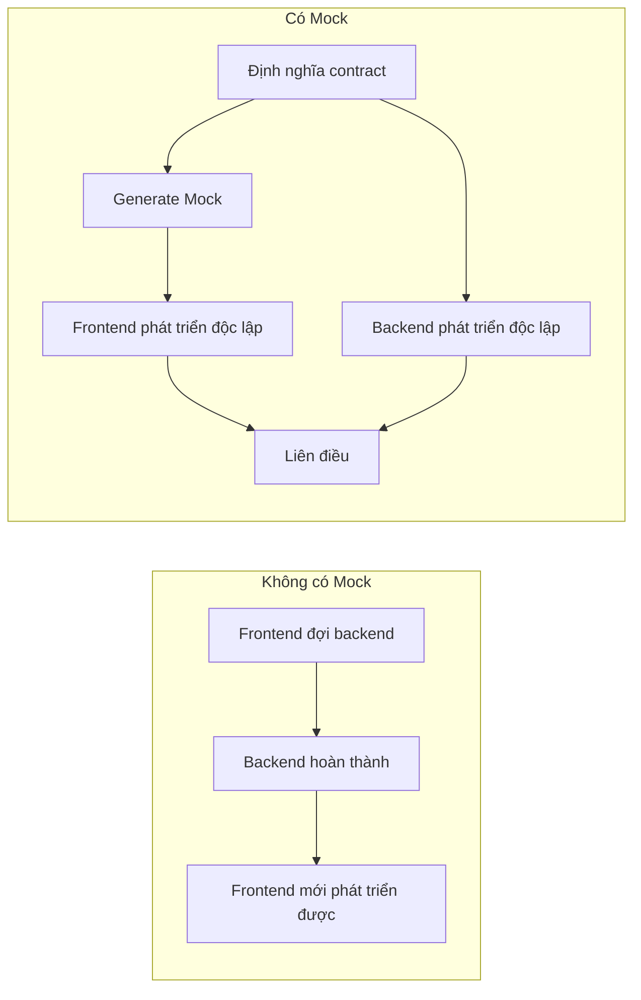

# 2.4.2 Dữ liệu giả cũng phát triển được — Mock data

## Một câu phá đề

Mock data giúp frontend không cần đợi backend interface mà vẫn phát triển được — Generate dữ liệu giả dựa trên contract, frontend page có thể chạy thông hoàn toàn, khi liên điều chỉ cần chuyển đổi data source.

## Tại sao cần Mock



## Lựa chọn phương án Mock

| Phương án | Ưu điểm | Nhược điểm | Tình huống áp dụng |
|------|------|------|----------|
| Static JSON file | Đơn giản | Không linh hoạt | Tình huống đơn giản |
| MSW | Chặn request thực | Cần cấu hình | Dự án phức tạp |
| Next.js API Routes | Nhất quán với code thực | Cần viết code | Dự án fullstack |

## Phương án 1: Static Mock file

### Cấu trúc thư mục

```
src/
├── mocks/
│   ├── users.json
│   └── posts.json
└── services/
    └── user.ts
```

### Implementation đơn giản

```typescript
// mocks/users.json
{
  "users": [
    {
      "id": "1",
      "name": "Trần Văn A",
      "email": "tranvana@example.com",
      "avatar": null,
      "createdAt": "2024-01-01T00:00:00Z"
    },
    {
      "id": "2",
      "name": "Nguyễn Thị B",
      "email": "nguyenthib@example.com",
      "avatar": "https://example.com/avatar.jpg",
      "createdAt": "2024-01-02T00:00:00Z"
    }
  ],
  "total": 2
}
```

```typescript
// services/user.ts
import type { UsersListResponse } from '@/types/user'
import mockData from '@/mocks/users.json'

const USE_MOCK = process.env.NEXT_PUBLIC_USE_MOCK === 'true'

export async function getUsers(): Promise<UsersListResponse> {
  if (USE_MOCK) {
    // Mô phỏng network delay
    await new Promise(resolve => setTimeout(resolve, 500))
    return {
      code: 200,
      message: 'Lấy thành công',
      data: mockData
    }
  }

  const res = await fetch('/api/users')
  return res.json()
}
```

## Phương án 2: Dùng Faker.js generate dynamic data

### Cài đặt

```bash
pnpm add -D @faker-js/faker
```

### Tạo Mock factory

```typescript
// mocks/factories/user.ts
import { faker } from '@faker-js/faker/locale/zh_CN'
import type { User } from '@/types/user'

export function createMockUser(overrides?: Partial<User>): User {
  return {
    id: faker.string.uuid(),
    name: faker.person.fullName(),
    email: faker.internet.email(),
    avatar: faker.image.avatar(),
    role: faker.helpers.arrayElement(['admin', 'user']),
    createdAt: faker.date.past().toISOString(),
    updatedAt: faker.date.recent().toISOString(),
    ...overrides,
  }
}

export function createMockUsers(count: number): User[] {
  return Array.from({ length: count }, () => createMockUser())
}
```

### Sử dụng factory

```typescript
// services/user.ts
import { createMockUsers } from '@/mocks/factories/user'
import type { UsersListResponse } from '@/types/user'

const USE_MOCK = process.env.NEXT_PUBLIC_USE_MOCK === 'true'

export async function getUsers(params?: {
  page?: number
  pageSize?: number
}): Promise<UsersListResponse> {
  if (USE_MOCK) {
    await new Promise(resolve => setTimeout(resolve, 300))

    const page = params?.page ?? 1
    const pageSize = params?.pageSize ?? 10
    const total = 100

    return {
      code: 200,
      message: 'Lấy thành công',
      data: {
        users: createMockUsers(pageSize),
        total,
        page,
        pageSize,
      }
    }
  }

  const searchParams = new URLSearchParams()
  if (params?.page) searchParams.set('page', String(params.page))
  if (params?.pageSize) searchParams.set('pageSize', String(params.pageSize))

  const res = await fetch(`/api/users?${searchParams}`)
  return res.json()
}
```

## Phương án 3: MSW (Mock Service Worker)

MSW chặn request ở network layer, gần nhất với môi trường thực.

### Cài đặt

```bash
pnpm add -D msw
```

### Cấu hình Handler

```typescript
// mocks/handlers.ts
import { http, HttpResponse } from 'msw'
import { createMockUser, createMockUsers } from './factories/user'

export const handlers = [
  // Lấy danh sách user
  http.get('/api/users', ({ request }) => {
    const url = new URL(request.url)
    const page = Number(url.searchParams.get('page')) || 1
    const pageSize = Number(url.searchParams.get('pageSize')) || 10

    return HttpResponse.json({
      code: 200,
      message: 'Lấy thành công',
      data: {
        users: createMockUsers(pageSize),
        total: 100,
        page,
        pageSize,
      }
    })
  }),

  // Tạo user
  http.post('/api/users', async ({ request }) => {
    const body = await request.json()

    return HttpResponse.json({
      code: 200,
      message: 'Tạo thành công',
      data: createMockUser(body as any),
    })
  }),

  // Lấy một user
  http.get('/api/users/:id', ({ params }) => {
    return HttpResponse.json({
      code: 200,
      message: 'Lấy thành công',
      data: createMockUser({ id: params.id as string }),
    })
  }),

  // Mô phỏng tình huống lỗi
  http.delete('/api/users/:id', ({ params }) => {
    if (params.id === 'error') {
      return HttpResponse.json(
        { code: 403, message: 'Không có quyền xóa' },
        { status: 403 }
      )
    }

    return HttpResponse.json({
      code: 200,
      message: 'Xóa thành công',
    })
  }),
]
```

### Kích hoạt trong môi trường dev

```typescript
// mocks/browser.ts
import { setupWorker } from 'msw/browser'
import { handlers } from './handlers'

export const worker = setupWorker(...handlers)
```

```typescript
// app/providers.tsx
'use client'

import { useEffect } from 'react'

export function Providers({ children }: { children: React.ReactNode }) {
  useEffect(() => {
    if (process.env.NODE_ENV === 'development') {
      import('@/mocks/browser').then(({ worker }) => {
        worker.start({ onUnhandledRequest: 'bypass' })
      })
    }
  }, [])

  return <>{children}</>
}
```

## Mock theo tình huống

### Mô phỏng các trạng thái khác nhau

```typescript
// mocks/scenarios.ts
import { http, HttpResponse } from 'msw'

// Tình huống danh sách rỗng
export const emptyListScenario = [
  http.get('/api/users', () => {
    return HttpResponse.json({
      code: 200,
      data: { users: [], total: 0, page: 1, pageSize: 10 }
    })
  }),
]

// Tình huống load thất bại
export const errorScenario = [
  http.get('/api/users', () => {
    return HttpResponse.json(
      { code: 500, message: 'Lỗi server' },
      { status: 500 }
    )
  }),
]

// Tình huống mạng chậm
export const slowNetworkScenario = [
  http.get('/api/users', async () => {
    await new Promise(resolve => setTimeout(resolve, 3000))
    return HttpResponse.json({ code: 200, data: { users: [] } })
  }),
]
```

### Chuyển đổi tình huống động

```typescript
// Khi phát triển có thể chuyển đổi qua URL parameter
// ?mock=empty dùng danh sách rỗng
// ?mock=error dùng tình huống lỗi
```

## Cấu hình môi trường

```bash
# .env.development
NEXT_PUBLIC_USE_MOCK=true

# .env.production
NEXT_PUBLIC_USE_MOCK=false
```

## Giác ngộ: Vấn đề thường gặp với Mock

### 1. Mock data và real data format không nhất quán

```typescript
// ❌ Mock trả về field khác với real API
{
  "userName": "Trần Văn A"  // API trả về "name"
}

// ✅ Strictly generate Mock theo contract type
function createMockUser(): User {  // Type constraint
  return {
    name: faker.person.fullName(),  // Nhất quán với định nghĩa type
    // ...
  }
}
```

### 2. Quên mô phỏng edge case

```typescript
// ✅ Nhớ mô phỏng các edge case
const edgeCases = {
  emptyString: createMockUser({ name: '' }),
  longName: createMockUser({ name: 'Đây là tên user rất rất dài'.repeat(10) }),
  specialChars: createMockUser({ name: '<script>alert(1)</script>' }),
  nullAvatar: createMockUser({ avatar: null }),
}
```

### 3. Mock delay khác với mạng thực

```typescript
// Mô phỏng network delay thực
const delay = (min: number, max: number) =>
  new Promise(resolve =>
    setTimeout(resolve, Math.random() * (max - min) + min)
  )

// Sử dụng
await delay(200, 800)  // 200-800ms random delay
```

## Tóm tắt phần này

| Phương án Mock | Tình huống sử dụng |
|-----------|----------|
| Static JSON | Prototype nhanh, trang đơn giản |
| Faker factory | Cần nhiều random data |
| MSW | Tương tác phức tạp, gần môi trường thực |

**Nguyên tắc cốt lõi**: Mock data phải strictly tuân thủ contract type, nếu không sẽ gặp vấn đề khi liên điều.
