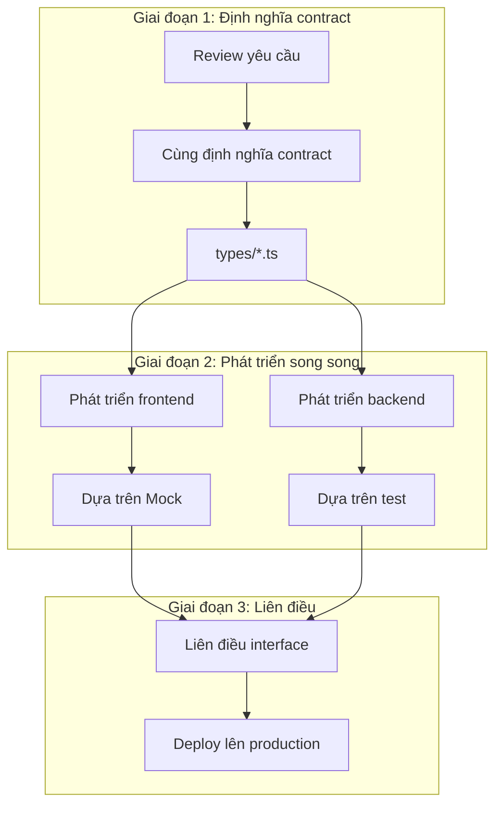
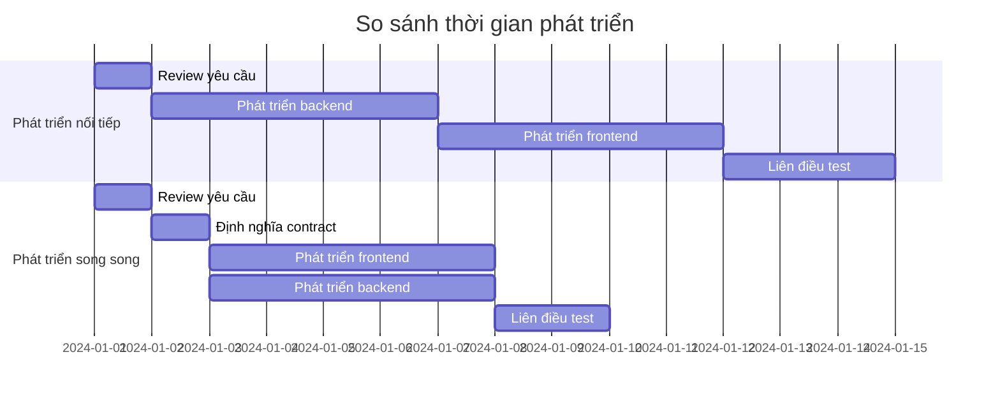
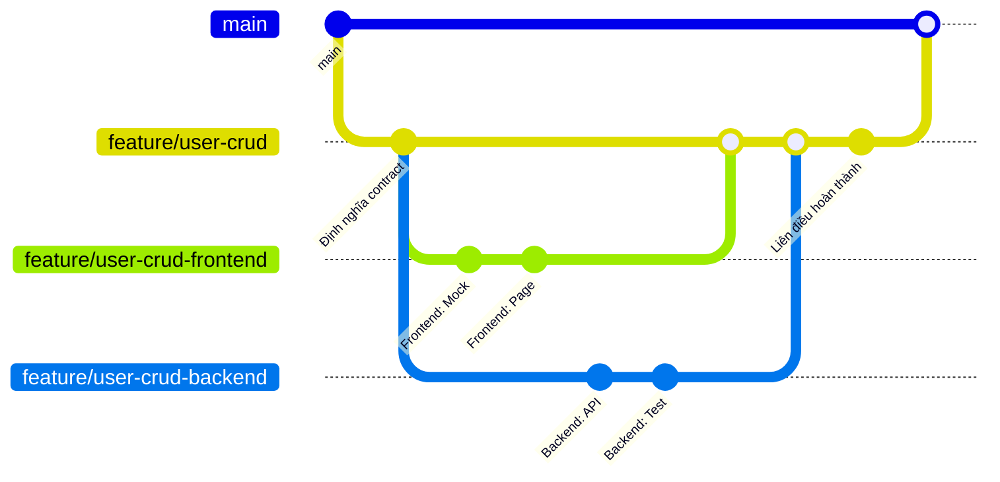
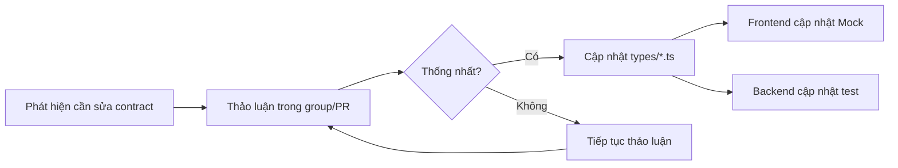

# 2.4.3 Bạn viết của bạn, tôi viết của tôi — Phát triển song song

## Một câu phá đề

Cốt lõi của phát triển song song là: **Frontend-backend làm việc độc lập dựa trên cùng một contract, không block lẫn nhau**. Frontend dùng Mock để chạy thông page, backend dùng test để verify logic, khi liên điều chỉ cần kết nối interface thực.

## Quy trình phát triển song song



## So sánh timeline



**Phát triển nối tiếp**: 1 + 5 + 5 + 3 = **14 ngày**
**Phát triển song song**: 1 + 1 + 5 + 2 = **9 ngày** (tiết kiệm 36%)

## Thực hành phát triển song song frontend

### Generate Mock dựa trên contract

```typescript
// 1. Định nghĩa contract (types/post.ts)
export interface Post {
  id: string
  title: string
  content: string
  author: { id: string; name: string }
  createdAt: string
}

export interface CreatePostRequest {
  title: string
  content: string
}

// 2. Tạo Mock factory (mocks/factories/post.ts)
import { faker } from '@faker-js/faker/locale/zh_CN'
import type { Post } from '@/types/post'

export function createMockPost(overrides?: Partial<Post>): Post {
  return {
    id: faker.string.uuid(),
    title: faker.lorem.sentence(),
    content: faker.lorem.paragraphs(3),
    author: {
      id: faker.string.uuid(),
      name: faker.person.fullName(),
    },
    createdAt: faker.date.recent().toISOString(),
    ...overrides,
  }
}

// 3. Frontend sử dụng trực tiếp (components/post-list.tsx)
'use client'
import { createMockPost } from '@/mocks/factories/post'

export function PostList() {
  // Giai đoạn phát triển dùng Mock data
  const posts = Array.from({ length: 10 }, () => createMockPost())

  return (
    <ul>
      {posts.map(post => (
        <li key={post.id}>{post.title}</li>
      ))}
    </ul>
  )
}
```

### Checklist phát triển frontend

- [ ] Tạo TypeScript type dựa trên contract
- [ ] Tạo Mock data factory
- [ ] Phát triển page component
- [ ] Xử lý loading state
- [ ] Xử lý error state
- [ ] Xử lý empty state
- [ ] Form validation
- [ ] Responsive adaptation

## Thực hành phát triển song song backend

### Viết test dựa trên contract

```typescript
// app/api/posts/route.test.ts
import { POST, GET } from './route'
import { createMockPost } from '@/mocks/factories/post'

describe('POST /api/posts', () => {
  it('nên tạo bài viết và trả về format đúng', async () => {
    const request = new Request('http://localhost/api/posts', {
      method: 'POST',
      body: JSON.stringify({
        title: 'Tiêu đề test',
        content: 'Nội dung test',
      }),
    })

    const response = await POST(request)
    const data = await response.json()

    // Verify response format tuân thủ contract
    expect(data.code).toBe(200)
    expect(data.data).toHaveProperty('id')
    expect(data.data).toHaveProperty('title', 'Tiêu đề test')
    expect(data.data).toHaveProperty('content', 'Nội dung test')
    expect(data.data).toHaveProperty('author')
    expect(data.data).toHaveProperty('createdAt')
  })

  it('title rỗng nên trả về 400', async () => {
    const request = new Request('http://localhost/api/posts', {
      method: 'POST',
      body: JSON.stringify({
        title: '',
        content: 'Nội dung test',
      }),
    })

    const response = await POST(request)
    const data = await response.json()

    expect(response.status).toBe(400)
    expect(data.code).toBe(400)
  })
})
```

### Checklist phát triển backend

- [ ] Định nghĩa response type dựa trên contract
- [ ] Viết API route handler
- [ ] Implement data validation (Zod)
- [ ] Implement business logic
- [ ] Viết unit test
- [ ] Xử lý error cases
- [ ] Implement permission control

## Quy chuẩn cộng tác

### Git branch strategy



### Quy trình thay đổi contract



### Template giao tiếp

```markdown
## Thông báo thay đổi contract

**Interface**: POST /api/posts
**Nội dung thay đổi**: Thêm field tags
**Lý do**: Yêu cầu sản phẩm thêm tính năng tag
**Phạm vi ảnh hưởng**: Tạo bài viết, danh sách bài viết

### Trước thay đổi
\`\`\`typescript
interface CreatePostRequest {
  title: string
  content: string
}
\`\`\`

### Sau thay đổi
\`\`\`typescript
interface CreatePostRequest {
  title: string
  content: string
  tags?: string[]  // Mới thêm
}
\`\`\`

**Bạn frontend**: Vui lòng cập nhật Mock và form
**Bạn backend**: Vui lòng cập nhật validation và storage logic

cc: @frontend @backend
```

## Vấn đề thường gặp và giải pháp

### 1. Hiểu contract không nhất quán

```typescript
// ❌ Frontend nghĩ là array
interface Response {
  users: User[]
}

// ❌ Backend nghĩ là object
interface Response {
  users: { list: User[], total: number }
}

// ✅ Thống nhất viết trong types file, hai bên dùng chung
// types/user.ts
export interface UsersResponse {
  code: number
  data: {
    users: User[]
    total: number
  }
}
```

### 2. Naming field không nhất quán

```typescript
// ✅ Quy chuẩn naming
// - Dùng camelCase
// - Time field thống nhất dùng xxxAt (createdAt, updatedAt)
// - ID field thống nhất dùng xxxId (userId, postId)
// - Boolean dùng isXxx / hasXxx (isActive, hasPermission)
```

### 3. Tiến độ không đồng bộ

```markdown
## Template sync daily standup

**Tiến độ frontend**:
- Hoàn thành: User list page
- Đang làm: User edit form
- Bị block: Không

**Tiến độ backend**:
- Hoàn thành: User CRUD API
- Đang làm: Permission validation
- Bị block: Đợi xác nhận permission rules

**Cần phối hợp**:
- Cần xác nhận format trả về của user delete interface
```

## Tóm tắt phần này

| Giai đoạn | Công việc frontend | Công việc backend |
|------|----------|----------|
| Định nghĩa contract | Tham gia thảo luận, xác nhận format | Tham gia thảo luận, xác nhận format |
| Phát triển song song | Mock data + Page development | API implementation + Unit test |
| Liên điều test | Chuyển sang real API | Cung cấp môi trường test |

**Nguyên tắc cốt lõi**: Contract là sự đồng thuận duy nhất giữa frontend-backend, mọi thứ đều dựa trên contract.
