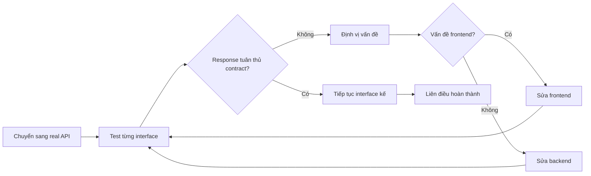

# 2.4.4 Tại sao interface không khớp — Liên điều test

## Một câu phá đề

Liên điều là bước cuối cùng để verify contract — Mock của frontend và implementation của backend đều phải strictly tuân thủ contract, nếu không giai đoạn này sẽ bộc lộ tất cả các vấn đề "tôi tưởng rằng".

## Quy trình liên điều



## Chuẩn bị trước khi liên điều

### 1. Cấu hình môi trường

```bash
# .env.development
NEXT_PUBLIC_API_BASE_URL=http://localhost:3000/api

# .env.staging
NEXT_PUBLIC_API_BASE_URL=https://staging-api.example.com

# .env.production
NEXT_PUBLIC_API_BASE_URL=https://api.example.com
```

### 2. Chuyển Mock sang real API

```typescript
// services/user.ts
const USE_MOCK = process.env.NEXT_PUBLIC_USE_MOCK === 'true'

export async function getUsers(): Promise<UsersListResponse> {
  if (USE_MOCK) {
    return getMockUsers()  // Khi dev dùng Mock
  }

  // Khi liên điều dùng real API
  const res = await fetch(`${process.env.NEXT_PUBLIC_API_BASE_URL}/users`)
  return res.json()
}
```

### 3. Checklist liên điều

```markdown
## Checklist liên điều module User

### GET /api/users
- [ ] Trả về danh sách user bình thường
- [ ] Pagination parameter có hiệu lực
- [ ] Search parameter có hiệu lực
- [ ] Xử lý danh sách rỗng
- [ ] Permission validation

### POST /api/users
- [ ] Tạo user bình thường
- [ ] Field validation error trả về
- [ ] Email duplicate detection
- [ ] Tạo thành công refresh list

### PUT /api/users/:id
- [ ] Cập nhật user bình thường
- [ ] User không tồn tại trả về 404
- [ ] Permission validation

### DELETE /api/users/:id
- [ ] Xóa user bình thường
- [ ] User không tồn tại trả về 404
- [ ] Sau khi xóa refresh list
```

## Troubleshooting vấn đề thường gặp

### 1. Field name không nhất quán

```typescript
// Định nghĩa contract
interface User {
  createdAt: string
}

// Backend trả về
{
  "created_at": "2024-01-01"  // snake_case vs camelCase
}

// Phương pháp troubleshoot: Xem actual response trong Network panel
```

**Giải pháp**:

```typescript
// Phương án 1: Backend đổi sang camelCase (khuyến nghị)
// Phương án 2: Frontend làm field mapping
function transformUser(data: any): User {
  return {
    ...data,
    createdAt: data.created_at,
  }
}
```

### 2. Data type không khớp

```typescript
// Định nghĩa contract
interface User {
  id: string  // Frontend expect string
}

// Backend trả về
{
  "id": 123  // Thực tế là number
}

// Có thể gây ra vấn đề
users.find(u => u.id === "123")  // Không bao giờ tìm thấy
```

**Giải pháp**:

```typescript
// Phương án 1: Backend thống nhất trả về string
// Phương án 2: Frontend làm type conversion
function transformUser(data: any): User {
  return {
    ...data,
    id: String(data.id),
  }
}
```

### 3. Response format không nhất quán

```typescript
// Định nghĩa contract
interface ApiResponse<T> {
  code: number
  message: string
  data: T
}

// Backend trả về (trường hợp lỗi)
{
  "error": "Not found"  // Thiếu code field
}

// Frontend xử lý bị crash
if (response.code === 200) { ... }  // code undefined
```

**Giải pháp**:

```typescript
// Hàm xử lý response thống nhất
async function fetchApi<T>(url: string): Promise<ApiResponse<T>> {
  const res = await fetch(url)
  const data = await res.json()

  // Chuẩn hóa response format
  if (!data.code) {
    return {
      code: res.status,
      message: data.error || data.message || 'Lỗi không xác định',
      data: null as T,
    }
  }

  return data
}
```

### 4. Vấn đề CORS (Cross-Origin)

```
Access to fetch at 'https://api.example.com' from origin
'http://localhost:3000' has been blocked by CORS policy
```

**Giải pháp**:

```typescript
// next.config.js - Dev environment proxy
module.exports = {
  async rewrites() {
    return [
      {
        source: '/api/:path*',
        destination: 'https://api.example.com/:path*',
      },
    ]
  },
}

// Hoặc backend cấu hình CORS headers
// Access-Control-Allow-Origin: *
```

### 5. Time format không nhất quán

```typescript
// Định nghĩa contract
createdAt: string  // Expect ISO format

// Backend trả về nhiều format khác nhau
"2024-01-01"           // Thiếu time
"2024/01/01 12:00:00"  // Không phải ISO format
1704067200             // Unix timestamp
```

**Giải pháp**:

```typescript
// Thống nhất dùng dayjs để xử lý
import dayjs from 'dayjs'

function formatDate(date: string | number): string {
  return dayjs(date).format('YYYY-MM-DD HH:mm:ss')
}
```

## Công cụ debug

### 1. Browser Network panel

```
Vị trí xem: F12 → Network → Fetch/XHR

Thông tin then chốt:
- Request URL: Request address có đúng không
- Request Method: GET/POST có đúng không
- Request Headers: Content-Type có đúng không
- Request Payload: Request body format
- Response: Actual returned data
- Status Code: 200/400/500
```

### 2. Dùng console.log để so sánh

```typescript
export async function getUsers() {
  const res = await fetch('/api/users')
  const data = await res.json()

  // So sánh contract và actual data
  console.log('Contract yêu cầu:', '{ code, message, data: { users, total } }')
  console.log('Actual trả về:', JSON.stringify(data, null, 2))

  return data
}
```

### 3. Postman / Thunder Client

```
1. Import API contract
2. Test từng interface độc lập
3. Verify response format
4. Lưu test case
```

## Template theo dõi vấn đề liên điều

```markdown
## Vấn đề: User list interface trả về format không đúng

**Interface**: GET /api/users

**Contract yêu cầu**:
\`\`\`json
{
  "code": 200,
  "data": {
    "users": [...],
    "total": 100
  }
}
\`\`\`

**Actual trả về**:
\`\`\`json
{
  "code": 200,
  "data": [...]  // Trực tiếp là array, thiếu total
}
\`\`\`

**Ảnh hưởng**: Pagination component không hiển thị được tổng số

**Giải pháp**: Backend sửa return format

**Người phụ trách**: @backend colleague

**Trạng thái**: Chờ sửa
```

## Tự động hóa liên điều

### Contract testing

```typescript
// tests/contract.test.ts
import { z } from 'zod'

const UserSchema = z.object({
  id: z.string(),
  name: z.string(),
  email: z.string().email(),
  createdAt: z.string().datetime(),
})

const UsersResponseSchema = z.object({
  code: z.number(),
  message: z.string(),
  data: z.object({
    users: z.array(UserSchema),
    total: z.number(),
  }),
})

describe('API contract test', () => {
  it('GET /api/users nên tuân thủ contract', async () => {
    const res = await fetch(`${API_BASE}/users`)
    const data = await res.json()

    // Verify response format
    const result = UsersResponseSchema.safeParse(data)

    if (!result.success) {
      console.log('Contract validation thất bại:', result.error.format())
    }

    expect(result.success).toBe(true)
  })
})
```

## Tóm tắt phần này

| Giai đoạn | Nội dung công việc |
|------|----------|
| Trước liên điều | Chuẩn bị environment variable, viết checklist liên điều |
| Đang liên điều | Verify từng interface, ghi lại vấn đề |
| Sau liên điều | Cập nhật contract (nếu có thay đổi), bổ sung test |

**Nguyên tắc cốt lõi**: 80% vấn đề liên điều xuất phát từ hiểu contract không nhất quán, check contract trước rồi mới check code.
