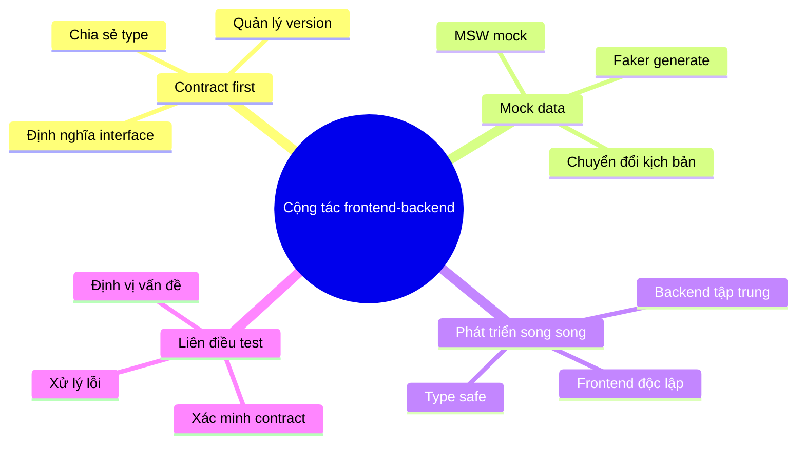
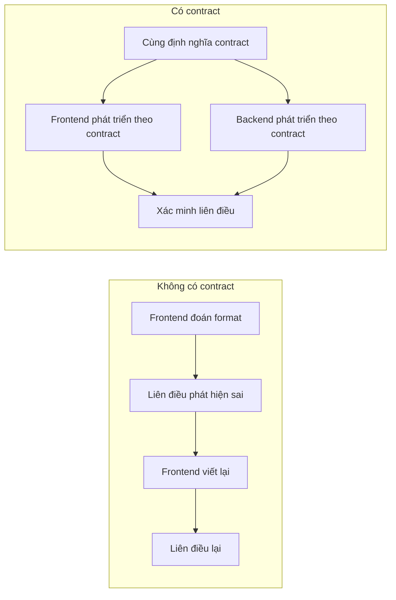
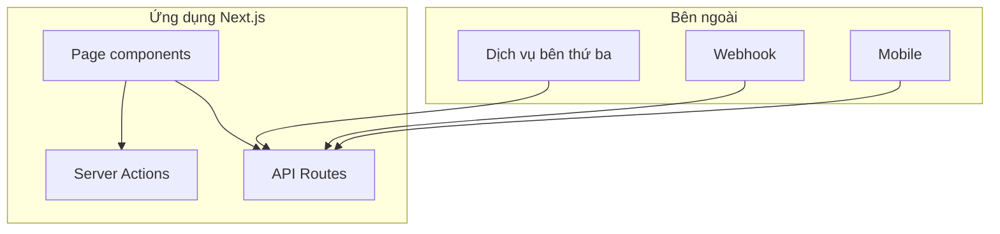

# 2.4 Frontend-backend cộng tác hiệu quả như thế nào — API Contract

## Tái cấu trúc nhận thức

Trong mô hình phát triển truyền thống, frontend đợi backend, backend đợi yêu cầu, chặn lẫn nhau là chuyện thường. Còn trong thời đại Vibe Coding, lý niệm **contract first** để frontend-backend có thể phát triển song song, AI cũng có thể tạo code chính xác hơn dựa trên contract.

```
Mô hình truyền thống: Yêu cầu → Backend phát triển → Frontend đối tiếp → Liên điều (nối tiếp)
Contract first: Yêu cầu → Định nghĩa contract → Frontend-backend phát triển song song → Liên điều (song song)
```

## Sơ đồ tri thức chương này



## Tra cứu nhanh khái niệm cốt lõi

| Khái niệm | Tác dụng | Công cụ |
|------|------|------|
| **API Contract** | Định nghĩa format request/response | TypeScript types, Zod Schema |
| **Mock data** | Mô phỏng response backend | MSW, Faker.js |
| **Phát triển song song** | Frontend-backend cùng tiến hành | Định nghĩa type chung |
| **Liên điều test** | Xác minh tính nhất quán contract | Postman, Test cases |

## Tại sao cần API Contract?



### Ba giá trị lớn của contract

1. **Loại bỏ sự mơ hồ trong giao tiếp**: Format interface rõ ràng, không có "tôi tưởng"
2. **Hỗ trợ phát triển song song**: Frontend dùng Mock, backend dùng test, không chặn nhau
3. **AI cộng tác chính xác hơn**: AI tạo code dựa trên định nghĩa type, độ chính xác tăng đáng kể

## Vị trí của API Route trong Next.js



| Tình huống | Phương án đề xuất |
|------|----------|
| Mutation data nội bộ | Server Actions |
| Expose API ra ngoài | API Routes |
| Callback bên thứ ba | API Routes |
| Gọi từ mobile | API Routes |

## Điều hướng chương này

- **2.4.1 Contract first**: Định nghĩa interface trước, viết code sau
- **2.4.2 Mock data**: Để frontend không phụ thuộc backend
- **2.4.3 Phát triển song song**: Frontend-backend cùng tiến hành
- **2.4.4 Liên điều test**: Đảm bảo tính nhất quán contract
