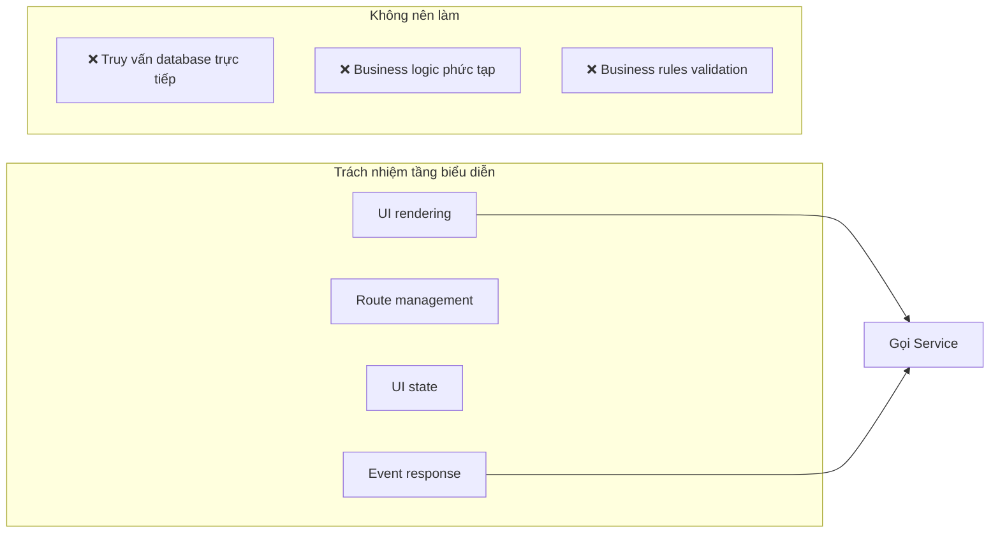
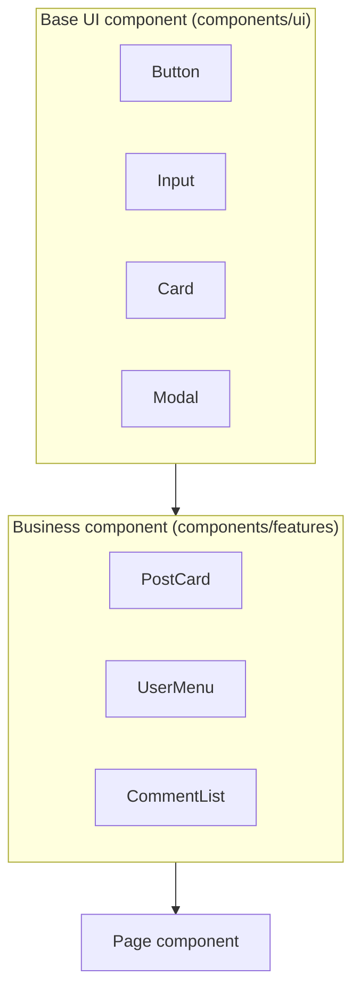

# 2.5.1 Tầng người dùng nhìn thấy — Tầng biểu diễn

## Một câu phá đề

Tầng biểu diễn là giao diện người dùng tiếp xúc trực tiếp — nó chỉ chịu trách nhiệm "trình bày cái gì" và "tương tác thế nào", không quan tâm data từ đâu đến, business rules là gì.

## Ranh giới trách nhiệm tầng biểu diễn



| Nên làm | Không nên làm |
|--------|----------|
| Render UI component | Viết SQL/Prisma query trực tiếp |
| Xử lý user interaction | Implement business logic phức tạp |
| Quản lý UI state (expand/collapse) | Xử lý business rules cross-entity |
| Gọi Service layer method | Thao tác trực tiếp nhiều data table |

## File tầng biểu diễn trong Next.js

### Trách nhiệm của file quy ước

| File | Trách nhiệm | Ví dụ |
|------|------|------|
| `page.tsx` | Page entry, component assembly | Article list page |
| `layout.tsx` | Shared layout, navigation/sidebar | Dashboard layout |
| `loading.tsx` | Loading state UI | Skeleton screen |
| `error.tsx` | Error boundary UI | Error prompt + retry |
| `not-found.tsx` | 404 page | Custom 404 |

### Tổ chức thư mục

```
app/
├── (marketing)/              # Marketing page group
│   ├── layout.tsx            # Marketing shared layout
│   ├── page.tsx              # Homepage
│   └── about/
│       └── page.tsx
│
├── (dashboard)/              # Dashboard page group
│   ├── layout.tsx            # Dashboard shared layout (có sidebar)
│   ├── dashboard/
│   │   └── page.tsx          # Dashboard homepage
│   └── posts/
│       ├── page.tsx          # Article list
│       ├── [id]/
│       │   └── page.tsx      # Article detail
│       └── new/
│           └── page.tsx      # Create article
│
└── components/               # Component library
    ├── ui/                   # Base UI components
    │   ├── button.tsx
    │   └── input.tsx
    └── features/             # Business components
        ├── post-card.tsx
        └── user-avatar.tsx
```

## Cách viết page component đúng

### ✅ Good practice: Single responsibility

```typescript
// app/(dashboard)/posts/page.tsx
import { postService } from '@/services/post.service'
import { PostList } from '@/components/features/post-list'
import { CreatePostButton } from '@/components/features/create-post-button'

export default async function PostsPage() {
  // Chỉ làm một việc: lấy data và truyền cho component
  const posts = await postService.getMyPosts()

  return (
    <div className="space-y-6">
      <div className="flex justify-between items-center">
        <h1 className="text-2xl font-bold">Bài viết của tôi</h1>
        <CreatePostButton />
      </div>
      <PostList posts={posts} />
    </div>
  )
}
```

### ❌ Bad practice: Mixed responsibilities

```typescript
// ❌ Đừng viết thế này
export default async function PostsPage() {
  const session = await getServerSession()

  // ❌ Business logic không nên ở page
  if (!session) {
    redirect('/login')
  }

  // ❌ Database operation không nên ở page
  const posts = await prisma.post.findMany({
    where: { authorId: session.user.id },
    include: { tags: true, author: true },
  })

  // ❌ Business rules không nên ở page
  const publishedPosts = posts.filter(p => p.status === 'published')
  const canCreateMore = publishedPosts.length < 100

  return (
    <div>
      {/* JSX rất dài, khó maintain */}
    </div>
  )
}
```

## Component classification strategy

### Base UI component vs Business component



| Loại | Đặc điểm | Ví dụ |
|------|------|------|
| **Base UI** | Không có business logic, highly reusable | Button, Input, Card |
| **Business component** | Chứa specific business display logic | PostCard, UserAvatar |
| **Page component** | Assembly các loại component, xử lý data flow | PostsPage |

### Business component example

```typescript
// components/features/post-card.tsx
import { Card } from '@/components/ui/card'
import { Badge } from '@/components/ui/badge'
import type { Post } from '@/types/post'

interface PostCardProps {
  post: Post
  onEdit?: () => void
  onDelete?: () => void
}

export function PostCard({ post, onEdit, onDelete }: PostCardProps) {
  return (
    <Card className="p-4">
      <div className="flex justify-between">
        <h3 className="font-semibold">{post.title}</h3>
        <Badge variant={post.status === 'published' ? 'success' : 'secondary'}>
          {post.status === 'published' ? 'Đã xuất bản' : 'Bản nháp'}
        </Badge>
      </div>
      <p className="text-gray-600 mt-2 line-clamp-2">{post.excerpt}</p>
      <div className="flex gap-2 mt-4">
        {onEdit && <button onClick={onEdit}>Sửa</button>}
        {onDelete && <button onClick={onDelete}>Xóa</button>}
      </div>
    </Card>
  )
}
```

## UI state management

### Local state: useState

```typescript
// Expand/collapse, input value etc UI state
'use client'

export function Accordion({ title, children }) {
  const [isOpen, setIsOpen] = useState(false)

  return (
    <div>
      <button onClick={() => setIsOpen(!isOpen)}>{title}</button>
      {isOpen && <div>{children}</div>}
    </div>
  )
}
```

### Cross-component state: Context

```typescript
// contexts/sidebar-context.tsx
'use client'

const SidebarContext = createContext<{
  isOpen: boolean
  toggle: () => void
} | null>(null)

export function SidebarProvider({ children }) {
  const [isOpen, setIsOpen] = useState(true)

  return (
    <SidebarContext.Provider value={{ isOpen, toggle: () => setIsOpen(!isOpen) }}>
      {children}
    </SidebarContext.Provider>
  )
}

export function useSidebar() {
  const context = useContext(SidebarContext)
  if (!context) throw new Error('useSidebar must be used within SidebarProvider')
  return context
}
```

## Giác ngộ: Vấn đề thường gặp tầng biểu diễn

### 1. Dùng Hooks trong Server Component

```typescript
// ❌ Server Component không thể dùng useState
export default function Page() {
  const [count, setCount] = useState(0)  // Báo lỗi!
}

// ✅ Tách phần có state thành Client Component
export default function Page() {
  return <Counter />  // Counter là 'use client'
}
```

### 2. Page component quá cồng kềnh

```typescript
// ❌ Một page file 500 dòng
export default function Page() {
  // 200 dòng logic
  return (
    // 300 dòng JSX
  )
}

// ✅ Tách thành nhiều component
export default function Page() {
  return (
    <PageLayout>
      <PageHeader />
      <PageContent />
      <PageFooter />
    </PageLayout>
  )
}
```

### 3. Style và logic coupling

```typescript
// ❌ Business logic quyết định style
<div className={user.role === 'admin' ? 'bg-red-500' : 'bg-blue-500'}>

// ✅ Trừu tượng thành semantic props
<UserBadge role={user.role} />

// UserBadge nội bộ xử lý style mapping
```

## Tóm tắt phần này

| Nguyên tắc | Giải thích |
|------|------|
| **Single responsibility** | Page chỉ chịu trách nhiệm assembly component và lấy data |
| **Component layering** | Base UI → Business component → Page component |
| **State push down** | UI state đặt ở component nhỏ nhất cần thiết |
| **Logic extraction** | Business logic giao cho Service layer |
