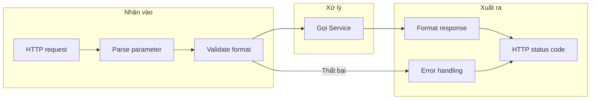

# 2.5.2 Tầng giao tiếp frontend-backend — Tầng interface

## Một câu phá đề

Tầng interface là "người phiên dịch" giữa frontend-backend — nó chuyển HTTP request thành parameter mà tầng nghiệp vụ hiểu được, chuyển kết quả từ tầng nghiệp vụ thành HTTP response chuẩn.

## Ranh giới trách nhiệm tầng interface



| Nên làm | Không nên làm |
|--------|----------|
| Parse request parameter | Implement business logic |
| Validate parameter format | Thao tác database trực tiếp |
| Gọi Service layer | Xử lý complex business rules |
| Format response data | Cross-entity operations |
| Xử lý HTTP error | Send email etc side effects |

## Tầng interface trong Next.js

### API Routes vs Server Actions

| Đặc điểm | API Routes | Server Actions |
|------|-----------|----------------|
| **Cách trigger** | HTTP request | Function call |
| **Tình huống áp dụng** | External API, Webhook | Internal data mutation |
| **Vị trí file** | `app/api/*/route.ts` | `app/actions/*.ts` |
| **Return format** | Response object | Any serializable data |

### API Route structure

```typescript
// app/api/posts/route.ts
import { NextRequest, NextResponse } from 'next/server'
import { postService } from '@/services/post.service'
import { CreatePostSchema } from '@/schemas/post'

// GET /api/posts
export async function GET(request: NextRequest) {
  const searchParams = request.nextUrl.searchParams
  const page = Number(searchParams.get('page')) || 1
  const pageSize = Number(searchParams.get('pageSize')) || 10

  const result = await postService.list({ page, pageSize })

  return NextResponse.json({
    code: 200,
    message: 'Lấy thành công',
    data: result,
  })
}

// POST /api/posts
export async function POST(request: NextRequest) {
  const body = await request.json()

  // Parameter validation
  const validated = CreatePostSchema.safeParse(body)
  if (!validated.success) {
    return NextResponse.json({
      code: 400,
      message: 'Lỗi tham số',
      errors: validated.error.flatten().fieldErrors,
    }, { status: 400 })
  }

  // Gọi Service
  const post = await postService.create(validated.data)

  return NextResponse.json({
    code: 200,
    message: 'Tạo thành công',
    data: post,
  }, { status: 201 })
}
```

### Dynamic route

```typescript
// app/api/posts/[id]/route.ts
import { NextRequest, NextResponse } from 'next/server'
import { postService } from '@/services/post.service'

// GET /api/posts/:id
export async function GET(
  request: NextRequest,
  { params }: { params: { id: string } }
) {
  const post = await postService.findById(params.id)

  if (!post) {
    return NextResponse.json({
      code: 404,
      message: 'Bài viết không tồn tại',
    }, { status: 404 })
  }

  return NextResponse.json({
    code: 200,
    data: post,
  })
}

// DELETE /api/posts/:id
export async function DELETE(
  request: NextRequest,
  { params }: { params: { id: string } }
) {
  await postService.delete(params.id)

  return NextResponse.json({
    code: 200,
    message: 'Xóa thành công',
  })
}
```

## Unified error handling

### Custom error class

```typescript
// lib/errors.ts
export class AppError extends Error {
  constructor(
    public code: number,
    public message: string,
    public status: number = 400
  ) {
    super(message)
  }
}

export class NotFoundError extends AppError {
  constructor(message = 'Tài nguyên không tồn tại') {
    super(404, message, 404)
  }
}

export class UnauthorizedError extends AppError {
  constructor(message = 'Chưa xác thực') {
    super(401, message, 401)
  }
}

export class ForbiddenError extends AppError {
  constructor(message = 'Không có quyền') {
    super(403, message, 403)
  }
}
```

### Error handling wrapper

```typescript
// lib/api-handler.ts
import { NextRequest, NextResponse } from 'next/server'
import { AppError } from './errors'

type Handler = (request: NextRequest, context?: any) => Promise<NextResponse>

export function withErrorHandler(handler: Handler): Handler {
  return async (request, context) => {
    try {
      return await handler(request, context)
    } catch (error) {
      console.error('API Error:', error)

      if (error instanceof AppError) {
        return NextResponse.json({
          code: error.code,
          message: error.message,
        }, { status: error.status })
      }

      return NextResponse.json({
        code: 500,
        message: 'Lỗi nội bộ server',
      }, { status: 500 })
    }
  }
}
```

### Using error handling

```typescript
// app/api/posts/[id]/route.ts
import { withErrorHandler } from '@/lib/api-handler'
import { NotFoundError } from '@/lib/errors'

export const GET = withErrorHandler(async (request, { params }) => {
  const post = await postService.findById(params.id)

  if (!post) {
    throw new NotFoundError('Bài viết không tồn tại')
  }

  return NextResponse.json({ code: 200, data: post })
})
```

## Request validation

### Using Zod validation

```typescript
// schemas/post.ts
import { z } from 'zod'

export const CreatePostSchema = z.object({
  title: z.string().min(1, 'Tiêu đề không được để trống').max(100, 'Tiêu đề tối đa 100 ký tự'),
  content: z.string().min(10, 'Nội dung tối thiểu 10 ký tự'),
  tags: z.array(z.string()).optional(),
  status: z.enum(['draft', 'published']).default('draft'),
})

export const UpdatePostSchema = CreatePostSchema.partial()

export const ListPostsSchema = z.object({
  page: z.coerce.number().min(1).default(1),
  pageSize: z.coerce.number().min(1).max(100).default(10),
  status: z.enum(['draft', 'published']).optional(),
})
```

### Validate query parameters

```typescript
// app/api/posts/route.ts
export async function GET(request: NextRequest) {
  const searchParams = Object.fromEntries(request.nextUrl.searchParams)

  const validated = ListPostsSchema.safeParse(searchParams)
  if (!validated.success) {
    return NextResponse.json({
      code: 400,
      message: 'Lỗi tham số',
      errors: validated.error.flatten().fieldErrors,
    }, { status: 400 })
  }

  const result = await postService.list(validated.data)
  return NextResponse.json({ code: 200, data: result })
}
```

## Authentication middleware

```typescript
// lib/auth-middleware.ts
import { getServerSession } from 'next-auth'
import { NextRequest, NextResponse } from 'next/server'
import { authOptions } from '@/lib/auth'

export async function withAuth(
  request: NextRequest,
  handler: (request: NextRequest, user: User) => Promise<NextResponse>
) {
  const session = await getServerSession(authOptions)

  if (!session?.user) {
    return NextResponse.json({
      code: 401,
      message: 'Vui lòng đăng nhập trước',
    }, { status: 401 })
  }

  return handler(request, session.user)
}
```

## Giác ngộ: Vấn đề thường gặp tầng interface

### 1. Viết business logic ở tầng interface

```typescript
// ❌ Business logic không nên ở route.ts
export async function POST(request: NextRequest) {
  const body = await request.json()

  // Những thứ này nên ở Service layer
  const existingUser = await prisma.user.findUnique({ ... })
  if (existingUser) { ... }
  const hashedPassword = await bcrypt.hash(body.password, 10)
  const user = await prisma.user.create({ ... })
  await sendWelcomeEmail(user.email)

  return NextResponse.json({ ... })
}

// ✅ Tầng interface chỉ forward
export async function POST(request: NextRequest) {
  const body = await request.json()
  const validated = CreateUserSchema.safeParse(body)
  if (!validated.success) { ... }

  const user = await userService.register(validated.data)

  return NextResponse.json({ code: 200, data: user })
}
```

### 2. Dùng status code không đúng

```typescript
// ❌ Tất cả response đều dùng 200
return NextResponse.json({ code: 404, message: 'Không tồn tại' })  // HTTP 200

// ✅ HTTP status code và business code tương ứng
return NextResponse.json(
  { code: 404, message: 'Không tồn tại' },
  { status: 404 }  // HTTP 404
)
```

### 3. Response format không thống nhất

```typescript
// ❌ Nhiều format trộn lẫn
return NextResponse.json({ success: true, data: user })
return NextResponse.json({ error: 'Not found' })
return NextResponse.json(user)

// ✅ Format thống nhất
return NextResponse.json({ code: 200, message: 'Thành công', data: user })
return NextResponse.json({ code: 404, message: 'Không tồn tại' })
```

## Tóm tắt phần này

| Nguyên tắc | Giải thích |
|------|------|
| **Chỉ forward** | Tầng interface không implement business logic |
| **Validate trước** | Validate parameter trước, rồi mới gọi Service |
| **Format thống nhất** | Response format và error handling giữ nhất quán |
| **Status code chính xác** | HTTP status code phải phản ánh tình huống thực |
