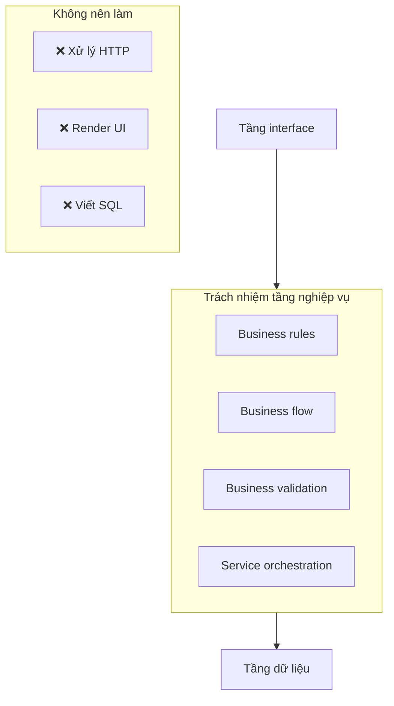
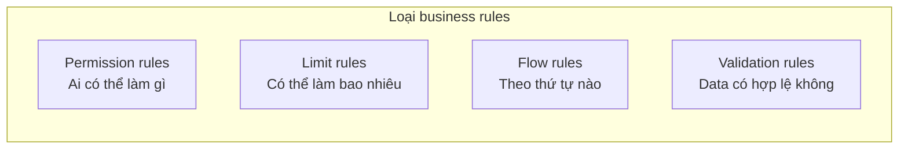
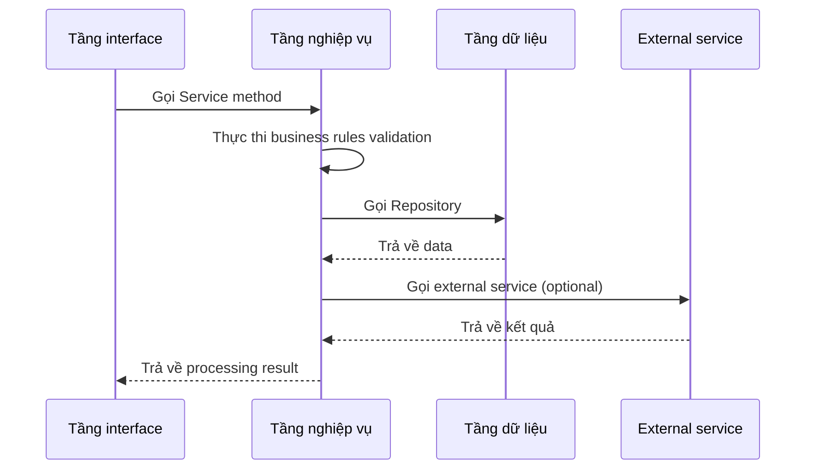

# 2.5.3 Tầng xử lý business phức tạp — Tầng nghiệp vụ

## Một câu phá đề

Tầng nghiệp vụ là "bộ não" của ứng dụng — nó đóng gói tất cả business rules và core logic, không quan tâm data được lưu thế nào, giao diện hiển thị ra sao, chỉ quan tâm "nghiệp vụ nên làm như thế nào".

## Ranh giới trách nhiệm tầng nghiệp vụ



| Nên làm | Không nên làm |
|--------|----------|
| Implement business rules | Xử lý HTTP request/response |
| Business data validation | Viết Prisma query trực tiếp |
| Orchestrate nhiều data operation | Render UI component |
| Gọi external service | Xử lý routing logic |

## Service basic structure

### Tổ chức file

```
services/
├── auth.service.ts      # Authentication related
├── user.service.ts      # User related
├── post.service.ts      # Post related
└── notification.service.ts  # Notification related
```

### Basic pattern

```typescript
// services/post.service.ts
import { postRepository } from '@/repositories/post.repository'
import { userRepository } from '@/repositories/user.repository'
import { NotFoundError, ForbiddenError } from '@/lib/errors'
import type { CreatePostInput, UpdatePostInput } from '@/types/post'

export const postService = {
  // Lấy danh sách bài viết
  async list(params: { page: number; pageSize: number; authorId?: string }) {
    return postRepository.findMany(params)
  },

  // Lấy một bài viết
  async findById(id: string) {
    const post = await postRepository.findById(id)
    if (!post) {
      throw new NotFoundError('Bài viết không tồn tại')
    }
    return post
  },

  // Tạo bài viết
  async create(input: CreatePostInput, authorId: string) {
    // Business rule: Kiểm tra user có thể publish không
    const user = await userRepository.findById(authorId)
    if (user.status === 'banned') {
      throw new ForbiddenError('Tài khoản đã bị cấm publish')
    }

    // Business rule: Free user mỗi ngày giới hạn 3 bài
    if (user.plan === 'free') {
      const todayCount = await postRepository.countTodayByAuthor(authorId)
      if (todayCount >= 3) {
        throw new ForbiddenError('Hôm nay publish đã đạt giới hạn')
      }
    }

    return postRepository.create({ ...input, authorId })
  },

  // Cập nhật bài viết
  async update(id: string, input: UpdatePostInput, userId: string) {
    const post = await this.findById(id)

    // Business rule: Chỉ edit được bài viết của mình
    if (post.authorId !== userId) {
      throw new ForbiddenError('Không có quyền edit bài viết này')
    }

    return postRepository.update(id, input)
  },

  // Xóa bài viết
  async delete(id: string, userId: string) {
    const post = await this.findById(id)

    if (post.authorId !== userId) {
      throw new ForbiddenError('Không có quyền xóa bài viết này')
    }

    return postRepository.delete(id)
  },
}
```

## Business rules encapsulation

### Rules classification



### Permission rules example

```typescript
// services/post.service.ts
async publish(postId: string, userId: string) {
  const post = await postRepository.findById(postId)

  // Permission rule 1: Bài viết phải tồn tại
  if (!post) {
    throw new NotFoundError()
  }

  // Permission rule 2: Chỉ tác giả mới publish được
  if (post.authorId !== userId) {
    throw new ForbiddenError('Chỉ tác giả mới publish được bài viết')
  }

  // Permission rule 3: Bản nháp mới publish được
  if (post.status !== 'draft') {
    throw new ForbiddenError('Chỉ bản nháp mới có thể publish')
  }

  return postRepository.update(postId, {
    status: 'published',
    publishedAt: new Date(),
  })
}
```

### Limit rules example

```typescript
// services/user.service.ts
async uploadAvatar(userId: string, file: File) {
  const user = await userRepository.findById(userId)

  // Limit rule 1: File size
  const maxSize = user.plan === 'pro' ? 10 * 1024 * 1024 : 2 * 1024 * 1024
  if (file.size > maxSize) {
    throw new ForbiddenError(`File size không được vượt quá ${maxSize / 1024 / 1024}MB`)
  }

  // Limit rule 2: File type
  const allowedTypes = ['image/jpeg', 'image/png', 'image/webp']
  if (!allowedTypes.includes(file.type)) {
    throw new ForbiddenError('Chỉ hỗ trợ JPG, PNG, WebP format')
  }

  // Upload logic...
}
```

## Service orchestration

Khi một operation liên quan đến nhiều data entity, Service layer chịu trách nhiệm orchestrate:

```typescript
// services/order.service.ts
async createOrder(input: CreateOrderInput, userId: string) {
  // 1. Validate user
  const user = await userRepository.findById(userId)
  if (!user) throw new NotFoundError('User không tồn tại')

  // 2. Validate product stock
  const product = await productRepository.findById(input.productId)
  if (!product) throw new NotFoundError('Sản phẩm không tồn tại')
  if (product.stock < input.quantity) {
    throw new ForbiddenError('Kho không đủ')
  }

  // 3. Tính giá (apply ưu đãi etc business rules)
  const totalPrice = this.calculatePrice(product, input.quantity, input.couponCode)

  // 4. Tạo order (transaction)
  return prisma.$transaction(async (tx) => {
    // Trừ kho
    await productRepository.decreaseStock(tx, input.productId, input.quantity)

    // Tạo order
    const order = await orderRepository.create(tx, {
      userId,
      productId: input.productId,
      quantity: input.quantity,
      totalPrice,
    })

    // Gửi notification
    await notificationService.sendOrderCreated(user.email, order)

    return order
  })
}
```

## Tương tác với các tầng khác



## Giác ngộ: Vấn đề thường gặp tầng nghiệp vụ

### 1. Service trở thành "tầng passthrough"

```typescript
// ❌ Không có business logic, chỉ forward
async findById(id: string) {
  return postRepository.findById(id)
}

// ✅ Nên bao gồm business processing
async findById(id: string) {
  const post = await postRepository.findById(id)
  if (!post) throw new NotFoundError()

  // Business logic: Tăng lượt xem
  await postRepository.incrementViewCount(id)

  return post
}
```

### 2. Viết Prisma query trong Service

```typescript
// ❌ Data access nên ở Repository
async list() {
  return prisma.post.findMany({
    where: { status: 'published' },
    include: { author: true },
  })
}

// ✅ Gọi Repository
async list() {
  return postRepository.findPublished()
}
```

### 3. Business rules phân tán khắp nơi

```typescript
// ❌ Cùng một rule lặp lại nhiều chỗ
// page.tsx
if (post.authorId !== userId) { ... }
// route.ts
if (post.authorId !== userId) { ... }

// ✅ Rule tập trung trong Service
// service.ts
async checkOwnership(postId: string, userId: string) {
  const post = await this.findById(postId)
  if (post.authorId !== userId) {
    throw new ForbiddenError()
  }
  return post
}
```

## Tóm tắt phần này

| Nguyên tắc | Giải thích |
|------|------|
| **Rules centralized** | Tất cả business rules viết trong Service layer |
| **Service orchestration** | Cross-entity operation do Service điều phối |
| **Không động database** | Data operation ủy thác cho Repository |
| **Không xử lý HTTP** | HTTP related logic ở interface layer |
