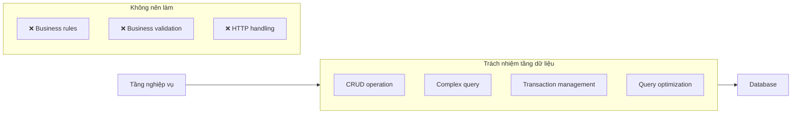

# 2.5.4 Tầng giao tiếp với database — Tầng dữ liệu

## Một câu phá đề

Tầng dữ liệu là "cầu nối" giữa ứng dụng và database — nó đóng gói tất cả data access logic, để tầng trên không cần quan tâm data được lưu thế nào, lấy ra sao.

## Ranh giới trách nhiệm tầng dữ liệu



| Nên làm | Không nên làm |
|--------|----------|
| CRUD của data | Business logic judge |
| Complex SQL/query | Permission validation |
| Transaction control | Send notification |
| Data transformation | Gọi external service |

## Repository pattern

### Basic structure

```typescript
// repositories/post.repository.ts
import { prisma } from '@/lib/prisma'
import type { Prisma } from '@prisma/client'

export const postRepository = {
  // Base CRUD
  async findById(id: string) {
    return prisma.post.findUnique({
      where: { id },
      include: { author: true, tags: true },
    })
  },

  async findMany(params: {
    page: number
    pageSize: number
    authorId?: string
    status?: string
  }) {
    const { page, pageSize, authorId, status } = params

    const where: Prisma.PostWhereInput = {}
    if (authorId) where.authorId = authorId
    if (status) where.status = status

    const [posts, total] = await Promise.all([
      prisma.post.findMany({
        where,
        skip: (page - 1) * pageSize,
        take: pageSize,
        orderBy: { createdAt: 'desc' },
        include: { author: true },
      }),
      prisma.post.count({ where }),
    ])

    return { posts, total, page, pageSize }
  },

  async create(data: Prisma.PostCreateInput) {
    return prisma.post.create({
      data,
      include: { author: true },
    })
  },

  async update(id: string, data: Prisma.PostUpdateInput) {
    return prisma.post.update({
      where: { id },
      data,
      include: { author: true },
    })
  },

  async delete(id: string) {
    return prisma.post.delete({ where: { id } })
  },
}
```

### Business query method

```typescript
// repositories/post.repository.ts
export const postRepository = {
  // ...Base CRUD

  // Business related query
  async findPublished() {
    return prisma.post.findMany({
      where: { status: 'published' },
      orderBy: { publishedAt: 'desc' },
    })
  },

  async findByAuthor(authorId: string) {
    return prisma.post.findMany({
      where: { authorId },
      orderBy: { createdAt: 'desc' },
    })
  },

  async countTodayByAuthor(authorId: string) {
    const today = new Date()
    today.setHours(0, 0, 0, 0)

    return prisma.post.count({
      where: {
        authorId,
        createdAt: { gte: today },
      },
    })
  },

  async incrementViewCount(id: string) {
    return prisma.post.update({
      where: { id },
      data: { viewCount: { increment: 1 } },
    })
  },

  async findWithRelations(id: string) {
    return prisma.post.findUnique({
      where: { id },
      include: {
        author: true,
        tags: true,
        comments: {
          include: { author: true },
          orderBy: { createdAt: 'desc' },
        },
      },
    })
  },
}
```

## Transaction handling

### Simple transaction

```typescript
// repositories/order.repository.ts
async createWithItems(
  orderData: Prisma.OrderCreateInput,
  items: Prisma.OrderItemCreateManyInput[]
) {
  return prisma.$transaction(async (tx) => {
    const order = await tx.order.create({ data: orderData })

    await tx.orderItem.createMany({
      data: items.map(item => ({ ...item, orderId: order.id })),
    })

    return order
  })
}
```

### Method với transaction parameter

```typescript
// repositories/product.repository.ts
async decreaseStock(
  tx: Prisma.TransactionClient,
  productId: string,
  quantity: number
) {
  return tx.product.update({
    where: { id: productId },
    data: { stock: { decrement: quantity } },
  })
}

// Usage
await prisma.$transaction(async (tx) => {
  await productRepository.decreaseStock(tx, productId, quantity)
  await orderRepository.create(tx, orderData)
})
```

## Complex query

### Relation query

```typescript
async findPostsWithStats(authorId: string) {
  return prisma.post.findMany({
    where: { authorId },
    include: {
      _count: {
        select: {
          comments: true,
          likes: true,
        },
      },
    },
  })
}
```

### Aggregate query

```typescript
async getAuthorStats(authorId: string) {
  return prisma.post.aggregate({
    where: { authorId },
    _count: { id: true },
    _sum: { viewCount: true },
    _avg: { viewCount: true },
  })
}
```

### Group by query

```typescript
async getPostCountByStatus(authorId: string) {
  return prisma.post.groupBy({
    by: ['status'],
    where: { authorId },
    _count: { id: true },
  })
}
```

## Data transformation

```typescript
// repositories/user.repository.ts
import type { User } from '@prisma/client'
import type { UserDTO } from '@/types/user'

function toDTO(user: User): UserDTO {
  return {
    id: user.id,
    name: user.name,
    email: user.email,
    avatar: user.avatar,
    createdAt: user.createdAt.toISOString(),
    // Không trả về password và sensitive field
  }
}

export const userRepository = {
  async findById(id: string): Promise<UserDTO | null> {
    const user = await prisma.user.findUnique({ where: { id } })
    return user ? toDTO(user) : null
  },
}
```

## Giác ngộ: Vấn đề thường gặp tầng dữ liệu

### 1. Viết business logic trong Repository

```typescript
// ❌ Permission judgment là business logic
async findById(id: string, userId: string) {
  const post = await prisma.post.findUnique({ where: { id } })
  if (post.authorId !== userId) {
    throw new Error('Không có quyền')  // Đây là business logic!
  }
  return post
}

// ✅ Repository chỉ chịu trách nhiệm lấy data
async findById(id: string) {
  return prisma.post.findUnique({ where: { id } })
}
// Permission judgment đặt ở Service layer
```

### 2. Query condition hardcode

```typescript
// ❌ Query condition hardcode
async findPosts() {
  return prisma.post.findMany({
    where: { status: 'published' },  // Hardcode
  })
}

// ✅ Truyền qua parameter
async findPosts(params: { status?: string }) {
  const where: Prisma.PostWhereInput = {}
  if (params.status) where.status = params.status
  return prisma.post.findMany({ where })
}
```

### 3. N+1 query problem

```typescript
// ❌ Query trong loop, gây ra N+1
const posts = await prisma.post.findMany()
for (const post of posts) {
  post.author = await prisma.user.findUnique({
    where: { id: post.authorId }
  })
}

// ✅ Dùng include query một lần
const posts = await prisma.post.findMany({
  include: { author: true }
})
```

## Prisma best practices

### 1. Singleton pattern

```typescript
// lib/prisma.ts
import { PrismaClient } from '@prisma/client'

const globalForPrisma = globalThis as unknown as {
  prisma: PrismaClient | undefined
}

export const prisma = globalForPrisma.prisma ?? new PrismaClient()

if (process.env.NODE_ENV !== 'production') {
  globalForPrisma.prisma = prisma
}
```

### 2. Query logging

```typescript
const prisma = new PrismaClient({
  log: process.env.NODE_ENV === 'development'
    ? ['query', 'error', 'warn']
    : ['error'],
})
```

### 3. Soft delete

```typescript
// Implement soft delete bằng middleware
prisma.$use(async (params, next) => {
  if (params.model === 'Post') {
    if (params.action === 'delete') {
      params.action = 'update'
      params.args.data = { deletedAt: new Date() }
    }
    if (params.action === 'findMany') {
      params.args.where = { ...params.args.where, deletedAt: null }
    }
  }
  return next(params)
})
```

## Tóm tắt phần này

| Nguyên tắc | Giải thích |
|------|------|
| **Chỉ quản data** | Repository chỉ chịu trách nhiệm data access |
| **Parameterized query** | Query condition truyền qua parameter |
| **Tránh N+1** | Dùng include relation query |
| **Transaction encapsulation** | Complex operation dùng transaction đảm bảo consistency |
