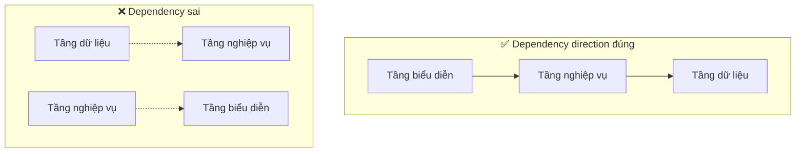

# 2.5.5 Các tầng giao tiếp như thế nào — Giao tiếp giữa tầng

## Một câu phá đề

Cách tầng giao tiếp với nhau quyết định khả năng maintain của code — Thông qua interface abstraction và dependency injection, có thể để các tầng loose coupling, thuận tiện cho testing và replacement.

## Nguyên tắc dependency relationship



**Nguyên tắc cốt lõi**: Tầng trên depend tầng dưới, tầng dưới không depend tầng trên.

| Tầng | Có thể depend | Không thể depend |
|------|----------|----------|
| Tầng biểu diễn | Tầng nghiệp vụ | - |
| Tầng nghiệp vụ | Tầng dữ liệu | Tầng biểu diễn |
| Tầng dữ liệu | Không | Tầng nghiệp vụ, Tầng biểu diễn |

## Interface abstraction

### Định nghĩa interface

```typescript
// types/repositories.ts
export interface IPostRepository {
  findById(id: string): Promise<Post | null>
  findMany(params: FindManyParams): Promise<PaginatedResult<Post>>
  create(data: CreatePostInput): Promise<Post>
  update(id: string, data: UpdatePostInput): Promise<Post>
  delete(id: string): Promise<void>
}

export interface IUserRepository {
  findById(id: string): Promise<User | null>
  findByEmail(email: string): Promise<User | null>
  create(data: CreateUserInput): Promise<User>
}
```

### Implement interface

```typescript
// repositories/post.repository.ts
import type { IPostRepository } from '@/types/repositories'

export const postRepository: IPostRepository = {
  async findById(id) {
    return prisma.post.findUnique({ where: { id } })
  },

  async findMany(params) {
    // Implementation...
  },

  async create(data) {
    return prisma.post.create({ data })
  },

  async update(id, data) {
    return prisma.post.update({ where: { id }, data })
  },

  async delete(id) {
    await prisma.post.delete({ where: { id } })
  },
}
```

## Dependency injection

### Simple approach: Direct import

```typescript
// services/post.service.ts
import { postRepository } from '@/repositories/post.repository'

export const postService = {
  async findById(id: string) {
    return postRepository.findById(id)
  },
}
```

Áp dụng cho: Small project, rapid development.

### Factory pattern

```typescript
// services/post.service.ts
import type { IPostRepository } from '@/types/repositories'

export function createPostService(repo: IPostRepository) {
  return {
    async findById(id: string) {
      const post = await repo.findById(id)
      if (!post) throw new NotFoundError()
      return post
    },

    async create(input: CreatePostInput, authorId: string) {
      return repo.create({ ...input, authorId })
    },
  }
}

// Tạo instance
import { postRepository } from '@/repositories/post.repository'
export const postService = createPostService(postRepository)
```

Áp dụng cho: Cần testing, cần replace implementation.

### Dependency container

```typescript
// lib/container.ts
import { postRepository } from '@/repositories/post.repository'
import { userRepository } from '@/repositories/user.repository'
import { createPostService } from '@/services/post.service'
import { createUserService } from '@/services/user.service'

// Tạo tất cả service instance
export const container = {
  repositories: {
    post: postRepository,
    user: userRepository,
  },
  services: {
    post: createPostService(postRepository),
    user: createUserService(userRepository),
  },
}

// Usage
import { container } from '@/lib/container'
const post = await container.services.post.findById(id)
```

## Dependency replacement trong testing

### Mock Repository

```typescript
// tests/post.service.test.ts
import { createPostService } from '@/services/post.service'

const mockPostRepository = {
  findById: jest.fn(),
  findMany: jest.fn(),
  create: jest.fn(),
  update: jest.fn(),
  delete: jest.fn(),
}

const postService = createPostService(mockPostRepository)

describe('PostService', () => {
  beforeEach(() => {
    jest.clearAllMocks()
  })

  describe('findById', () => {
    it('should return post when found', async () => {
      const mockPost = { id: '1', title: 'Test' }
      mockPostRepository.findById.mockResolvedValue(mockPost)

      const result = await postService.findById('1')

      expect(result).toEqual(mockPost)
      expect(mockPostRepository.findById).toHaveBeenCalledWith('1')
    })

    it('should throw NotFoundError when not found', async () => {
      mockPostRepository.findById.mockResolvedValue(null)

      await expect(postService.findById('1')).rejects.toThrow(NotFoundError)
    })
  })
})
```

### Dùng real database testing

```typescript
// tests/integration/post.repository.test.ts
import { postRepository } from '@/repositories/post.repository'
import { prisma } from '@/lib/prisma'

describe('PostRepository Integration', () => {
  beforeEach(async () => {
    await prisma.post.deleteMany()
  })

  afterAll(async () => {
    await prisma.$disconnect()
  })

  it('should create and find post', async () => {
    const created = await postRepository.create({
      title: 'Test',
      content: 'Content',
      authorId: 'user-1',
    })

    const found = await postRepository.findById(created.id)

    expect(found).toMatchObject({
      title: 'Test',
      content: 'Content',
    })
  })
})
```

## Cross-layer data transfer

### Dùng DTO

```typescript
// types/dto.ts
export interface PostDTO {
  id: string
  title: string
  content: string
  author: {
    id: string
    name: string
  }
  createdAt: string
}

// Tầng dữ liệu trả về raw data
// Tầng nghiệp vụ transform thành DTO
// Tầng biểu diễn dùng DTO

// services/post.service.ts
function toDTO(post: PostWithAuthor): PostDTO {
  return {
    id: post.id,
    title: post.title,
    content: post.content,
    author: {
      id: post.author.id,
      name: post.author.name,
    },
    createdAt: post.createdAt.toISOString(),
  }
}

export const postService = {
  async findById(id: string): Promise<PostDTO> {
    const post = await postRepository.findWithAuthor(id)
    if (!post) throw new NotFoundError()
    return toDTO(post)
  },
}
```

## Giác ngộ: Vấn đề thường gặp giao tiếp giữa tầng

### 1. Circular dependency

```typescript
// ❌ Service A depend Service B, B lại depend A
// user.service.ts
import { postService } from './post.service'
// post.service.ts
import { userService } from './user.service'

// ✅ Decouple qua event hoặc callback
// Hoặc extract common logic sang Service mới
```

### 2. Cross-layer direct call

```typescript
// ❌ Tầng biểu diễn call trực tiếp tầng dữ liệu
// page.tsx
const post = await prisma.post.findUnique({ where: { id } })

// ✅ Qua tầng nghiệp vụ
// page.tsx
const post = await postService.findById(id)
```

### 3. Expose internal implementation

```typescript
// ❌ Trả về Prisma type, expose ORM detail
async findById(id: string): Promise<Prisma.Post> { }

// ✅ Trả về business type
async findById(id: string): Promise<Post> { }
```

## Tóm tắt phần này

| Nguyên tắc | Giải thích |
|------|------|
| **Unidirectional dependency** | Tầng trên depend tầng dưới, không thể ngược lại |
| **Interface abstraction** | Định nghĩa contract giữa các tầng qua interface |
| **Dependency injection** | Runtime truyền dependency, thuận tiện cho testing |
| **DTO transfer** | Cross-layer dùng DTO, ẩn internal implementation |
