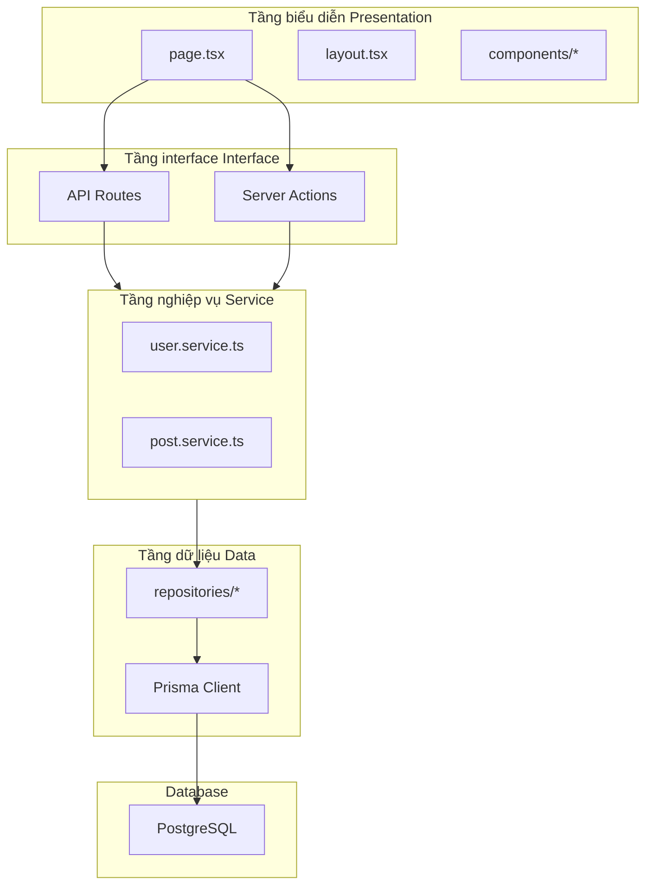

# 2.5 Code tại sao càng viết càng lộn xộn — Phân tầng kiến trúc

## Tái cấu trúc nhận thức

Lý do căn bản khiến code càng viết càng lộn xộn là: **trách nhiệm lẫn lộn**. Page component viết database query, API route viết business logic, code trùng lặp khắp nơi. Mục đích của phân tầng kiến trúc là **để mỗi tầng chỉ làm một việc**.

```
Code lộn xộn: page.tsx vừa có UI, vừa có business logic, còn có cả database operation
Code tốt: page.tsx chỉ quản UI, logic giao cho service, data giao cho repository
```

## Toàn cảnh phân tầng kiến trúc



## Tổng quan trách nhiệm từng tầng

| Tầng | Trách nhiệm | File quan trọng |
|------|------|----------|
| **Tầng biểu diễn** | UI rendering, user interaction | `page.tsx`, `components/*` |
| **Tầng interface** | Request handling, parameter validation | `route.ts`, `actions.ts` |
| **Tầng nghiệp vụ** | Core logic, business rules | `*.service.ts` |
| **Tầng dữ liệu** | Data access, ORM operations | `*.repository.ts`, Prisma |

## Tại sao cần phân tầng?

### Code không phân tầng

```typescript
// app/posts/page.tsx - Một file làm tất cả mọi thứ
export default async function PostsPage() {
  // UI quan tâm
  const session = await getServerSession()

  // Business logic
  if (!session) {
    redirect('/login')
  }

  // Data access
  const posts = await prisma.post.findMany({
    where: { authorId: session.user.id },
    orderBy: { createdAt: 'desc' },
    include: { author: true, tags: true },
  })

  // Business logic nữa
  const publishedPosts = posts.filter(p => p.status === 'published')
  const draftPosts = posts.filter(p => p.status === 'draft')

  return (
    <div>
      <h1>Bài viết của tôi</h1>
      {/* JSX rất dài */}
    </div>
  )
}
```

**Vấn đề**:
- Đổi database phải sửa file page
- Business logic không thể tái sử dụng
- Khó test
- Code do AI generate nằm lung tung khắp nơi

### Code sau khi phân tầng

```typescript
// app/posts/page.tsx - Chỉ quan tâm UI
export default async function PostsPage() {
  const { publishedPosts, draftPosts } = await postService.getMyPosts()

  return (
    <div>
      <PostTabs published={publishedPosts} drafts={draftPosts} />
    </div>
  )
}

// services/post.service.ts - Chỉ quan tâm business logic
export const postService = {
  async getMyPosts() {
    const session = await authService.requireAuth()
    const posts = await postRepository.findByAuthor(session.user.id)

    return {
      publishedPosts: posts.filter(p => p.status === 'published'),
      draftPosts: posts.filter(p => p.status === 'draft'),
    }
  }
}

// repositories/post.repository.ts - Chỉ quan tâm data access
export const postRepository = {
  async findByAuthor(authorId: string) {
    return prisma.post.findMany({
      where: { authorId },
      orderBy: { createdAt: 'desc' },
      include: { author: true, tags: true },
    })
  }
}
```

**Lợi ích**:
- Mỗi tầng trách nhiệm đơn nhất, dễ hiểu
- Business logic tái sử dụng được
- Dễ test (Mock tầng data là được)
- Code do AI generate có vị trí cố định để đặt

## Gợi ý cấu trúc thư mục

```
src/
├── app/                    # Tầng biểu diễn + Tầng interface
│   ├── (marketing)/        # Marketing pages
│   ├── (dashboard)/        # Dashboard pages
│   ├── api/                # API Routes
│   └── actions/            # Server Actions (có thể tách riêng)
│
├── components/             # UI components
│   ├── ui/                 # Base UI components
│   └── features/           # Business components
│
├── services/               # Tầng nghiệp vụ
│   ├── auth.service.ts
│   ├── user.service.ts
│   └── post.service.ts
│
├── repositories/           # Tầng dữ liệu
│   ├── user.repository.ts
│   └── post.repository.ts
│
├── lib/                    # Utility functions
│   ├── prisma.ts
│   └── utils.ts
│
└── types/                  # Type definitions
    ├── user.ts
    └── post.ts
```

## Điều hướng chương này

- **2.5.1 Tầng biểu diễn**: Page component và route management
- **2.5.2 Tầng interface**: API route và HTTP handling
- **2.5.3 Tầng nghiệp vụ**: Core logic và rules encapsulation
- **2.5.4 Tầng dữ liệu**: ORM và database interaction
- **2.5.5 Giao tiếp giữa các tầng**: Dependency injection và interface abstraction
