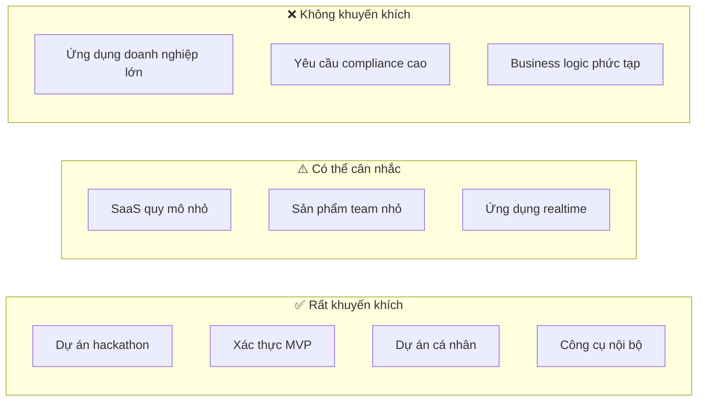
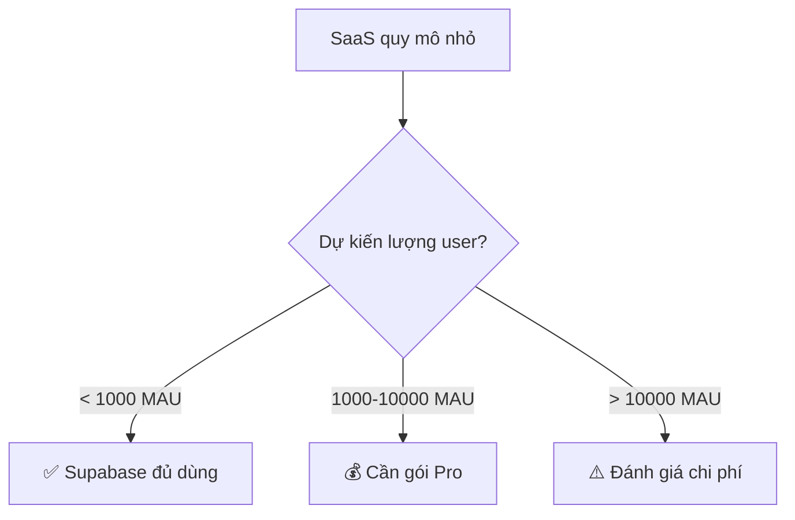
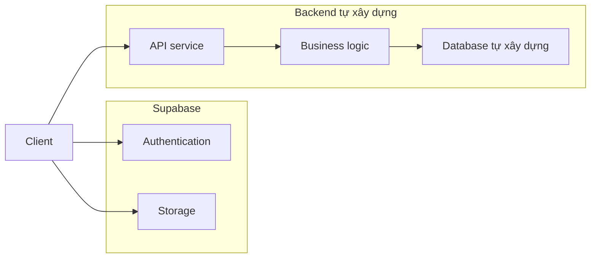

# 2.6.2 Tình huống áp dụng: Prototype nhanh vs môi trường production

## Một câu phá đề

Supabase vô địch trong tình huống "ra mắt nhanh", nhưng đến giai đoạn "tùy chỉnh sâu" thì phải cân nhắc kỹ.

## Ma trận quyết định tình huống



## ✅ Tình huống rất khuyến khích

### 1. Hackathon / Thi đấu 48 giờ

```typescript
// 10 phút xây dựng backend hoàn chỉnh
// 1. Tạo project (supabase.com)
// 2. Tạo table (giao diện trực quan)
// 3. Viết code

const { data } = await supabase
  .from('submissions')
  .insert({ name, idea, team_id })
  .select()

// Xong! Không cần config database, không cần viết API
```

**Tại sao phù hợp**: Thời gian gấp, xác thực ý tưởng quan trọng hơn chất lượng code.

### 2. Xác thực sản phẩm MVP

| Giai đoạn | Dùng Supabase | Cách truyền thống |
|------|-------------|----------|
| Xây dựng backend | 1 ngày | 1-2 tuần |
| User authentication | 30 phút | 2-3 ngày |
| Upload file | 1 giờ | 1-2 ngày |
| **Tổng** | **1-2 ngày** | **2-3 tuần** |

**Giá trị cốt lõi**: Nhanh chóng xác thực giả thuyết sản phẩm, thất bại cũng mất ít nhất.

### 3. Dự án cá nhân / Side Project

```typescript
// Blog cá nhân, ứng dụng note, công cụ TODO etc
// Gói miễn phí hoàn toàn đủ dùng:
// - 500MB database
// - 1GB file storage
// - 200 concurrent connections
```

### 4. Công cụ nội bộ

- Hệ thống quản lý backend
- Data dashboard
- Công cụ collaboration team

**Ưu điểm**: Lượng user có thể kiểm soát, gói miễn phí đủ dùng, iteration nhanh.

## ⚠️ Có thể cân nhắc

### SaaS quy mô nhỏ



### Ứng dụng collaboration realtime

```typescript
// Supabase Realtime sẵn sàng dùng
const channel = supabase
  .channel('room:123')
  .on('broadcast', { event: 'cursor' }, (payload) => {
    updateCursor(payload.userId, payload.position)
  })
  .subscribe()

// Broadcast vị trí chuột
channel.send({
  type: 'broadcast',
  event: 'cursor',
  payload: { userId, position },
})
```

**Lưu ý**: Gói miễn phí giới hạn 200 concurrent connections.

## ❌ Tình huống không khuyến khích

### 1. Business logic phức tạp

```typescript
// ❌ Business rules phức tạp khó biểu diễn bằng RLS
// Ví dụ: Duyệt nhiều cấp, quyền động, quy tắc tính phí phức tạp

// Logic này đặt trong Supabase RLS sẽ rất khổ
// Khuyến khích dùng backend truyền thống + tầng nghiệp vụ
```

### 2. Yêu cầu compliance cao

| Yêu cầu | Supabase hỗ trợ |
|------|---------------|
| Data localization | ⚠️ Hạn chế (một số khu vực) |
| Audit logs | ⚠️ Cần cấu hình thêm |
| HIPAA | ❌ Cần bản Enterprise |
| PCI DSS | ❌ Không hỗ trợ |

### 3. Đã có hạ tầng ổn định

```
Nếu bạn đã có:
- Team vận hành
- Quy trình CI/CD
- Monitoring và alerting
- Hệ thống authentication tự xây dựng

Thì giá trị của Supabase không còn lớn
```

## Phương án kết hợp

### Supabase + Backend tự xây dựng



```typescript
// Chỉ dùng Auth và Storage của Supabase
// Business logic đi qua backend tự xây dựng

// 1. Đăng nhập bằng Supabase
const { data: { session } } = await supabase.auth.getSession()

// 2. Gọi API tự xây dựng (kèm token)
const response = await fetch('/api/orders', {
  headers: {
    Authorization: `Bearer ${session?.access_token}`,
  },
})

// 3. Backend tự xây dựng xác thực Supabase JWT
import { createClient } from '@supabase/supabase-js'
const { data: { user } } = await supabase.auth.getUser(token)
```

## Giác ngộ: Nhận thức sai lầm về lựa chọn tình huống

### 1. "Miễn phí thì dùng Supabase"

```
❌ Nhận thức sai: Vì miễn phí nên dùng
✅ Suy nghĩ đúng: Vì phù hợp tình huống nên dùng

Ngay cả khi Supabase tính phí, nếu giúp bạn tiết kiệm 2 tuần phát triển,
thì vẫn đáng giá.
```

### 2. "Môi trường production không thể dùng BaaS"

```
❌ Nhận thức sai: BaaS chỉ dùng cho prototype
✅ Thực tế:

Nhiều công ty dùng Supabase chạy production:
- SaaS với lượng user không lớn
- Công cụ nội bộ
- Module cụ thể (authentication, storage)
```

### 3. "Sau này chắc chắn phải migrate, không bằng tự xây dựng ngay"

```
❌ Tối ưu hóa quá sớm
✅ Nguyên tắc YAGNI

Nếu dự án có thể thất bại, xác thực trước rồi tối ưu sau.
Chi phí migration < Chi phí thời gian xác thực thất bại.
```

## Tóm tắt phần này

| Tình huống | Mức độ khuyến khích | Lý do |
|------|--------|------|
| Hackathon/MVP | ⭐⭐⭐⭐⭐ | Tốc độ đầu tiên |
| Dự án cá nhân | ⭐⭐⭐⭐⭐ | Miễn phí đủ dùng |
| SaaS quy mô nhỏ | ⭐⭐⭐⭐ | Chi phí kiểm soát được |
| Ứng dụng realtime | ⭐⭐⭐⭐ | Sẵn sàng dùng |
| Business phức tạp | ⭐⭐ | Khó tùy chỉnh |
| Ứng dụng doanh nghiệp | ⭐ | Vấn đề compliance |
