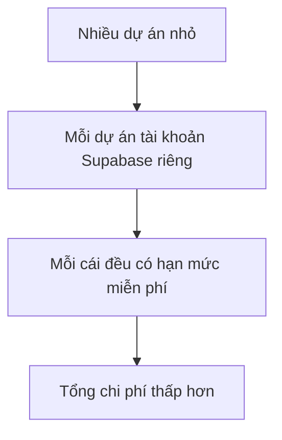

# 2.6.3 Cân nhắc chi phí: Gói miễn phí và gói trả phí

## Một câu phá đề

Gói miễn phí của Supabase rất đủ cho dự án cá nhân, nhưng khi lượng sử dụng tăng, chi phí có thể cao hơn tự xây dựng — điểm then chốt là tính toán rõ mô hình sử dụng của bạn.

## So sánh gói giá

### Ba mức giá (2024)

| Hạng mục | Free | Pro ($25/tháng) | Team ($599/tháng) |
|------|------|--------------|----------------|
| **Database** | 500 MB | 8 GB | 8 GB |
| **File storage** | 1 GB | 100 GB | 100 GB |
| **Băng thông** | 2 GB | 250 GB | 250 GB |
| **Concurrent connections** | 200 | 500 | 500 |
| **Edge Functions** | 500K lượt gọi | 2M lượt gọi | 2M lượt gọi |
| **Realtime** | 200 concurrent | 500 concurrent | 500 concurrent |
| **Chính sách tạm dừng** | 7 ngày không hoạt động | Không bao giờ tạm dừng | Không bao giờ tạm dừng |

### Chi phí khi vượt hạn mức

```
Database: $0.125/GB/tháng
Storage: $0.021/GB/tháng
Băng thông: $0.09/GB
Edge Functions: $2/1 triệu lượt gọi
```

## Ví dụ tính toán chi phí

### Tình huống 1: Blog cá nhân

```
Lượt truy cập/tháng: 5,000 PV
Database: 50 MB
File storage: 200 MB
Băng thông: 1 GB

Kết luận: ✅ Gói miễn phí hoàn toàn đủ dùng
Chi phí: $0/tháng
```

### Tình huống 2: SaaS quy mô nhỏ

```
Monthly active users: 500
Database: 2 GB
File storage: 20 GB
Băng thông: 50 GB

Phương án: Gói Pro
Chi phí: $25/tháng
```

### Tình huống 3: Ứng dụng quy mô trung bình

```
Monthly active users: 5,000
Database: 10 GB
File storage: 100 GB
Băng thông: 300 GB

Tính toán:
- Pro cơ bản: $25
- Database vượt (10-8) × $0.125 = $0.25
- Băng thông vượt (300-250) × $0.09 = $4.5

Chi phí: Khoảng $30/tháng
```

### Tình huống 4: Ứng dụng lưu lượng cao

```
Monthly active users: 50,000
Database: 100 GB
File storage: 1 TB
Băng thông: 5 TB

Trong trường hợp này, tự xây dựng có thể tiết kiệm hơn
Cần đánh giá gói Team hoặc tự host
```

## Chiến lược tối ưu chi phí

### 1. Tối ưu database

```sql
-- Định kỳ dọn dẹp dữ liệu cũ
DELETE FROM logs WHERE created_at < NOW() - INTERVAL '30 days';

-- Dùng data type phù hợp
-- ❌ Không dùng TEXT để lưu chuỗi ngắn
-- ✅ Dùng VARCHAR(100) etc
```

### 2. Tối ưu storage

```typescript
// Nén ảnh trước khi upload
import imageCompression from 'browser-image-compression'

const compressedFile = await imageCompression(file, {
  maxSizeMB: 0.5,
  maxWidthOrHeight: 1200,
})

await supabase.storage.from('images').upload(path, compressedFile)
```

### 3. Giảm băng thông

```typescript
// Chỉ query các field cần thiết
const { data } = await supabase
  .from('posts')
  .select('id, title, summary')  // Không dùng select('*')
  .limit(20)

// Dùng CDN cache
const { data } = supabase.storage
  .from('images')
  .getPublicUrl('image.jpg', {
    transform: { width: 400, height: 300 },
  })
```

### 4. Tận dụng hạn mức miễn phí



## So sánh chi phí với phương án tự xây dựng

### Ước tính chi phí tự xây dựng

| Thành phần | Chi phí/tháng |
|------|--------|
| VPS (2 core 4G) | $10-20 |
| PostgreSQL hosting | $15-50 |
| S3 storage (50GB) | $1-3 |
| Chi phí thời gian vận hành | $$$（không thể ước tính） |

### Kết luận so sánh

```
Dự án nhỏ (< 1000 users):
  Supabase tiết kiệm hơn, tiết kiệm chi phí vận hành

Dự án quy mô trung (1000-10000 users):
  Tương đương nhau, tùy mô hình sử dụng cụ thể

Dự án lớn (> 10000 users):
  Tự xây dựng có thể tiết kiệm hơn, nhưng phải tính chi phí vận hành
```

## Chi phí ẩn

### Chi phí ẩn của Supabase

- **Đường cong học tập**: RLS, Realtime cần thời gian học
- **Khó debug**: Khắc phục sự cố không trong suốt như tự xây dựng
- **Vendor lock-in**: Migration có chi phí

### Chi phí ẩn của tự xây dựng

- **Thời gian vận hành**: Backup database, cập nhật bảo mật
- **Phản hồi sự cố**: Nửa đêm database sập ai sửa
- **Lập kế hoạch mở rộng**: Ước tính capacity, điều chỉnh cấu hình

## Cảnh báo giới hạn gói miễn phí

### Chính sách tạm dừng 7 ngày

```
Gói Free: 7 ngày không hoạt động sẽ tự động tạm dừng database
- Sẽ mất kết nối database
- Cần đánh thức thủ công
- Không phù hợp môi trường production

Giải pháp:
1. Nâng cấp Pro
2. Scheduled task giữ hoạt động (không khuyến khích)
3. Tự host Supabase
```

### Giới hạn concurrent connections

```
Free: 200 concurrent
Pro: 500 concurrent

Vượt giới hạn sẽ gây kết nối thất bại
Tình huống concurrency cao cần:
1. Dùng connection pool
2. Nâng cấp lên gói cao hơn
3. Cân nhắc tự xây dựng
```

## Tóm tắt phần này

| Quy mô user | Phương án khuyến khích | Chi phí/tháng |
|----------|----------|--------|
| Dự án cá nhân | Free | $0 |
| 1-500 MAU | Free/Pro | $0-25 |
| 500-5000 MAU | Pro | $25-50 |
| 5000-50000 MAU | Team/Tự xây dựng | $100+ |
| 50000+ MAU | Tự xây dựng | Tùy tình huống |
