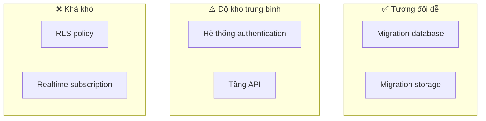
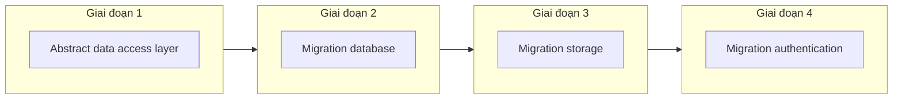

# 2.6.4 Chiến lược migration: Từ Supabase sang dịch vụ tự xây dựng

## Một câu phá đề

Supabase dựa trên công nghệ mã nguồn mở, migration không phải không thể, nhưng cần lập kế hoạch trước — khi thiết kế code phải nghĩ đến "tính thay thế được".

## Đánh giá độ khó migration



| Dịch vụ | Độ khó migration | Phương án thay thế |
|------|----------|----------|
| Database | ⭐⭐ | PostgreSQL chuẩn |
| Storage | ⭐⭐ | S3 / Alibaba Cloud OSS |
| Auth | ⭐⭐⭐ | NextAuth.js / Clerk |
| Realtime | ⭐⭐⭐⭐ | Socket.io / Pusher |
| RLS | ⭐⭐⭐⭐⭐ | Kiểm soát quyền tầng application |

## Migration database

### Export data

```bash
# Cách 1: Export từ Supabase Dashboard
# Settings > Database > Download backup

# Cách 2: Dùng pg_dump
pg_dump -h db.xxx.supabase.co \
  -p 5432 \
  -U postgres \
  -d postgres \
  -F c \
  -f backup.dump
```

### Import vào database mới

```bash
# Tạo database mới
createdb -h localhost -U postgres myapp

# Khôi phục data
pg_restore -h localhost \
  -U postgres \
  -d myapp \
  backup.dump
```

### Cải tạo code

```typescript
// Trước: Dùng Supabase client
const { data } = await supabase.from('posts').select('*')

// Sau: Dùng Prisma
const posts = await prisma.post.findMany()

// Hoặc giữ interface nhất quán
// repositories/post.repository.ts
export const postRepository = {
  async findAll() {
    // Chỉ cần thay đổi implementation ở đây
    return prisma.post.findMany()
  }
}
```

## Migration storage

### Export files

```typescript
// List tất cả files
const { data: files } = await supabase.storage
  .from('images')
  .list()

// Download hàng loạt
for (const file of files) {
  const { data } = await supabase.storage
    .from('images')
    .download(file.name)

  // Lưu local hoặc upload lên storage mới
  await uploadToS3(file.name, data)
}
```

### Migration sang S3

```typescript
// lib/storage.ts
import { S3Client, PutObjectCommand } from '@aws-sdk/client-s3'

const s3 = new S3Client({ region: 'ap-northeast-1' })

export async function uploadFile(key: string, file: Buffer) {
  await s3.send(new PutObjectCommand({
    Bucket: 'my-bucket',
    Key: key,
    Body: file,
  }))
}

export function getPublicUrl(key: string) {
  return `https://my-bucket.s3.amazonaws.com/${key}`
}
```

### Điều chỉnh code

```typescript
// Abstract storage interface
interface IStorage {
  upload(path: string, file: File): Promise<string>
  getUrl(path: string): string
  delete(path: string): Promise<void>
}

// Implementation Supabase
const supabaseStorage: IStorage = {
  async upload(path, file) {
    await supabase.storage.from('bucket').upload(path, file)
    return path
  },
  getUrl(path) {
    return supabase.storage.from('bucket').getPublicUrl(path).data.publicUrl
  },
  async delete(path) {
    await supabase.storage.from('bucket').remove([path])
  },
}

// Implementation S3
const s3Storage: IStorage = {
  async upload(path, file) { /* Implementation S3 */ },
  getUrl(path) { /* S3 URL */ },
  async delete(path) { /* S3 delete */ },
}

// Khi sử dụng chỉ phụ thuộc interface
export const storage: IStorage = supabaseStorage  // Dễ dàng chuyển đổi
```

## Migration authentication

### Export user data

```sql
-- Export từ Supabase auth.users
SELECT id, email, created_at, raw_user_meta_data
FROM auth.users;
```

### Migration sang NextAuth.js

```typescript
// 1. Cài đặt NextAuth
// pnpm add next-auth @auth/prisma-adapter

// 2. Cấu hình NextAuth
// app/api/auth/[...nextauth]/route.ts
import NextAuth from 'next-auth'
import { PrismaAdapter } from '@auth/prisma-adapter'
import Google from 'next-auth/providers/google'

export const { handlers, auth } = NextAuth({
  adapter: PrismaAdapter(prisma),
  providers: [Google],
})

// 3. Migration user data
// Cần reset password hoặc để user liên kết lại OAuth
```

### Xử lý user đã đăng nhập

```typescript
// Giai đoạn chuyển tiếp: Hỗ trợ đồng thời hai hệ thống authentication
async function getCurrentUser(request: Request) {
  // Thử Supabase token trước
  const supabaseUser = await getSupabaseUser(request)
  if (supabaseUser) return supabaseUser

  // Sau đó thử NextAuth session
  const session = await auth()
  if (session?.user) return session.user

  return null
}
```

## Migration RLS (khó nhất)

### Supabase RLS

```sql
-- RLS policy của Supabase
CREATE POLICY "users_own_posts" ON posts
  USING (auth.uid() = author_id);
```

### Migration sang tầng application

```typescript
// Phải implement kiểm soát quyền ở tầng application
// services/post.service.ts
export const postService = {
  async findById(id: string, userId: string) {
    const post = await postRepository.findById(id)

    if (!post) throw new NotFoundError()

    // Những gì RLS tự động làm, giờ phải làm thủ công
    if (post.authorId !== userId && post.status !== 'published') {
      throw new ForbiddenError()
    }

    return post
  },

  async update(id: string, userId: string, data: UpdatePostInput) {
    const post = await postRepository.findById(id)

    // Kiểm tra quyền
    if (post.authorId !== userId) {
      throw new ForbiddenError()
    }

    return postRepository.update(id, data)
  },
}
```

## Chiến lược migration dần dần



### Giai đoạn 1: Refactor code

```typescript
// Không dùng trực tiếp Supabase client
// ❌
const { data } = await supabase.from('posts').select('*')

// ✅ Abstract qua Repository
const posts = await postRepository.findAll()
```

### Giai đoạn 2: Migration database

```typescript
// Thay đổi implementation Repository, không thay interface
// postRepository từ Supabase chuyển sang Prisma
```

### Giai đoạn 3: Migration storage

```typescript
// Thay đổi implementation Storage
export const storage: IStorage = s3Storage
```

### Giai đoạn 4: Migration authentication

```typescript
// Cuối cùng migrate authentication, phạm vi ảnh hưởng lớn nhất
// Cần thông báo user đăng nhập lại
```

## Giác ngộ: Vấn đề thường gặp khi migration

### 1. Không abstract trước

```typescript
// ❌ Dùng supabase.from() ở khắp mọi nơi
// Khi migration phải sửa hàng chục files

// ✅ Dùng Repository pattern trước
// Khi migration chỉ cần sửa một chỗ
```

### 2. Phụ thuộc quyền ngầm của RLS

```typescript
// ❌ Frontend query trực tiếp, phụ thuộc RLS lọc
const { data } = await supabase.from('posts').select('*')

// Sau migration không có RLS, sẽ lộ toàn bộ data!

// ✅ Truyền userId tường minh
const posts = await postService.findByUser(userId)
```

### 3. Đánh giá thấp thời gian migration

```
Thời gian migration thực tế thường gấp 2-3 lần ước tính

Khuyến nghị:
1. Dự trù đủ thời gian
2. Chạy đầy đủ một lần trên môi trường test trước
3. Chuẩn bị phương án rollback
```

## Tóm tắt phần này

| Hạng mục migration | Độ khó | Khuyến nghị |
|--------|------|------|
| **Database** | ⭐⭐ | pg_dump/restore chuẩn |
| **Storage** | ⭐⭐ | Abstract Storage interface |
| **Authentication** | ⭐⭐⭐ | Lập kế hoạch giai đoạn chuyển tiếp |
| **RLS** | ⭐⭐⭐⭐⭐ | Viết lại quyền ở tầng application |

**Nguyên tắc cốt lõi**: Khi viết code hãy nghĩ đến tính thay thế được, dùng interface abstraction để cách ly implementation cụ thể.
