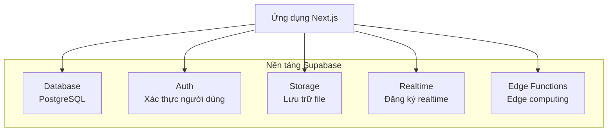
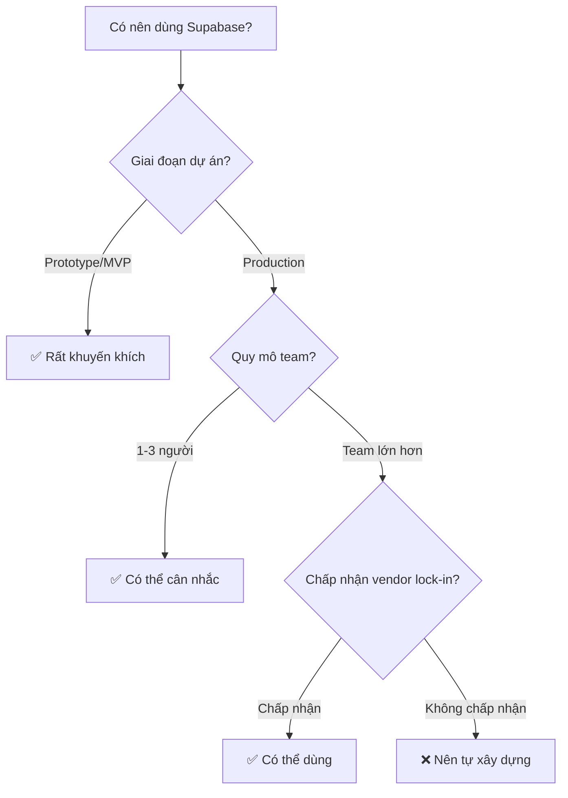

# 2.6 Dịch vụ all-in-one có tốt không — Supabase khi nào nên dùng

## Tái cấu trúc nhận thức

Supabase tự gọi mình là "giải pháp thay thế Firebase mã nguồn mở", cung cấp các dịch vụ tích hợp như database, authentication, storage, realtime subscription. Nó giúp bạn xây dựng backend nhanh chóng, nhưng "all-in-one" cũng đồng nghĩa với việc phụ thuộc nhất định vào nhà cung cấp.

```
Cách truyền thống: PostgreSQL + NextAuth + S3 + tự xây dựng dịch vụ realtime
Supabase: Một nền tảng giải quyết tất cả (nhưng có chi phí migration)
```

## Toàn cảnh dịch vụ Supabase



| Dịch vụ | Chức năng | So sánh với |
|------|------|------|
| **Database** | PostgreSQL database | PostgreSQL tự xây dựng |
| **Auth** | Xác thực người dùng, OAuth | NextAuth.js |
| **Storage** | Lưu trữ file | Alibaba Cloud OSS / S3 |
| **Realtime** | Đăng ký thay đổi data | Socket.io |
| **Edge Functions** | Edge functions | Cloudflare Workers |

## Khi nào nên dùng Supabase?



### ✅ Phù hợp dùng Supabase

- **Prototype nhanh**: Xây dựng backend trong vài phút
- **Dự án hackathon**: Thời gian gấp, giải pháp tất cả trong một
- **Team nhỏ**: Không muốn vận hành database
- **Tính năng realtime**: Chat, collaboration và các tình huống tương tự

### ❌ Không phù hợp

- **Nhu cầu tùy chỉnh cao**: Business logic phức tạp
- **Yêu cầu compliance nghiêm ngặt**: Data phải được kiểm soát hoàn toàn
- **Đã có hạ tầng ổn định**: Chi phí migration cao
- **Nhạy cảm về ngân sách**: Chi phí có thể cao hơn khi lượng sử dụng tăng

## Điều hướng chương này

- **2.6.1 Tổng quan dịch vụ Supabase**: Database/Storage/Auth tất cả trong một
- **2.6.2 Tình huống áp dụng**: Prototype nhanh vs môi trường production
- **2.6.3 Cân nhắc về chi phí**: Gói miễn phí và gói trả phí
- **2.6.4 Chiến lược migration**: Từ Supabase sang dịch vụ tự xây dựng
