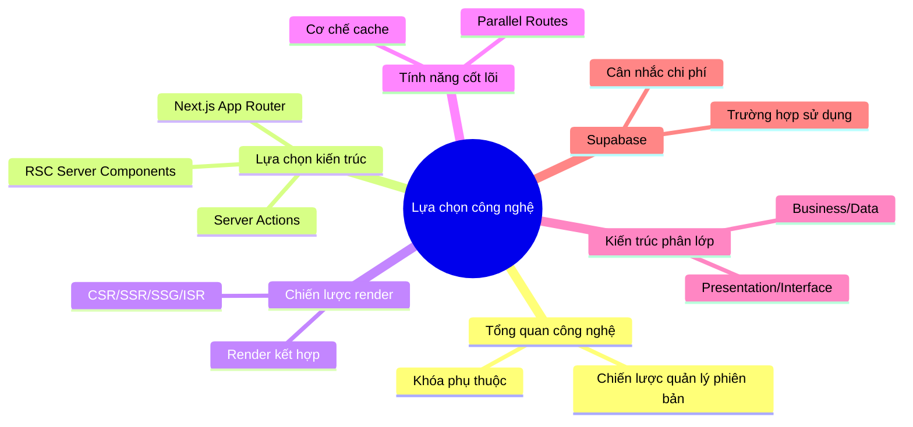

# 2 ｜Lựa chọn công nghệ và kiến trúc tổng quan

> **Bản chất của việc lựa chọn công nghệ không phải là chọn "tốt nhất", mà là chọn "phù hợp nhất".**

Trong thời đại Vibe Coding, việc lựa chọn công nghệ trở nên đặc biệt quan trọng—không chỉ đáp ứng nhu cầu kinh doanh, mà còn phải giúp AI có thể viết code hiệu quả cho bạn. Một bộ công nghệ mà AI thành thạo, cộng đồng sôi động, tài liệu hoàn thiện, có thể nâng cao hiệu suất phát triển của bạn lên gấp nhiều lần.

## Những gì bạn sẽ học được trong chương này

## Tổng quan công nghệ cốt lõi

| Tầng | Công nghệ | Giá trị cốt lõi |
|------|----------|----------|
| **Framework** | Next.js 16+ (App Router) | Khả năng fullstack, hiệu suất tối ưu |
| **Ngôn ngữ** | TypeScript | Type-safe, thân thiện với AI |
| **Database** | PostgreSQL + Prisma | ORM type-safe, hệ sinh thái mạnh mẽ |
| **Styling** | Tailwind CSS + shadcn/ui | Atomic CSS, component sẵn dùng |
| **Triển khai** | Vercel / Docker + 1Panel | Deploy không cấu hình / Tự chủ kiểm soát |
| **Backend-as-a-Service** | Supabase (tùy chọn) | Database+Auth+Storage tích hợp |

## Điều hướng chương

- **2.0** Tổng quan công nghệ và chiến lược quản lý phiên bản
- **2.1** Kiến trúc tổng quan Next.js + TS + Prisma
- **2.2** Chiến lược render: CSR/SSR/SSG/ISR
- **2.3** Đào sâu tính năng cốt lõi Next.js
- **2.4** Phối hợp frontend-backend và API Contract
- **2.5** Giải thích chi tiết kiến trúc phân lớp
- **2.6** Sử dụng và cân nhắc Supabase
