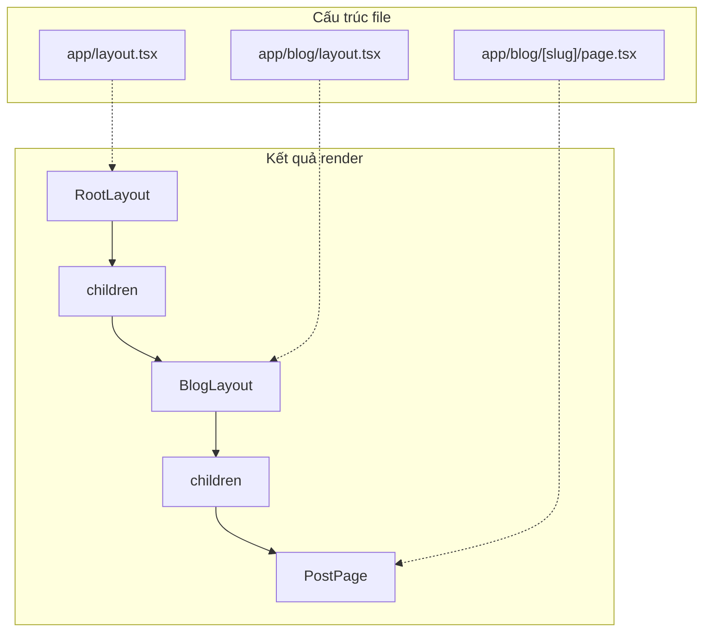

# 3.1.1 Trang đặt đâu, route ở đó——File system routing

### Tóm tắt một câu

Trong App Router, cấu trúc thư mục chính là cấu trúc URL, `page.tsx` là điểm kết thúc trang, `layout.tsx` là vỏ bọc dùng chung.

### Giá trị cốt lõi

Cấu hình routing truyền thống cần duy trì một file cấu hình riêng, ánh xạ thủ công URL và component. File system routing của App Router đã loại bỏ hoàn toàn lớp trừu tượng này——**Cấu trúc thư mục của bạn chính là sơ đồ website của bạn**. Thiết kế "what you see is what you get" này giảm đáng kể gánh nặng tư duy.

### Quy ước file đặc biệt

Next.js App Router định nghĩa một bộ **tên file dành riêng**, mỗi cái có mục đích cụ thể:

| Tên file | Tác dụng | Bắt buộc hay không |
|--------|------|----------|
| `page.tsx` | Định nghĩa nội dung UI của route, làm route đó có thể truy cập | Có (nếu không đường dẫn đó không truy cập được) |
| `layout.tsx` | Định nghĩa layout dùng chung, bao bọc các route con | Thư mục gốc bắt buộc phải có |
| `loading.tsx` | Định nghĩa UI trạng thái loading (Suspense boundary) | Không |
| `error.tsx` | Định nghĩa UI trạng thái lỗi (Error Boundary) | Không |
| `not-found.tsx` | Định nghĩa trang 404 | Không |
| `template.tsx` | Giống layout nhưng re-mount lại mỗi lần navigate | Không |

### Bắt đầu nhanh

**Cấu trúc khả thi tối thiểu:**

```
app/
├── layout.tsx      # Layout gốc (bắt buộc)
├── page.tsx        # Trang chủ /
├── about/
│   └── page.tsx    # /about
└── blog/
    ├── page.tsx    # /blog
    └── [slug]/
        └── page.tsx # /blog/xxx
```

**Ví dụ layout gốc (`app/layout.tsx`):**

```tsx
export default function RootLayout({
  children,
}: {
  children: React.ReactNode
}) {
  return (
    <html lang="vi">
      <body>
        <nav>Thanh điều hướng toàn site</nav>
        <main>{children}</main>
        <footer>Footer toàn site</footer>
      </body>
    </html>
  )
}
```

**Ví dụ page (`app/about/page.tsx`):**

```tsx
export default function AboutPage() {
  return (
    <div>
      <h1>Giới thiệu</h1>
      <p>Đây là nội dung trang giới thiệu</p>
    </div>
  )
}
```

### Cơ chế lồng layout

Đặc tính cốt lõi của layout là **lồng nhau** và **persistent**. Khi người dùng điều hướng giữa các trang con, Layout cha không re-render lại.



**Ví dụ lồng layout (`app/blog/layout.tsx`):**

```tsx
export default function BlogLayout({
  children,
}: {
  children: React.ReactNode
}) {
  return (
    <div className="blog-container">
      <aside>Sidebar blog</aside>
      <article>{children}</article>
    </div>
  )
}
```

### Trạng thái Loading

`loading.tsx` sẽ tự động tạo một Suspense boundary, hiển thị khi nội dung trang đang loading:

```tsx
// app/blog/loading.tsx
export default function Loading() {
  return (
    <div className="animate-pulse">
      <div className="h-8 bg-gray-200 rounded w-3/4 mb-4"></div>
      <div className="h-4 bg-gray-200 rounded w-full mb-2"></div>
      <div className="h-4 bg-gray-200 rounded w-5/6"></div>
    </div>
  )
}
```

### Hướng dẫn cộng tác AI

**Ý định cốt lõi**: Để AI giúp bạn dựng khung cấu trúc trang nhanh chóng.

**Công thức định nghĩa yêu cầu**:
- Mô tả chức năng: Tôi cần tạo một trang [loại trang]
- Cách tương tác: Trang đó cần [layout dùng chung/layout độc lập]
- Hiệu quả kỳ vọng: Đường dẫn URL là `/xxx`, bao gồm [nội dung cụ thể]

**Thuật ngữ chính**: `page.tsx`, `layout.tsx`, `loading.tsx`, `children prop`, `nested layout`

**Chiến lược tương tác**:
1. Trước tiên để AI sinh cấu trúc thư mục file
2. Sau khi xác nhận cấu trúc đúng, mới để nó điền nội dung các file
3. Cuối cùng để nó thêm trạng thái loading và error

### Hướng dẫn tránh hố

1. **Layout gốc bắt buộc phải chứa thẻ `<html>` và `<body>`**, layout con không cần
2. **`page.tsx` là cách duy nhất để làm route có thể truy cập**, không có nó thì thư mục chỉ dùng để tổ chức code
3. **Component Layout phải nhận và render `children` prop**, nếu không trang con sẽ không hiển thị
4. **Tránh dùng state thay đổi thường xuyên trong Layout**, vì nó không re-render

### Checklist nghiệm thu

- [ ] Thư mục gốc có `layout.tsx` và chứa `<html>` và `<body>`
- [ ] Mỗi đường dẫn cần truy cập đều có `page.tsx` tương ứng
- [ ] Layout lồng đúng, khi navigate layout cha không nhấp nháy
- [ ] Trang load dữ liệu chậm có skeleton screen `loading.tsx`
