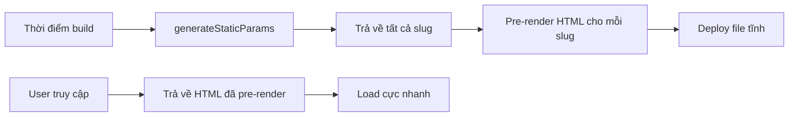

# 3.1.2 Làm routing cho hàng nghìn trang——Dynamic routes

### Tóm tắt một câu

Dùng dấu ngoặc vuông `[param]` để đặt tên thư mục, tạo dynamic route, một bộ code phục vụ vô số trang.

### Giá trị cốt lõi

Blog có hàng nghìn bài viết, shop có hàng vạn sản phẩm, user có hàng triệu trang cá nhân—bạn không thể tạo thủ công một `page.tsx` cho mỗi thực thể. Dynamic routes cho phép một template trang khớp với vô số đường dẫn URL.

### Cú pháp dynamic routes

| Cú pháp | Đường dẫn ví dụ | Khớp URL | Giá trị params |
|------|----------|----------|-----------|
| `[slug]` | `app/blog/[slug]/page.tsx` | `/blog/hello-world` | `{ slug: 'hello-world' }` |
| `[...slug]` | `app/docs/[...slug]/page.tsx` | `/docs/a/b/c` | `{ slug: ['a', 'b', 'c'] }` |
| `[[...slug]]` | `app/shop/[[...slug]]/page.tsx` | `/shop` hoặc `/shop/a/b` | `{ slug: undefined }` hoặc `{ slug: ['a', 'b'] }` |

### Bắt đầu nhanh

**Dynamic route cơ bản:**

```
app/
└── blog/
    └── [slug]/
        └── page.tsx    # Khớp /blog/nội-dung-bất-kỳ
```

**Lấy tham số động:**

```tsx
// app/blog/[slug]/page.tsx
type Props = {
  params: { slug: string }
}

export default async function BlogPost({ params }: Props) {
  const { slug } = params

  // Lấy dữ liệu bài viết theo slug
  const post = await getPostBySlug(slug)

  if (!post) {
    notFound() // Trigger not-found.tsx
  }

  return (
    <article>
      <h1>{post.title}</h1>
      <div>{post.content}</div>
    </article>
  )
}
```

### Catch-all routes

Khi bạn cần khớp đường dẫn nhiều cấp, dùng cú pháp `[...param]`:

```tsx
// app/docs/[...slug]/page.tsx
// Khớp /docs/getting-started
// Khớp /docs/api/authentication/oauth

type Props = {
  params: { slug: string[] }
}

export default function DocsPage({ params }: Props) {
  // slug là mảng: ['api', 'authentication', 'oauth']
  const breadcrumb = params.slug.join(' > ')

  return <div>Đường dẫn hiện tại: {breadcrumb}</div>
}
```

### Static generation cho dynamic routes

Với các trang SEO quan trọng, có thể pre-generate tất cả đường dẫn có thể có tại thời điểm build:

```tsx
// app/blog/[slug]/page.tsx

// Nói với Next.js pre-generate những đường dẫn nào
export async function generateStaticParams() {
  const posts = await getAllPosts()

  return posts.map((post) => ({
    slug: post.slug,
  }))
}

// Component page giữ nguyên
export default async function BlogPost({ params }: Props) {
  // ...
}
```



### Search params vs Route params

Ngoài route params, còn có thể truyền dữ liệu qua URL query string:

```tsx
// URL: /products?category=electronics&sort=price

type Props = {
  params: { id: string }
  searchParams: { category?: string; sort?: string }
}

export default function ProductsPage({ searchParams }: Props) {
  const { category, sort } = searchParams

  return (
    <div>
      <p>Danh mục: {category}</p>
      <p>Sắp xếp: {sort}</p>
    </div>
  )
}
```

| Loại | Mục đích sử dụng | Ví dụ |
|------|------|------|
| **Route params** | Định danh tài nguyên | `/blog/my-post` (định danh duy nhất bài viết) |
| **Search params** | Lọc/Sắp xếp | `/products?sort=price` (điều kiện lọc danh sách) |

### Hướng dẫn cộng tác AI

**Ý định cốt lõi**: Để AI giúp bạn tạo trang hỗ trợ nội dung động.

**Công thức định nghĩa yêu cầu**:
- Mô tả chức năng: Tôi cần trang chi tiết của [loại tài nguyên]
- Cách tương tác: Format URL là `/[tên-tài-nguyên]/[định-danh]`
- Hiệu quả kỳ vọng: Lấy và hiển thị dữ liệu tương ứng theo tham số URL

**Thuật ngữ chính**: `[slug]`, `params`, `generateStaticParams`, `notFound`, `searchParams`

**Chiến lược tương tác**:
1. Trước tiên để AI tạo cấu trúc file của dynamic route
2. Để nó implement logic lấy tham số và request dữ liệu
3. Bổ sung xử lý 404 và trạng thái loading
4. Nếu cần SSG, để nó thêm `generateStaticParams`

### Hướng dẫn tránh hố

1. **Tham số động là string**: Dù URL là `/post/123`, `params.id` vẫn là `"123"` chứ không phải `123`
2. **Catch-all params là mảng**: `[...slug]` trả về `string[]`, nhớ xử lý trường hợp mảng rỗng
3. **Giá trị trả về `generateStaticParams` phải là mảng object**: `[{ slug: 'a' }, { slug: 'b' }]`
4. **Dynamic routes mặc định là dynamic rendering**: Trừ khi dùng `generateStaticParams` để pre-generate

### Checklist nghiệm thu

- [ ] Dynamic route khớp chính xác các đường dẫn URL khác nhau
- [ ] `params` lấy đúng phần động trong URL
- [ ] Tham số động không hợp lệ có trigger trang 404
- [ ] Trang cần SEO đã cấu hình `generateStaticParams`
