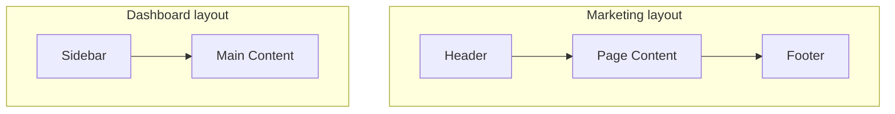

# 3.1.3 Sắp xếp routing rối loạn——Route groups

### Tóm tắt một câu

Dùng dấu ngoặc tròn `(group)` để đặt tên thư mục, có thể tổ chức code và chia sẻ layout mà không ảnh hưởng URL.

### Giá trị cốt lõi

Khi dự án lớn lên, thư mục `app` sẽ chứa đầy các folder: trang chủ, giới thiệu, blog, backend, settings... rối thành một mớ. Route groups cho phép bạn phân loại các trang này như sắp xếp ngăn kéo, và **tên phân loại sẽ không xuất hiện trong URL**.

### Cú pháp route groups

Tên thư mục được bao bọc bởi dấu ngoặc tròn chính là route group:

```
app/
├── (marketing)/
│   ├── layout.tsx      # Layout chuyên dụng cho marketing
│   ├── page.tsx        # Trang chủ -> URL: /
│   └── about/
│       └── page.tsx    # Giới thiệu -> URL: /about
├── (dashboard)/
│   ├── layout.tsx      # Layout chuyên dụng cho backend
│   └── settings/
│       └── page.tsx    # Settings -> URL: /settings
```

**Điểm quan trọng**: `(marketing)` và `(dashboard)` đều không xuất hiện trong URL.

### Ba kịch bản ứng dụng

#### Kịch bản 1: Tổ chức code

Đặt các trang liên quan với nhau, code rõ ràng hơn:

```
app/
├── (auth)/             # Liên quan xác thực
│   ├── login/
│   ├── register/
│   └── forgot-password/
├── (shop)/             # Liên quan shop
│   ├── products/
│   ├── cart/
│   └── checkout/
└── (blog)/             # Liên quan blog
    ├── posts/
    └── categories/
```

#### Kịch bản 2: Layout khác nhau

Trang marketing và trang backend thường cần UI framework hoàn toàn khác nhau:

```tsx
// app/(marketing)/layout.tsx
export default function MarketingLayout({ children }) {
  return (
    <div>
      <header>Logo thương hiệu + Điều hướng</header>
      <main>{children}</main>
      <footer>Thông tin bản quyền</footer>
    </div>
  )
}

// app/(dashboard)/layout.tsx
export default function DashboardLayout({ children }) {
  return (
    <div className="flex">
      <aside>Menu sidebar</aside>
      <main className="flex-1">{children}</main>
    </div>
  )
}
```



#### Kịch bản 3: Nhiều root layout

Thậm chí có thể tạo root layout độc lập cho các route group khác nhau:

```
app/
├── (marketing)/
│   ├── layout.tsx      # Chứa <html><body>
│   └── page.tsx
├── (dashboard)/
│   ├── layout.tsx      # Chứa <html><body>
│   └── page.tsx
```

> **Lưu ý**: Khi dùng nhiều root layout, điều hướng giữa chúng sẽ trigger full page refresh.

### Route groups vs Thư mục thường

| Đặc tính | Thư mục thường | Route group `(name)` |
|------|-----------|-----------------|
| Ảnh hưởng URL | Có | Không |
| Có thể chứa layout | Có | Có |
| Có thể chứa page | Có | Có |
| Mục đích sử dụng | Định nghĩa đường dẫn URL | Tổ chức code/chia sẻ layout |

### Route groups lồng nhau

Route groups có thể dùng lồng nhau:

```
app/
├── (shop)/
│   ├── (browse)/       # Liên quan duyệt
│   │   ├── products/
│   │   └── categories/
│   └── (checkout)/     # Liên quan thanh toán
│       ├── cart/
│       └── payment/
```

### Hướng dẫn cộng tác AI

**Ý định cốt lõi**: Để AI giúp bạn refactor cấu trúc routing hiện tại, hoặc lập kế hoạch tổ chức routing cho dự án mới.

**Công thức định nghĩa yêu cầu**:
- Mô tả chức năng: Dự án tôi có [danh sách loại trang]
- Cách tương tác: Các loại khác nhau cần [mô tả layout khác nhau]
- Hiệu quả kỳ vọng: URL giữ gọn gàng, code phân nhóm theo chức năng

**Thuật ngữ chính**: `route groups`, `(group)`, `shared layout`, `code organization`

**Chiến lược tương tác**:
1. Liệt kê tất cả trang và URL của chúng
2. Để AI phân tích trang nào có thể chia sẻ layout
3. Để nó đưa ra đề xuất phân chia route groups
4. Sau khi xác nhận, để nó sinh cấu trúc file

### Hướng dẫn tránh hố

1. **Tên route group không được trùng**: `(auth)` và `(auth)` không thể tồn tại đồng thời
2. **Cùng URL chỉ có một page.tsx**: Không thể có đồng thời `(a)/about/page.tsx` và `(b)/about/page.tsx`
3. **Nhiều root layout sẽ gây page refresh**: Khi điều hướng cross root layout, state sẽ mất
4. **Đừng lạm dụng**: Dự án đơn giản dùng thư mục thường là đủ

### Checklist nghiệm thu

- [ ] Tên route group dùng dấu ngoặc tròn bao bọc
- [ ] URL không chứa tên route group
- [ ] Mỗi route group có layout.tsx độc lập (nếu cần)
- [ ] Dưới cùng đường dẫn URL chỉ có một page.tsx
