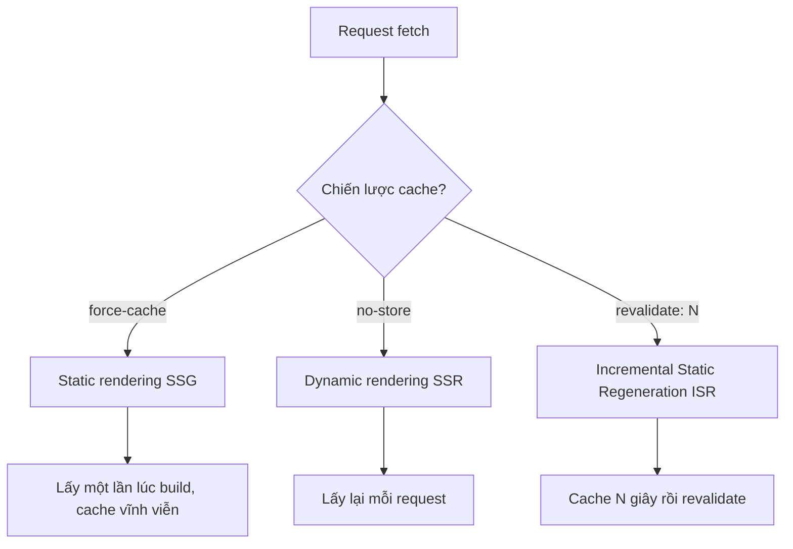

# 3.1.4 Dữ liệu nên lấy khi nào——Chiến lược data fetching

### Tóm tắt một câu

Trong Server Component trực tiếp `await` dữ liệu, Next.js sẽ tự động chọn chiến lược rendering tối ưu dựa theo cấu hình cache của bạn.

### Giá trị cốt lõi

Hãy quên `useEffect` và quản lý state `isLoading`. Mô hình data fetching của App Router cho phép bạn lấy dữ liệu trực tiếp như viết code backend—không có request ở client, không có quản lý loading state, dữ liệu đến cùng HTML đến trình duyệt.

### Data fetching cơ bản

**Lấy dữ liệu trực tiếp trong Server Component:**

```tsx
// app/posts/page.tsx
async function getPosts() {
  const res = await fetch('https://api.example.com/posts')
  if (!res.ok) throw new Error('Lấy thất bại')
  return res.json()
}

export default async function PostsPage() {
  const posts = await getPosts()

  return (
    <ul>
      {posts.map((post: any) => (
        <li key={post.id}>{post.title}</li>
      ))}
    </ul>
  )
}
```

### Ba chiến lược caching

Next.js đã mở rộng `fetch` native, cung cấp ba hành vi caching:



| Chiến lược | Cấu hình | Hành vi | Kịch bản áp dụng |
|------|------|------|----------|
| **Static** | `cache: 'force-cache'` | Lấy lúc build, cache vĩnh viễn | Nội dung ít thay đổi |
| **Dynamic** | `cache: 'no-store'` | Lấy lại mỗi request | Dữ liệu realtime |
| **ISR** | `next: { revalidate: N }` | Cache N giây rồi revalidate | Nội dung cần cập nhật định kỳ |

### Bắt đầu nhanh

**Static rendering (mặc định):**

```tsx
// Lấy lúc build, sau đó không cập nhật nữa
const data = await fetch('https://api.example.com/static-data')
```

**Dynamic rendering:**

```tsx
// Lấy lại mỗi lần truy cập
const data = await fetch('https://api.example.com/realtime', {
  cache: 'no-store'
})
```

**ISR (khuyến nghị):**

```tsx
// Revalidate mỗi 60 giây
const data = await fetch('https://api.example.com/posts', {
  next: { revalidate: 60 }
})
```

### Cấu hình cache cấp page

Ngoài cấu hình trong fetch, cũng có thể set ở cấp page:

```tsx
// app/posts/page.tsx

// Toàn bộ page revalidate mỗi 60 giây
export const revalidate = 60

// Hoặc bắt buộc dynamic rendering
// export const dynamic = 'force-dynamic'

export default async function PostsPage() {
  // ...
}
```

### Parallel data fetching

Khi có nhiều nguồn dữ liệu, dùng `Promise.all` để lấy song song:

```tsx
export default async function DashboardPage() {
  // Lấy song song, tổng thời gian = request chậm nhất
  const [user, posts, notifications] = await Promise.all([
    getUser(),
    getPosts(),
    getNotifications()
  ])

  return (
    <div>
      <UserProfile user={user} />
      <PostList posts={posts} />
      <NotificationBell count={notifications.length} />
    </div>
  )
}
```

### Revalidation thủ công

Với các kịch bản cần cập nhật ngay lập tức (như user submit), có thể trigger revalidation thủ công:

```tsx
// app/actions.ts
'use server'

import { revalidatePath, revalidateTag } from 'next/cache'

export async function createPost(formData: FormData) {
  // Tạo bài viết...

  // Cách 1: Revalidate đường dẫn cụ thể
  revalidatePath('/posts')

  // Cách 2: Revalidate tag cụ thể
  revalidateTag('posts')
}
```

Kết hợp với tag của fetch:

```tsx
const posts = await fetch('https://api.example.com/posts', {
  next: { tags: ['posts'] }
})
```

### So sánh mô hình data fetching

| Mô hình | Thời điểm lấy | Tốc độ first screen | Độ mới dữ liệu | Kịch bản áp dụng |
|------|----------|----------|------------|----------|
| **Server Component** | Server-side | Nhanh | Có thể cấu hình | Hầu hết kịch bản |
| **Client fetch** | Client-side | Chậm | Realtime | Trigger bởi tương tác user |
| **Route Handler** | API route | - | Realtime | Gọi từ bên thứ 3 |

### Hướng dẫn cộng tác AI

**Ý định cốt lõi**: Để AI giúp bạn chọn chiến lược data fetching phù hợp cho trang.

**Công thức định nghĩa yêu cầu**:
- Mô tả chức năng: Trang này cần hiển thị [loại dữ liệu]
- Cách tương tác: Tần suất cập nhật dữ liệu là [realtime/mỗi giờ/mỗi ngày/hiếm khi]
- Hiệu quả kỳ vọng: First screen load [nhanh/chấp nhận được], dữ liệu [phải mới nhất/có thể cũ một chút]

**Thuật ngữ chính**: `fetch`, `cache`, `revalidate`, `no-store`, `revalidatePath`, `revalidateTag`

**Chiến lược tương tác**:
1. Mô tả nhu cầu dữ liệu và tần suất cập nhật của trang
2. Để AI đề xuất chiến lược caching
3. Để nó implement hàm lấy dữ liệu
4. Bổ sung logic revalidation thủ công (nếu cần)

### Hướng dẫn tránh hố

1. **Không thể dùng Hooks trong Server Component**: `useState`, `useEffect` v.v. không khả dụng ở server-side
2. **fetch mặc định static cache**: Nếu cần dữ liệu realtime, phải set rõ ràng `cache: 'no-store'`
3. **revalidate là khoảng tối thiểu**: Set 60 giây không có nghĩa cứ 60 giây là cập nhật, mà là ít nhất 60 giây sau mới có thể cập nhật
4. **Phải xử lý lỗi**: Khi fetch thất bại cần có phương án dự phòng, nếu không toàn trang sẽ crash

### Checklist nghiệm thu

- [ ] Dữ liệu được lấy ở server-side, HTML đã chứa nội dung
- [ ] Chiến lược cache khớp với nhu cầu business
- [ ] Nhiều nguồn dữ liệu dùng `Promise.all` để lấy song song
- [ ] Lỗi fetch có xử lý thích hợp
- [ ] Kịch bản cần cập nhật ngay đã cấu hình revalidation thủ công
