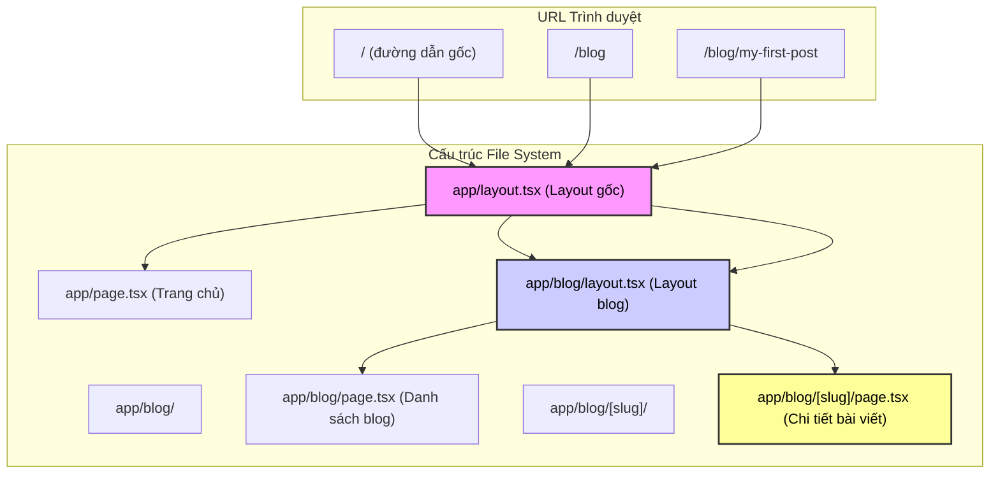

# 3.1 Cấu trúc thư mục chính là sơ đồ website——App Router: File routing và Data fetching

> Quay về bản chất của Web, đường dẫn URL chính là đường dẫn tài nguyên.

Trong phần này, chúng ta sẽ cải tổ hoàn toàn nhận thức của bạn về "routing".

Trong thời đại SPA (Single Page Application) truyền thống, bạn có thể đã quen với việc viết đầy đủ các mối quan hệ ánh xạ `path: '/about', component: About` trong một file cấu hình `router.js` khổng lồ. Đó là một loại ánh xạ được duy trì thủ công.

Nhưng giờ đây, Next.js App Router đưa chúng ta quay về **nguyên lý đầu tiên** của Web: **Cấu trúc file system chính là cấu trúc URL**. Bạn đặt file ở đâu, địa chỉ web của nó sẽ là gì. Đây không chỉ là sự đơn giản hóa về mặt kỹ thuật, mà còn là thể hiện tột cùng của tư duy "what you see is what you get".

## 1. Định nghĩa ranh giới: Quy luật vật lý của App Router

Trước khi bắt đầu viết code, chúng ta cần thiết lập một bộ quy luật vật lý. Giống như việc nói với kiến trúc sư AI: "Trong thế giới này, cách đặt gạch quyết định hình dạng của ngôi nhà."

- **Input (URL)**: Đường dẫn người dùng nhập vào thanh địa chỉ trình duyệt (như `/dashboard/settings`).
- **Cơ chế ánh xạ**: Next.js tự động tìm `app/dashboard/settings/page.tsx`.
- **Output (UI)**: HTML được render bởi `page.tsx` cuối cùng, được bao bọc bởi các `layout.tsx` lồng nhau từng lớp.
- **Biên giới ngoại lệ**: Không tìm thấy file? Hiển thị `not-found.tsx`. Báo lỗi? Hiển thị `error.tsx`.

**Tâm pháp một câu**: **Thư mục là đường dẫn, `page.tsx` là điểm đích, `layout.tsx` là giấy gói.**

## 2. Trực quan hóa cấu trúc: Logic routing vô hình

Điều khó hiểu nhất ở App Router không phải là "quan hệ tương ứng", mà là "quan hệ lồng nhau". Khi bạn truy cập một trang sâu, Next.js thực chất đang lắp ráp các component giống như "búp bê Nga".



> **Điểm giác ngộ**: Chú ý xem biểu đồ, `layout` là **persistent**. Khi bạn chuyển từ `/blog` sang `/blog/my-first-post`, `RootLayout` và `BlogLayout` **không** re-render, chỉ có `page.tsx` bên trong thay đổi. Đây chính là bí mật của trải nghiệm cực nhanh của Next.js.

## 3. Chiến lược phát triển lũy tiến: Pair programming với AI

Đừng cố viết ra cấu trúc routing hoàn hảo trong một lần. Chúng ta sẽ dùng tư duy **MVP (Minimum Viable Product)**, từng bước một chỉ huy AI xây dựng.

### Bước 1: Dựng khung xương (Static Routes & Layouts)

Trước tiên hãy để AI giúp bạn hoàn thành cấu trúc trang cơ bản nhất.

> **🤖 Ý định chỉ dẫn AI**: "Hãy giúp tôi tạo cấu trúc cơ bản của App Router. Tôi muốn một trang chủ, một trang giới thiệu, và một layout thanh điều hướng dùng chung."

**Cấu trúc file quan trọng:**

- `app/layout.tsx`: **Bắt buộc phải có**. Đây là nơi định nghĩa thẻ `<html>` và `<body>`.
- `app/page.tsx`: Nội dung trang chủ.
- `app/about/page.tsx`: Nội dung trang `/about`.

**Checklist nghiệm thu:**

- [ ] Truy cập `http://localhost:3000/` có thấy trang chủ không?
- [ ] Truy cập `http://localhost:3000/about` có thấy trang giới thiệu không?
- [ ] Cả hai trang có cùng thanh điều hướng (từ `layout.tsx`) không?

### Bước 2: Xử lý nội dung động (Dynamic Routes)

Bây giờ, chúng ta sẽ xử lý "hàng nghìn" trang, ví dụ như bài viết blog hoặc hồ sơ người dùng. Chúng ta không thể tạo thủ công `post-1.tsx`, `post-2.tsx`.

> **Ý định chỉ dẫn AI**: "Tôi muốn làm trang chi tiết blog. Hãy tạo một dynamic route trong `app/blog`, dùng `slug` làm tham số. Và in tham số `slug` này ra trong trang."

**Logic code quan trọng (`app/blog/[slug]/page.tsx`):**

```
// params ở đây được Next.js tự động truyền vào
// Lưu ý: params trong Next.js 16+ có thể là async, tùy thuộc phiên bản, nhưng trong hệ thống Vibe Coding chúng ta thường destructure trực tiếp
export default async function BlogPost({ params }: { params: { slug: string } }) {
  // 1. Lấy tham số trên URL
  const { slug } = params;

  return <div>Đang đọc bài viết: {slug}</div>;
}
```

### Bước 3: Tổ chức & Sắp xếp (Route Groups)

Nếu dự án của bạn lớn lên, một đống thư mục trong `app` rối loạn thì sao? Ví dụ bạn muốn phân biệt "admin backend" và "marketing pages", nhưng không muốn URL thành `/marketing/home`.

Lúc này cần dùng **Route Groups**. Đây là một loại phép thuật **"chỉ có thư mục, không có URL"**.

> **🤖 Ý định chỉ dẫn AI**: "Tôi muốn tổ chức code rõ ràng hơn. Hãy đặt các trang liên quan marketing (trang chủ, giới thiệu) vào nhóm `(marketing)`, đặt các trang backend vào nhóm `(dashboard)`. Đảm bảo đường dẫn URL **không bao gồm** tên trong ngoặc."

**Hiệu quả:**

- `app/(marketing)/about/page.tsx` -> URL vẫn là `/about`
- `app/(dashboard)/settings/page.tsx` -> URL vẫn là `/settings`

## 4. Lấy dữ liệu: "Đặc quyền" của Server Component

Đây là nơi hấp dẫn nhất của tech stack Vibe Coding. Hãy quên `useEffect`, quên quản lý state `isLoading`. Trong App Router, chúng ta lấy dữ liệu trực tiếp trên **server**.

### Khái niệm cốt lõi: Fetch, Cache, Revalidate

Trong `page.tsx` (Server Component), việc lấy dữ liệu đơn giản như viết script Node.js thông thường.

> **🤖 Hướng dẫn cộng tác AI**: Nói với AI: "Tôi muốn lấy dữ liệu danh sách blog trong trang này. Hãy dùng `fetch` API và cấu hình chiến lược cache dữ liệu."

**Template code thực chiến:**

```
// app/blog/page.tsx

// 1. Định nghĩa hàm lấy dữ liệu
async function getPosts() {
  // Next.js đã mở rộng fetch native
  const res = await fetch('https://api.example.com/posts', {
    // Chiến lược A: Static generation (mặc định) - giống SSG, lấy lúc build, cache vĩnh viễn
    // cache: 'force-cache',

    // Chiến lược B: Dynamic rendering - giống SSR, lấy lại mỗi request
    // cache: 'no-store',

    // Chiến lược C: Incremental Static Regeneration (ISR) - Vibe Coding khuyến nghị!
    // Cập nhật cache mỗi 3600 giây, cân bằng tốc độ và độ mới
    next: { revalidate: 3600 }
  });

  if (!res.ok) throw new Error('Failed to fetch posts');
  return res.json();
}

// 2. Page component trực tiếp biến thành async
export default async function BlogPage() {
  // 3. Trực tiếp await dữ liệu, giống như viết code backend
  const posts = await getPosts();

  return (
    <ul>
      {posts.map((post: any) => (
        <li key={post.id}>{post.title}</li>
      ))}
    </ul>
  );
}
```

### Tại sao điều này rất "Vibe"?

1. **Không có màn hình trắng loading**: Dữ liệu đã được lấy trên server, gửi cùng HTML đến trình duyệt.
2. **Zero client JS**: Logic lấy dữ liệu không được đóng gói vào client, giảm kích thước.
3. **Trực quan**: Cần dữ liệu? Thì lấy thôi. Không cần thư viện quản lý state phức tạp.

## 5. Checklist nghiệm thu

Khi kết thúc chương này, hãy nghiệm thu thành quả của bạn theo các tiêu chuẩn sau:

1. [ ] **Cấu trúc file rõ ràng**: Tôi có thể vẽ ra Sitemap của website chỉ bằng cách xem cấu trúc thư mục.
2. [ ] **Chuyển trang mượt mà**: Dùng component `<Link>` để chuyển giữa các trang, và Layout không nhấp nháy không cần thiết.
3. [ ] **Trạng thái Loading**: Đặt một `loading.tsx` bên cạnh trang load dữ liệu chậm, kiểm tra xem có tự động hiển thị skeleton screen không.
4. [ ] **Lấy dữ liệu chính xác**: Sau khi sửa dữ liệu database hoặc API, hành vi cập nhật trang phù hợp với thời gian `revalidate` bạn đã đặt (thử đặt 0 hoặc 10 giây để test).

## 6. Bước tiếp theo

Bây giờ trang của bạn đã chạy được, dữ liệu cũng có rồi. Nhưng chúng vẫn còn xấu, và là một đống khối lego rời rạc. Phần tiếp theo, chúng ta sẽ học **3.2 Xây dựng trang như lắp ráp Lego**, dùng tư duy component hóa để biến những trang này thành đẹp và có thể tái sử dụng.
