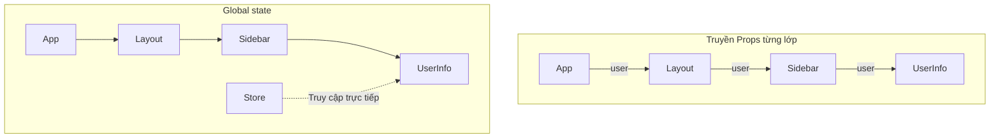
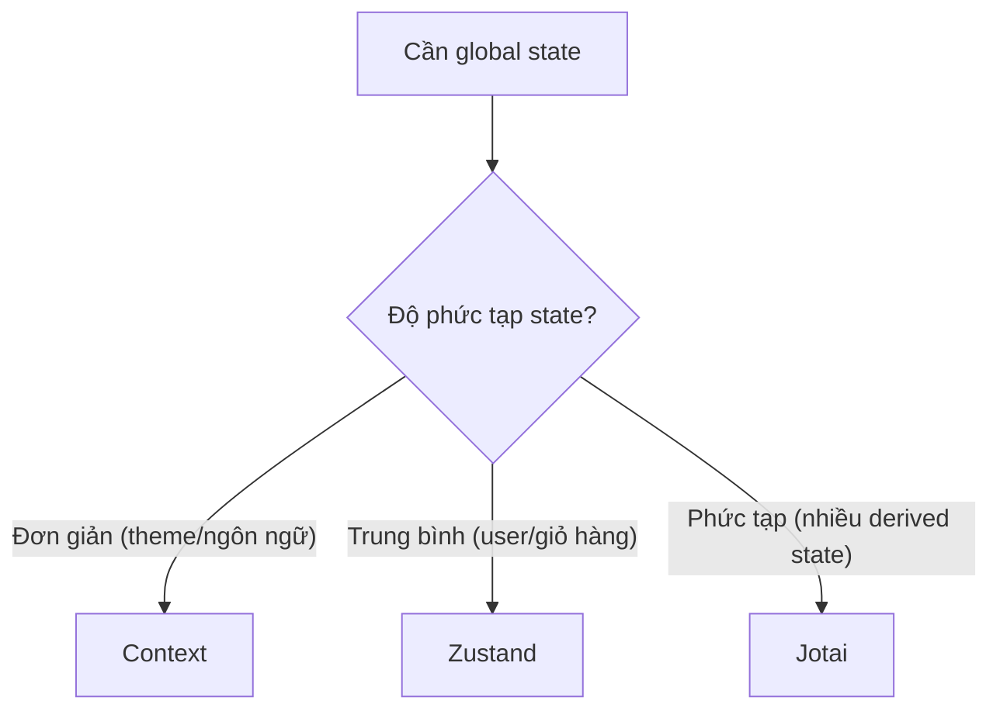

# 3.2.3 Quản lý toàn cục state phức tạp——Global state management

### Tóm tắt một câu

Khi state cần chia sẻ qua nhiều lớp component, global state management giúp bạn thoát khỏi "ác mộng truyền Props từng lớp".

### Giá trị cốt lõi

State lifting giải quyết vấn đề chia sẻ dữ liệu giữa các component anh em, nhưng khi cấu trúc component rất sâu, các component trung gian bị buộc phải truyền Props mà chúng hoàn toàn không quan tâm. Global state management cho phép bất kỳ component nào truy cập trực tiếp state được chia sẻ.



### Phương án 1: React Context

Phương án tích hợp sẵn, phù hợp kịch bản đơn giản:

```tsx
'use client'

import { createContext, useContext, useState, ReactNode } from 'react'

// 1. Tạo Context
interface ThemeContextType {
  theme: 'light' | 'dark'
  toggleTheme: () => void
}

const ThemeContext = createContext<ThemeContextType | null>(null)

// 2. Tạo Provider
export function ThemeProvider({ children }: { children: ReactNode }) {
  const [theme, setTheme] = useState<'light' | 'dark'>('light')

  const toggleTheme = () => {
    setTheme(prev => prev === 'light' ? 'dark' : 'light')
  }

  return (
    <ThemeContext.Provider value={{ theme, toggleTheme }}>
      {children}
    </ThemeContext.Provider>
  )
}

// 3. Tạo Hook (khuyến nghị)
export function useTheme() {
  const context = useContext(ThemeContext)
  if (!context) {
    throw new Error('useTheme must be used within ThemeProvider')
  }
  return context
}

// 4. Sử dụng
function ThemeToggle() {
  const { theme, toggleTheme } = useTheme()
  return <button onClick={toggleTheme}>Hiện tại: {theme}</button>
}
```

**Hạn chế của Context:**
- Bất kỳ thay đổi value nào cũng khiến tất cả consumer re-render
- Cần tối ưu thủ công (useMemo, tách Context)
- Không phù hợp với state cập nhật thường xuyên

### Phương án 2: Zustand (khuyến nghị)

Nhẹ, đơn giản, không boilerplate code:

```tsx
// store/useUserStore.ts
import { create } from 'zustand'

interface UserState {
  user: { name: string; email: string } | null
  setUser: (user: UserState['user']) => void
  logout: () => void
}

export const useUserStore = create<UserState>((set) => ({
  user: null,
  setUser: (user) => set({ user }),
  logout: () => set({ user: null }),
}))

// Dùng trong component
'use client'

import { useUserStore } from '@/store/useUserStore'

function UserProfile() {
  const user = useUserStore((state) => state.user)
  const logout = useUserStore((state) => state.logout)

  if (!user) return <p>Vui lòng đăng nhập</p>

  return (
    <div>
      <p>{user.name}</p>
      <button onClick={logout}>Đăng xuất</button>
    </div>
  )
}
```

**Ưu điểm của Zustand:**
- Tự động subscribe theo cấp độ chi tiết, tránh render không cần thiết
- Có thể truy cập state bên ngoài React
- Hỗ trợ middleware (persist, logging, etc.)
- Hỗ trợ TypeScript tốt

### Phương án 3: Jotai

State nguyên tử hóa, phù hợp tương tác phức tạp:

```tsx
// atoms/userAtom.ts
import { atom } from 'jotai'

export const userAtom = atom<{ name: string } | null>(null)

// Derived state
export const isLoggedInAtom = atom((get) => get(userAtom) !== null)

// Sử dụng
'use client'

import { useAtom, useAtomValue } from 'jotai'
import { userAtom, isLoggedInAtom } from '@/atoms/userAtom'

function UserStatus() {
  const [user, setUser] = useAtom(userAtom)
  const isLoggedIn = useAtomValue(isLoggedInAtom)  // Chỉ đọc

  return <p>{isLoggedIn ? user?.name : 'Chưa đăng nhập'}</p>
}
```

### So sánh phương án

| Đặc tính | Context | Zustand | Jotai |
|------|---------|---------|-------|
| Chi phí học tập | Thấp | Thấp | Trung bình |
| Boilerplate code | Trung bình | Ít | Ít |
| Tối ưu render | Thủ công | Tự động | Tự động |
| Kịch bản áp dụng | Đơn giản/cập nhật ít | Đa năng | Derived state phức tạp |
| Truy cập ngoài React | Khó | Đơn giản | Khả thi |

### Gợi ý lựa chọn



### Hướng dẫn cộng tác AI

**Ý định cốt lõi**: Để AI giúp bạn thiết kế cấu trúc global state và chọn phương án phù hợp.

**Công thức định nghĩa yêu cầu**:
- Mô tả chức năng: Cần chia sẻ [dữ liệu gì] giữa [component nào]
- Cách tương tác: Tần suất cập nhật dữ liệu là [cao/trung bình/thấp]
- Hiệu quả kỳ vọng: Khi state thay đổi chỉ có [component nào] cần re-render

**Thuật ngữ chính**: `Context`, `Zustand`, `Jotai`, `atom`, `store`, `selector`

**Chiến lược tương tác**:
1. Mô tả state cần chia sẻ và use case
2. Để AI đề xuất phương án phù hợp
3. Để nó implement định nghĩa store/context
4. Tích hợp sử dụng trong component

### Hướng dẫn tránh hố

1. **Context không phải vạn năng**: State cập nhật thường xuyên dùng Context sẽ gây vấn đề hiệu năng
2. **Zustand selector phải ổn định**: Tránh tạo selector function mới trong component
3. **Đừng lạm dụng global state**: Giải quyết được bằng Props thì đừng dùng global
4. **Server Component không thể dùng Hooks**: Global state chỉ có thể truy cập trong Client Component

### Checklist nghiệm thu

- [ ] Đã chọn phương án quản lý state phù hợp
- [ ] Cấu trúc state thiết kế hợp lý
- [ ] Dùng selector để subscribe ở cấp độ chi tiết
- [ ] Provider bao bọc đúng cấp độ
