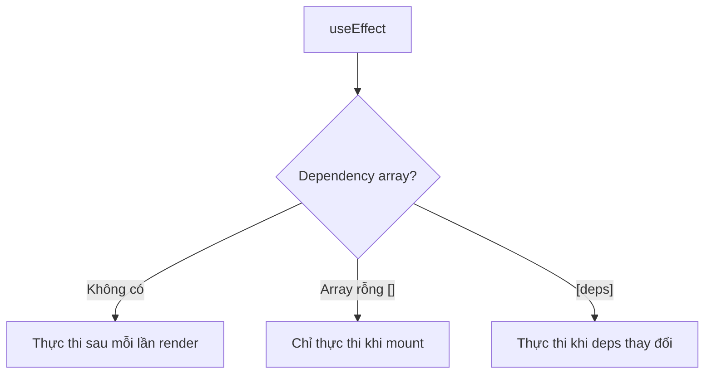

# 3.2.4 Side effects của khối lego xử lý thế nào——Effect side effects

### Tóm tắt một câu

useEffect cho phép bạn thực thi các thao tác "side effects" sau khi component render, như fetch dữ liệu, subscribe event, thao tác DOM.

### Giá trị cốt lõi

Trách nhiệm chính của React component là trả về UI dựa trên Props và State. Nhưng đôi khi bạn cần tương tác với "thế giới bên ngoài"—những thao tác không trực tiếp ảnh hưởng đến output render chính là "side effects".

**Side effects phổ biến:**
- Gửi network request
- Thao tác DOM thủ công
- Thiết lập timer
- Subscribe event/WebSocket
- Ghi log

### useEffect cơ bản

```tsx
'use client'

import { useEffect, useState } from 'react'

function UserProfile({ userId }: { userId: string }) {
  const [user, setUser] = useState(null)

  useEffect(() => {
    // Logic side effect
    async function fetchUser() {
      const res = await fetch(`/api/users/${userId}`)
      const data = await res.json()
      setUser(data)
    }
    fetchUser()
  }, [userId])  // Dependency array: thực thi lại khi userId thay đổi

  return <div>{user?.name}</div>
}
```

### Giải thích chi tiết dependency array

```tsx
// 1. Không có dependency array: thực thi sau mỗi lần render (dùng cẩn thận)
useEffect(() => {
  console.log('Thực thi sau mỗi lần render')
})

// 2. Array rỗng: chỉ thực thi một lần khi mount
useEffect(() => {
  console.log('Chỉ thực thi khi mount')
}, [])

// 3. Có dependency: thực thi khi dependency thay đổi
useEffect(() => {
  console.log('Thực thi khi userId thay đổi')
}, [userId])
```



### Cleanup function

Khi component unmount hoặc dependency thay đổi, cần cleanup side effects:

```tsx
useEffect(() => {
  // Thiết lập
  const timer = setInterval(() => {
    console.log('tick')
  }, 1000)

  // Cleanup function (thực thi trước khi component unmount hoặc dependency thay đổi)
  return () => {
    clearInterval(timer)
  }
}, [])
```

**Kịch bản cần cleanup:**

```tsx
// Event listener
useEffect(() => {
  const handleResize = () => console.log(window.innerWidth)
  window.addEventListener('resize', handleResize)
  return () => window.removeEventListener('resize', handleResize)
}, [])

// WebSocket
useEffect(() => {
  const ws = new WebSocket('wss://...')
  ws.onmessage = (e) => setMessages(prev => [...prev, e.data])
  return () => ws.close()
}, [])

// AbortController (hủy request)
useEffect(() => {
  const controller = new AbortController()

  fetch('/api/data', { signal: controller.signal })
    .then(res => res.json())
    .then(setData)
    .catch(err => {
      if (err.name !== 'AbortError') throw err
    })

  return () => controller.abort()
}, [])
```

### Mô hình lỗi phổ biến

**Lỗi 1: Thiếu dependency**

```tsx
// Sai: count nên có trong dependency array
useEffect(() => {
  const timer = setInterval(() => {
    setCount(count + 1)  // Closure trap
  }, 1000)
  return () => clearInterval(timer)
}, [])  // ESLint sẽ cảnh báo

// Đúng: Dùng functional update
useEffect(() => {
  const timer = setInterval(() => {
    setCount(prev => prev + 1)
  }, 1000)
  return () => clearInterval(timer)
}, [])
```

**Lỗi 2: Vòng lặp vô hạn**

```tsx
// Sai: Mỗi lần render tạo object mới, trigger effect
useEffect(() => {
  setUser({ ...user, lastVisit: new Date() })
}, [user])  // Vòng lặp chết!

// Đúng: Chỉ cập nhật khi cần thiết
useEffect(() => {
  setUser(prev => ({ ...prev, lastVisit: new Date() }))
}, [])  // Hoặc dùng điều kiện khác
```

### useEffect trong App Router

Trong App Router, **ưu tiên dùng Server Component để fetch dữ liệu**, chỉ dùng useEffect khi cần thiết:

| Kịch bản | Phương án khuyến nghị |
|------|----------|
| Dữ liệu khởi tạo trang | Server Component + fetch |
| Fetch sau tương tác user | useEffect hoặc Server Action |
| Subscribe/Monitoring | useEffect |
| Thao tác DOM | useEffect |

### Hướng dẫn cộng tác AI

**Ý định cốt lõi**: Để AI giúp bạn xử lý đúng logic side effect.

**Công thức định nghĩa yêu cầu**:
- Mô tả chức năng: Cần thực thi [thao tác] vào [thời điểm]
- Cách tương tác: Thao tác này phụ thuộc vào sự thay đổi của [dữ liệu nào]
- Hiệu quả kỳ vọng: Khi component unmount cần [cleanup gì]

**Thuật ngữ chính**: `useEffect`, dependency array, cleanup function, `AbortController`

**Chiến lược tương tác**:
1. Mô tả điều kiện trigger side effect
2. Để AI phân tích dependency array đúng
3. Xác nhận có cần cleanup function không
4. Kiểm tra có phương án thay thế tốt hơn không (như Server Component)

### Hướng dẫn tránh hố

1. **Dependency array phải đầy đủ**: ESLint rule `react-hooks/exhaustive-deps` sẽ nhắc nhở bạn
2. **Dependency object/function phải ổn định**: Dùng useMemo/useCallback bao bọc
3. **Thao tác async phải xử lý race condition**: Dùng AbortController hoặc biến flag
4. **Tránh async trực tiếp trong useEffect**: Định nghĩa async function bên trong rồi gọi

### Checklist nghiệm thu

- [ ] Dependency array đầy đủ và đúng
- [ ] Side effect cần cleanup có return cleanup function
- [ ] Async request có xử lý race condition
- [ ] Đã cân nhắc xem có thể thay bằng Server Component không
