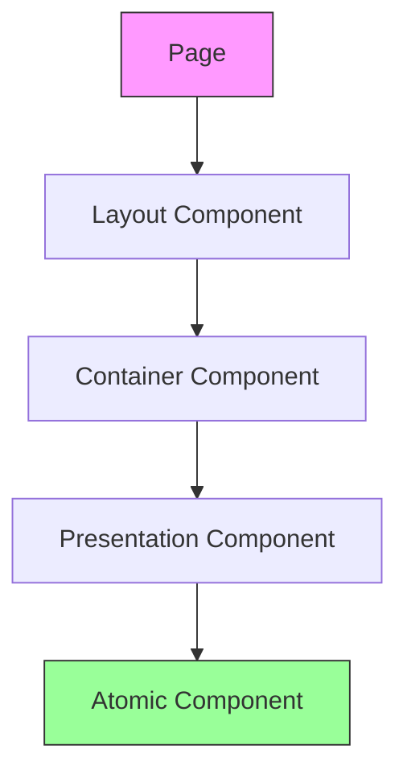
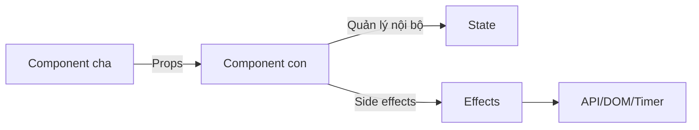

# 3.2 Xây dựng trang như lắp ráp Lego——Khối xây dựng frontend

### Tóm tắt một câu

Component là đơn vị nguyên tử của ứng dụng React, truyền dữ liệu qua Props, quản lý trạng thái nội bộ bằng State, xử lý side effects bằng Effects.

### Định vị phần này

Nếu routing là khung xương của website, thì component là từng khối lego tạo nên khung xương đó. Phần này sẽ dạy bạn cách xây dựng giao diện người dùng phức tạp bằng các component có thể tái sử dụng, như lắp ráp Lego.



### Cốt lõi của tư duy component hóa

#### Tại sao cần component hóa?

| Phát triển truyền thống | Phát triển component hóa |
|----------|------------|
| Một trang một đống code | Tách thành các khối nhỏ tái sử dụng |
| Sửa một chỗ ảnh hưởng toàn bộ | Component hoạt động độc lập bên trong |
| Copy paste tràn lan | Sửa một chỗ, hiệu lực khắp nơi |
| Khó test | Thân thiện với unit test |

#### Ba yếu tố của component

1. **Props (Thuộc tính)**: Dữ liệu component cha truyền cho component con, chỉ đọc
2. **State (Trạng thái)**: Dữ liệu component quản lý nội bộ, có thể thay đổi
3. **Effects (Side effects)**: Logic tương tác với thế giới bên ngoài



### Server Component vs Client Component

Trong App Router, component mặc định là Server Component:

| Đặc tính | Server Component | Client Component |
|------|------------------|------------------|
| Giá trị mặc định | Có | Không (cần `'use client'`) |
| Có thể dùng Hooks | Không | Có |
| Có thể truy cập browser API | Không | Có |
| Có thể truy cập database trực tiếp | Có | Không |
| Đóng gói vào client JS | Không | Có |
| Kịch bản áp dụng | Lấy dữ liệu, UI tĩnh | Tương tác, quản lý state |

**Khi nào dùng Client Component:**

```tsx
'use client' // Khai báo ở đầu file

import { useState } from 'react'

export function Counter() {
  const [count, setCount] = useState(0)

  return (
    <button onClick={() => setCount(count + 1)}>
      Số lần click: {count}
    </button>
  )
}
```

### Nguyên tắc thiết kế component

1. **Đơn trách nhiệm**: Mỗi component chỉ làm một việc
2. **Props xuống, Events lên**: Dữ liệu chảy một chiều
3. **Kết hợp hơn kế thừa**: Xây dựng UI phức tạp qua tổ hợp lồng nhau
4. **Tách biệt mối quan tâm**: Tách logic hiển thị và logic business

### Điều hướng phần này

| Tiểu mục | Chủ đề | Nội dung cốt lõi |
|------|------|----------|
| **3.2.1** | Props | Định nghĩa kiểu, giá trị mặc định, children |
| **3.2.2** | State | useState, state lifting |
| **3.2.3** | Global state | Context, Zustand/Jotai |
| **3.2.4** | Effects | useEffect, cleanup function |
| **3.2.5** | Custom Hooks | Tái sử dụng và trừu tượng hóa logic |
| **3.2.6** | Thiết kế component | Đơn trách nhiệm, mô hình kết hợp |

### Hướng dẫn cộng tác AI

**Ý định cốt lõi**: Để AI giúp bạn thiết kế và implement component có thể tái sử dụng.

**Công thức định nghĩa yêu cầu**:
- Mô tả chức năng: Tôi cần một [tên component], dùng cho [mục đích cụ thể]
- Cách tương tác: Người dùng có thể [mô tả thao tác]
- Hiệu quả kỳ vọng: Component hiển thị [mô tả ngoại quan], phản hồi [hành vi tương tác]

**Thuật ngữ chính**: `Props`, `State`, `useEffect`, `'use client'`, `Server Component`

**Chiến lược tương tác**:
1. Trước tiên để AI phân tích component nên là Server hay Client
2. Định nghĩa Props interface
3. Implement cấu trúc UI cơ bản
4. Thêm logic tương tác và quản lý state

### Checklist nghiệm thu

- [ ] Hiểu sự khác biệt giữa Server/Client Component
- [ ] Biết khi nào dùng `'use client'`
- [ ] Có thể thiết kế Props interface hợp lý
- [ ] Hiểu hướng chảy dữ liệu (Props xuống, Events lên)
