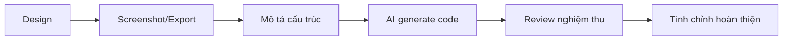

# 3.3 Có thể cho AI hiểu design——Tích hợp Figma thực chiến và cộng tác AI

### Tóm tắt một câu

Cung cấp screenshot hoặc link design cho AI, kết hợp mô tả cấu trúc rõ ràng, để AI generate code gần với design.

### Giá trị cốt lõi

Quy trình truyền thống từ design đến code cần developer restore từng pixel, tốn thời gian và dễ sai sót. Trong hệ thống Vibe Coding, AI có thể "hiểu" design và generate code cơ bản, nhiệm vụ của bạn là **nghiệm thu và tinh chỉnh**.

### Workflow từ design đến code



### Chuẩn bị: Lấy thông tin từ Figma

**Cách 1: Screenshot (khuyến nghị người mới)**

1. Trong Figma chọn component hoặc page mục tiêu
2. Chụp screenshot rõ ràng
3. Paste screenshot vào chat AI

**Cách 2: Dev Mode export**

Figma Dev Mode có thể export:
- CSS properties (màu sắc, spacing, font)
- Cấu trúc component
- Asset files

**Cách 3: Figma plugins**

Một số plugins có thể generate code trực tiếp:
- **Anima**: Export React/Vue code
- **Locofy**: AI-driven code generation
- **Builder.io**: Visual to code

### Cộng tác AI: Mô tả design có cấu trúc

Chỉ đưa ảnh cho AI là chưa đủ. Bạn cần dùng **ngôn ngữ có cấu trúc** để mô tả ý đồ design:

**Template Prompt hiệu quả:**

```
Vui lòng generate React + Tailwind code theo design này:

**Tên page/component**: User profile card

**Layout tổng thể**:
- Card container, bo góc có shadow
- Bên trái: Avatar user (tròn, 64px)
- Bên phải: Thông tin user (tên, chức vụ, bio)

**Yêu cầu tương tác**:
- Khi hover card nhẹ nhàng nổi lên
- Click card chuyển đến trang chi tiết user

**Chi tiết style**:
- Background: trắng
- Shadow: nhẹ
- Spacing: padding 16px

**Yêu cầu kỹ thuật**:
- Sử dụng Tailwind CSS
- Component nhận user object làm Props
```

### Kỹ thuật quan trọng: Mô tả phân tầng

Phân tích design thành nhiều tầng:

| Tầng | Nội dung mô tả | Ví dụ |
|------|----------|------|
| **Tầng layout** | Cấu trúc tổng thể, container, grid | "Two-column layout, left fixed 240px" |
| **Tầng component** | UI unit độc lập | "Card, button, input box" |
| **Tầng style** | Màu sắc, font, spacing | "Primary color #3B82F6, border radius 8px" |
| **Tầng tương tác** | Hover, click, animation | "Hover scale 1.05x" |

### Thực chiến tình huống thường gặp

**Tình huống 1: Restore navigation bar**

```
Design: [Paste screenshot]

Vui lòng generate code top navigation bar:
- Bên trái: Logo image
- Giữa: Navigation links (Home, Products, About)
- Bên phải: Login/Register buttons
- Mobile: Hamburger menu
- Sử dụng Next.js Link component
- Highlight link trang hiện tại
```

**Tình huống 2: Restore form**

```
Design: [Paste screenshot]

Vui lòng generate login form:
- Email input box (có icon)
- Password input box (có toggle show/hide)
- Remember me checkbox
- Login button (primary color)
- Forgot password link
- Sử dụng shadcn/ui components
- Thêm form validation hints
```

### Checklist nghiệm thu

Sau khi AI generate code, nghiệm thu theo checklist sau:

- [ ] **Layout chính xác**: Vị trí element, spacing khớp design
- [ ] **Responsive**: Hiển thị bình thường ở các kích thước màn hình khác nhau
- [ ] **Tương tác đầy đủ**: Hover, click và các state khác đúng
- [ ] **Accessibility**: Có alt text, semantic tags đúng
- [ ] **Chất lượng code**: Không trùng code, Props types đúng

### Vấn đề thường gặp và giải pháp

**Vấn đề: AI generate layout sai lệch lớn**

Giải pháp:
1. Cung cấp mô tả layout chi tiết hơn (dùng thuật ngữ Flexbox/Grid)
2. Generate từng bước: layout trước, rồi mới fill content
3. Chỉ định giá trị pixel hoặc tỷ lệ cụ thể

**Vấn đề: Màu sắc không chính xác**

Giải pháp:
1. Copy chính xác color values từ Figma
2. Chỉ định rõ trong Prompt: `background color #F3F4F6`
3. Xây dựng Design Tokens

**Vấn đề: Component style không thống nhất**

Giải pháp:
1. Trước tiên xây dựng component library cơ bản (Button, Input etc)
2. Tham chiếu component đã có trong Prompt
3. Dùng shadcn/ui để giữ tính nhất quán

### Hướng dẫn cộng tác AI

**Ý định cốt lõi**: Để AI hiểu design và generate code khả dụng.

**Công thức định nghĩa yêu cầu**:
- Mô tả visual: [Screenshot] + layout explanation
- Mô tả tương tác: User operation + system response
- Ràng buộc kỹ thuật: Framework/component library sử dụng

**Thuật ngữ chính**: `Flexbox`, `Grid`, `Tailwind`, `Responsive`, `Design tokens`

**Chiến lược tương tác**:
1. Trước tiên cho AI xem overall design, để nó hiểu context
2. Generate từng component, không generate toàn bộ page một lúc
3. Sau khi generate ngay lập tức verify trong browser
4. Khi phát hiện sai lệch, đưa ra chỉ thị sửa cụ thể cho AI

### Công cụ khuyến nghị

| Công cụ | Mục đích | Đặc điểm |
|------|------|------|
| **v0.dev** | Natural language generate UI | Vercel product, generate shadcn components |
| **Claude** | Image recognition + code generation | Multimodal, có thể nhìn ảnh trực tiếp |
| **Cursor** | Design restoration trong IDE | Có thể paste ảnh vào chat |

### Tổng kết best practices

1. **Xây dựng design system**: Thống nhất color, font, spacing, giảm chi phí mô tả mỗi lần
2. **Component ưu tiên**: Trước tiên generate reusable components, sau đó compose thành page
3. **Incremental development**: Không generate toàn bộ page một lúc, chia thành từng khối
4. **Nghiệm thu kịp thời**: Mỗi lần generate component đều verify, tránh lỗi tích lũy
5. **Giữ lại design gốc**: Lưu screenshot design trong project, thuận tiện cho việc đối chiếu sau này
