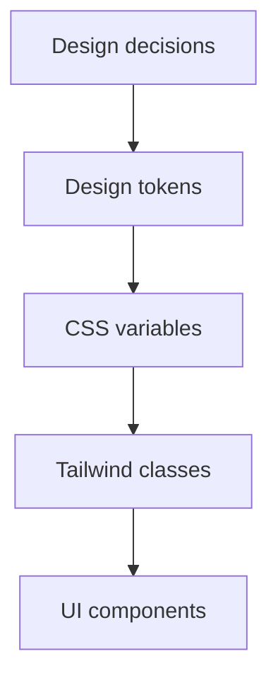

# 3.4.3 Tạm biệt đen đủ sắc màu——Design system

### Tóm tắt một câu

Design system là một bộ quy chuẩn visual thống nhất (color, font, spacing), đảm bảo tính nhất quán UI và đơn giản hóa cộng tác với AI.

### Giá trị cốt lõi

Không có design system, mỗi lần mô tả màu sắc phải nói "màu xanh đó", "xám đậm một chút". Có design system, bạn chỉ cần nói `primary`, `muted`, AI biết chính xác giá trị.

### Design Tokens

Design tokens là nền tảng của design system, abstraction các design decisions thành reusable variables:



### Hệ thống màu sắc

**Semantic colors (khuyến nghị)**

shadcn/ui sử dụng semantic color naming:

| Biến | Mục đích | Ví dụ |
|------|------|------|
| `--background` | Background trang | Trắng/Xám đậm |
| `--foreground` | Text chính | Đen/Trắng |
| `--primary` | Brand color chính | Xanh |
| `--secondary` | Elements phụ | Xám nhạt |
| `--muted` | Nội dung yếu hơn | Text xám |
| `--accent` | Elements nhấn mạnh | Background hover |
| `--destructive` | Actions nguy hiểm | Đỏ |

**Định nghĩa trong CSS**

```css
/* globals.css */
@layer base {
  :root {
    --background: 0 0% 100%;
    --foreground: 222.2 84% 4.9%;
    --primary: 222.2 47.4% 11.2%;
    --primary-foreground: 210 40% 98%;
    --secondary: 210 40% 96%;
    --muted: 210 40% 96%;
    --muted-foreground: 215.4 16.3% 46.9%;
    --accent: 210 40% 96%;
    --destructive: 0 84.2% 60.2%;
  }

  .dark {
    --background: 222.2 84% 4.9%;
    --foreground: 210 40% 98%;
    /* ... */
  }
}
```

**Sử dụng trong Tailwind**

```tsx
<div className="bg-background text-foreground">
  <button className="bg-primary text-primary-foreground">
    Primary button
  </button>
  <p className="text-muted-foreground">
    Secondary text
  </p>
</div>
```

### Hệ thống font

**Quy chuẩn font sizes**

| Class | Size | Mục đích |
|------|------|------|
| `text-xs` | 12px | Thông tin phụ, labels |
| `text-sm` | 14px | Nội dung phụ, forms |
| `text-base` | 16px | Body text |
| `text-lg` | 18px | Tiêu đề nhỏ |
| `text-xl` | 20px | Tiêu đề |
| `text-2xl` | 24px | Tiêu đề lớn |
| `text-3xl` | 30px | Tiêu đề trang |

**Quy chuẩn font weights**

| Class | Weight | Mục đích |
|------|------|------|
| `font-normal` | 400 | Body text |
| `font-medium` | 500 | Nhấn mạnh |
| `font-semibold` | 600 | Tiêu đề nhỏ |
| `font-bold` | 700 | Tiêu đề |

**Cấu hình custom fonts**

```ts
// tailwind.config.ts
import { fontFamily } from "tailwindcss/defaultTheme"

export default {
  theme: {
    extend: {
      fontFamily: {
        sans: ["Inter", ...fontFamily.sans],
        mono: ["JetBrains Mono", ...fontFamily.mono],
      },
    },
  },
}
```

### Hệ thống spacing

Tailwind sử dụng 4px làm base unit:

| Giá trị | Pixels | Mục đích thường gặp |
|-----|------|----------|
| `1` | 4px | Khoảng cách icon và text |
| `2` | 8px | Spacing elements gần nhau |
| `3` | 12px | Padding form elements |
| `4` | 16px | Padding card, spacing mặc định |
| `6` | 24px | Spacing khối |
| `8` | 32px | Spacing khối lớn |
| `12` | 48px | Phân cách các vùng page |

**Nguyên tắc sử dụng spacing**

1. **Nhất quán**: Elements cùng cấp dùng cùng spacing
2. **Tính phân cấp**: Spacing parent-child < spacing anh em
3. **Breathing room**: Content quan trọng để nhiều khoảng trống hơn

### Bo góc và shadow

**Quy chuẩn bo góc**

| Class | Giá trị | Mục đích |
|------|-----|------|
| `rounded-sm` | 2px | Elements nhỏ |
| `rounded` | 4px | Mặc định |
| `rounded-md` | 6px | Buttons, inputs |
| `rounded-lg` | 8px | Cards |
| `rounded-xl` | 12px | Cards lớn |
| `rounded-full` | 9999px | Avatar tròn, tags |

**Quy chuẩn shadows**

| Class | Mục đích |
|------|------|
| `shadow-sm` | Floating cards, dropdowns |
| `shadow` | Regular cards |
| `shadow-md` | Modals, dialogs |
| `shadow-lg` | Important floating layers |

### Xây dựng design system cho project

**1. Định nghĩa file design variables**

```ts
// lib/design-tokens.ts
export const colors = {
  brand: {
    primary: "#3B82F6",
    secondary: "#10B981",
    accent: "#F59E0B",
  },
  semantic: {
    success: "#22C55E",
    warning: "#EAB308",
    error: "#EF4444",
    info: "#3B82F6",
  },
}

export const spacing = {
  page: "max-w-7xl mx-auto px-4 sm:px-6 lg:px-8",
  section: "py-12 md:py-16 lg:py-20",
  card: "p-4 md:p-6",
}
```

**2. Extend Tailwind config**

```ts
// tailwind.config.ts
import { colors } from "./lib/design-tokens"

export default {
  theme: {
    extend: {
      colors: {
        brand: colors.brand,
      },
    },
  },
}
```

### Hướng dẫn cộng tác AI

**Ý định cốt lõi**: Để AI sử dụng ngôn ngữ design thống nhất.

**Công thức định nghĩa yêu cầu**:
- Project sử dụng [tên design system/quy chuẩn tùy chỉnh]
- Colors dùng semantic variables: `primary`, `muted`, `destructive`
- Spacing tuân theo 4px base unit

**Thuật ngữ chính**: `Design tokens`, `Semantic colors`, `CSS variables`, `Theme switching`

**Chiến lược tương tác**:
1. Đầu project nói rõ quy chuẩn design system với AI
2. Trong Prompt sử dụng thuật ngữ design system
3. Yêu cầu AI dùng color/spacing variables đã định nghĩa

### Checklist nghiệm thu

- [ ] Colors dùng semantic variables, không hardcode values
- [ ] Font sizes dùng Tailwind preset classes
- [ ] Spacing tuân theo quy luật bội số 4px
- [ ] Colors dark mode chuyển đổi đúng
