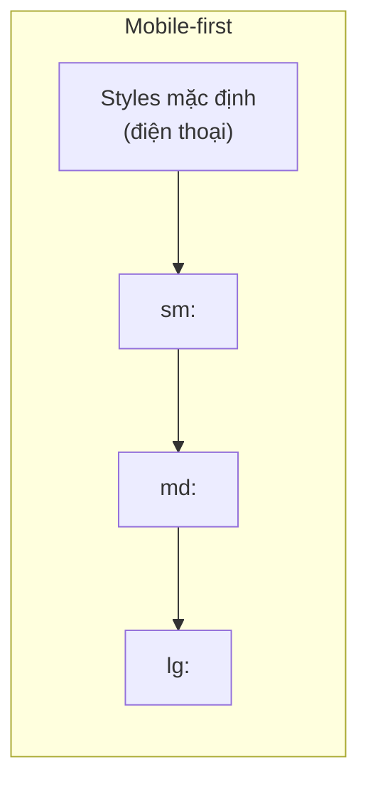

# 3.4.4 Điện thoại và máy tính đều xem được——Responsive design

### Tóm tắt một câu

Mobile-first nghĩa là thiết kế cho màn hình nhỏ trước, rồi dần dần tăng cường trải nghiệm màn hình lớn, hệ thống breakpoint của Tailwind hỗ trợ cách này một cách tự nhiên.

### Giá trị cốt lõi

Hơn 50% lưu lượng web đến từ thiết bị di động. Responsive design đảm bảo ứng dụng của bạn cung cấp trải nghiệm tốt trên mọi thiết bị, và chiến lược mobile-first làm quá trình này đơn giản hơn.

### Mobile-first vs Desktop-first



**Mobile-first**: Styles mặc định hướng đến điện thoại, dùng breakpoint thêm styles cho màn hình lớn.

```html
<!-- Mobile-first: mặc định một cột, md trở lên hai cột -->
<div class="grid grid-cols-1 md:grid-cols-2">
```

**Desktop-first** (không khuyến nghị): Styles mặc định hướng đến desktop, dùng `max-*` breakpoint thu nhỏ.

### Giải thích chi tiết breakpoint Tailwind

| Breakpoint | Chiều rộng tối thiểu | Thiết bị điển hình |
|------|----------|----------|
| Mặc định | 0px | Điện thoại (dọc) |
| `sm:` | 640px | Điện thoại (ngang) |
| `md:` | 768px | Tablet |
| `lg:` | 1024px | Laptop |
| `xl:` | 1280px | Màn hình desktop |
| `2xl:` | 1536px | Màn hình lớn |

### Các pattern responsive thường gặp

**1. Responsive grid**

```tsx
<div className="grid grid-cols-1 sm:grid-cols-2 lg:grid-cols-3 xl:grid-cols-4 gap-4">
  {products.map(product => (
    <ProductCard key={product.id} {...product} />
  ))}
</div>
```

**2. Responsive navigation**

```tsx
function Navbar() {
  return (
    <nav className="flex items-center justify-between p-4">
      <Logo />

      {/* Navigation desktop: hiển thị màn hình lớn */}
      <div className="hidden md:flex gap-6">
        <NavLink href="/">Trang chủ</NavLink>
        <NavLink href="/products">Sản phẩm</NavLink>
        <NavLink href="/about">Giới thiệu</NavLink>
      </div>

      {/* Hamburger menu mobile: hiển thị màn hình nhỏ */}
      <button className="md:hidden">
        <MenuIcon />
      </button>
    </nav>
  )
}
```

**3. Responsive font**

```html
<h1 class="text-2xl sm:text-3xl md:text-4xl lg:text-5xl font-bold">
  Tiêu đề responsive
</h1>
```

**4. Responsive spacing**

```html
<section class="py-8 md:py-12 lg:py-16">
  <div class="px-4 md:px-6 lg:px-8 max-w-7xl mx-auto">
    Khu vực nội dung
  </div>
</section>
```

**5. Responsive hide/show**

| Class | Hiệu ứng |
|-----|------|
| `hidden` | Ẩn mặc định |
| `block` | Hiển thị mặc định |
| `md:hidden` | Ẩn từ md trở lên |
| `hidden md:block` | Ẩn dưới md, hiển thị từ md trở lên |

### Responsive layout components

**Container component**

```tsx
function Container({ children }: { children: React.ReactNode }) {
  return (
    <div className="w-full max-w-7xl mx-auto px-4 sm:px-6 lg:px-8">
      {children}
    </div>
  )
}
```

**Responsive card list**

```tsx
function CardGrid({ children }: { children: React.ReactNode }) {
  return (
    <div className="grid grid-cols-1 sm:grid-cols-2 lg:grid-cols-3 gap-4 md:gap-6">
      {children}
    </div>
  )
}
```

**Responsive sidebar layout**

```tsx
function DashboardLayout({ children }: { children: React.ReactNode }) {
  return (
    <div className="flex flex-col md:flex-row min-h-screen">
      {/* Sidebar: mobile ở trên, desktop ở bên trái */}
      <aside className="w-full md:w-64 bg-gray-100 p-4">
        <Sidebar />
      </aside>

      {/* Khu vực nội dung chính */}
      <main className="flex-1 p-4 md:p-6">
        {children}
      </main>
    </div>
  )
}
```

### Responsive images

```tsx
import Image from 'next/image'

function ResponsiveImage() {
  return (
    <div className="relative w-full aspect-video md:aspect-[4/3] lg:aspect-[16/9]">
      <Image
        src="/hero.jpg"
        alt="Hero"
        fill
        className="object-cover"
        sizes="(max-width: 768px) 100vw, (max-width: 1200px) 50vw, 33vw"
      />
    </div>
  )
}
```

### Debug responsive

**1. Browser developer tools**

Device emulator của Chrome DevTools có thể nhanh chóng chuyển đổi các kích thước khác nhau.

**2. Tailwind debug indicator**

```tsx
// Thêm vào góc trang khi development
function BreakpointIndicator() {
  if (process.env.NODE_ENV === 'production') return null

  return (
    <div className="fixed bottom-4 left-4 bg-black text-white px-2 py-1 text-xs rounded z-50">
      <span className="sm:hidden">xs</span>
      <span className="hidden sm:inline md:hidden">sm</span>
      <span className="hidden md:inline lg:hidden">md</span>
      <span className="hidden lg:inline xl:hidden">lg</span>
      <span className="hidden xl:inline 2xl:hidden">xl</span>
      <span className="hidden 2xl:inline">2xl</span>
    </div>
  )
}
```

### Hướng dẫn cộng tác AI

**Ý định cốt lõi**: Để AI generate responsive code theo mobile-first.

**Công thức định nghĩa yêu cầu**:
- Mô tả chức năng: [component/page]
- Yêu cầu responsive: Mobile [layout], desktop [layout]
- Breakpoint: Sử dụng breakpoint mặc định của Tailwind

**Thuật ngữ chính**: `Mobile-first`, `Breakpoint`, `grid`, `hidden`, `flex-col md:flex-row`

**Ví dụ Prompt**:

```
Tạo trang danh sách sản phẩm:
- Mobile: card một cột
- Tablet (md): hai cột
- Desktop (lg): ba cột
- Sử dụng responsive classes của Tailwind
- Spacing giữa cards: mobile 16px, desktop 24px
```

### Hướng dẫn tránh hố

1. **Không dùng `max-*` breakpoint**: Trừ trường hợp đặc biệt, kiên trì mobile-first
2. **Test thiết bị thật**: Emulator không thể thay thế hoàn toàn test trên máy thật
3. **Chú ý touch target**: Nút bấm mobile tối thiểu 44x44px
4. **Tránh horizontal scroll**: Đảm bảo nội dung không vượt quá viewport

### Checklist nghiệm thu

- [ ] Styles mặc định hướng đến mobile
- [ ] Breakpoint quan trọng (md, lg) có styles tương ứng
- [ ] Navigation mobile khả dụng (hamburger menu hoặc bottom nav)
- [ ] Hình ảnh sử dụng thuộc tính `sizes` tối ưu tải
- [ ] Touch element đủ lớn
