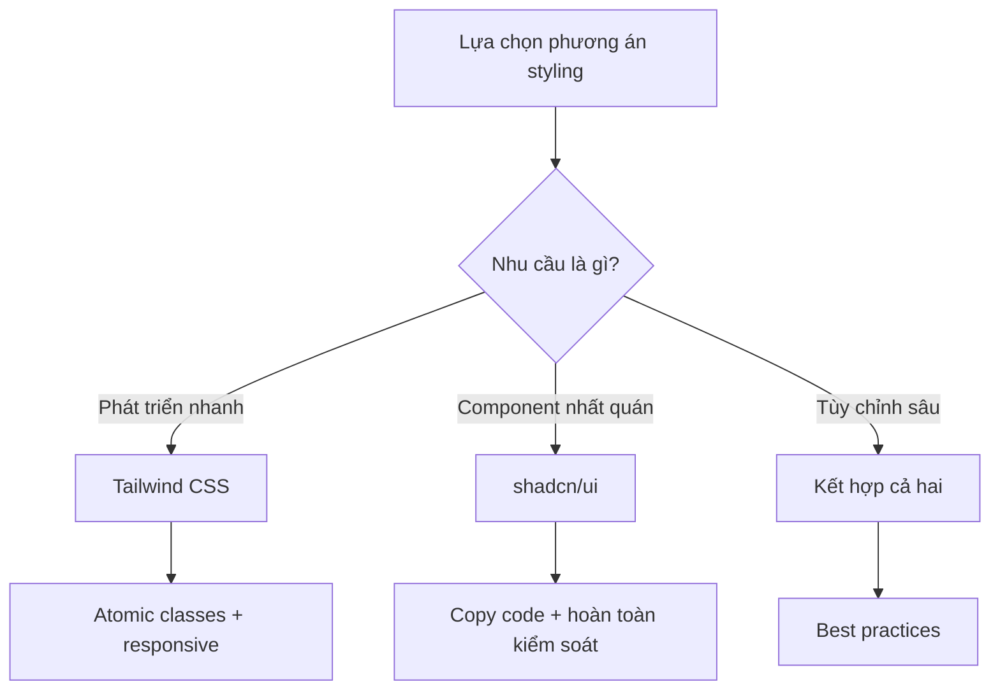

# 3.4 Tạm biệt hội chứng khó lựa chọn——Tailwind + shadcn/ui

### Tóm tắt một câu

Tailwind cung cấp atomic style classes, shadcn/ui cung cấp customizable components, hai thứ kết hợp là phương án styling tốt nhất cho dự án Next.js.

### Giá trị cốt lõi

Thế giới CSS đầy rẫy lựa chọn: CSS Modules, Styled Components, Emotion, Sass... Mỗi phương án đều có ưu nhược điểm. Sự kết hợp Tailwind + shadcn/ui đã trở thành lựa chọn chủ đạo của React community, cũng là chuẩn của tech stack Vibe Coding.

### Tại sao chọn bộ phương án này?



| Phương án | Ưu điểm | Nhược điểm |
|------|------|------|
| **Tailwind CSS** | Không cần naming, iteration nhanh, size nhỏ | Class names dài, cần học |
| **shadcn/ui** | High-quality components, hoàn toàn customizable | Cần cài đặt thủ công |
| **CSS truyền thống** | Quen thuộc, không cần học | Khó naming, style conflicts |
| **CSS-in-JS** | Component hóa, dynamic styles | Runtime overhead |

### Điều hướng phần này

| Section | Chủ đề | Nội dung cốt lõi |
|------|------|----------|
| **3.4.1** | Tailwind CSS | Atomic CSS, classes thường dùng, responsive |
| **3.4.2** | shadcn/ui | Cài đặt sử dụng, tùy chỉnh component |
| **3.4.3** | Design system | Quy chuẩn color/font/spacing |
| **3.4.4** | Responsive design | Mobile-first, breakpoint strategy |

### Bắt đầu nhanh

**1. Khi tạo project đã bao gồm Tailwind**

```bash
npx create-next-app@latest my-app
# Chọn Yes để sử dụng Tailwind CSS
```

**2. Cài đặt shadcn/ui**

```bash
npx shadcn@latest init
```

**3. Thêm components**

```bash
npx shadcn@latest add button
npx shadcn@latest add card
npx shadcn@latest add input
```

### Hướng dẫn cộng tác AI

**Ý định cốt lõi**: Để AI sử dụng Tailwind + shadcn generate UI code nhất quán.

**Công thức định nghĩa yêu cầu**:
- Mô tả chức năng: Tôi cần một [component/page]
- Yêu cầu styling: Sử dụng Tailwind CSS
- Yêu cầu component: Sử dụng [tên component] của shadcn/ui

**Thuật ngữ chính**: `Tailwind`, `shadcn/ui`, `cn()`, `className`, `responsive`

**Ví dụ Prompt**:

```
Vui lòng dùng Tailwind CSS và shadcn/ui tạo login form:
- Sử dụng Card làm container
- Sử dụng Input component (email và password)
- Sử dụng Button component (login button)
- Thêm link "Quên mật khẩu"
- Responsive: mobile full width, desktop tối đa 400px
```

### Checklist nghiệm thu

- [ ] Tailwind config đúng, styles hoạt động
- [ ] shadcn/ui components cài đặt và import đúng
- [ ] Components sử dụng `cn()` để merge style classes
- [ ] Responsive breakpoints thiết lập hợp lý
