# 3.5.1 Xem request chậm ở đâu——Panel Network

### Tóm tắt một câu

Data không hiển thị? API báo lỗi? Panel Network có thể cho bạn biết toàn bộ vòng đời của mỗi request.

### Giá trị cốt lõi

Phần lớn vấn đề của ứng dụng frontend liên quan đến network request. Panel Network cho bạn thấy: request đã gửi đi chưa? Server trả về gì? Mất bao lâu?

### Mở panel Network

1. Mở Chrome DevTools (F12 hoặc chuột phải → Inspect)
2. Click tab "Network"
3. **Refresh trang** để bắt đầu capture request

### Khu vực cốt lõi của panel

```
┌─────────────────────────────────────────────────────┐
│ [Filter] All | Fetch/XHR | JS | CSS | Img | ...     │
├─────────────────────────────────────────────────────┤
│ Name          Status  Type    Size    Time          │
│ api/users     200     fetch   1.2KB   120ms         │
│ api/posts     404     fetch   0.5KB   80ms   ← vấn đề│
│ bundle.js     200     script  450KB   1.2s          │
├─────────────────────────────────────────────────────┤
│ [Request details panel]                             │
│ Headers | Preview | Response | Timing               │
└─────────────────────────────────────────────────────┘
```

### Lọc request nhanh

| Filter | Mục đích |
|--------|------|
| **Fetch/XHR** | Chỉ xem API request (thường dùng nhất) |
| **JS** | JavaScript files |
| **CSS** | Style files |
| **Img** | Image resources |
| **Search box** | Lọc theo từ khóa URL |

### Xem chi tiết request

Click vào bất kỳ request nào, panel bên phải sẽ mở ra:

**Tab Headers**

```
General:
  Request URL: https://api.example.com/users
  Request Method: GET
  Status Code: 200 OK

Request Headers:
  Authorization: Bearer eyJhbGc...
  Content-Type: application/json

Response Headers:
  Content-Type: application/json
  Cache-Control: max-age=3600
```

**Tab Response**

Hiển thị dữ liệu thô server trả về:

```json
{
  "users": [
    { "id": 1, "name": "Nguyễn Văn A" },
    { "id": 2, "name": "Trần Thị B" }
  ]
}
```

**Tab Preview**

Hiển thị response data theo cách được format, dễ đọc hơn.

**Tab Timing**

```mermaid
gantt
    title Request timeline
    dateFormat X
    axisFormat %L ms

    section Kết nối
    DNS lookup      :0, 10
    TCP connect      :10, 30
    SSL handshake      :30, 50

    section Request
    Chờ server    :50, 150
    Download response      :150, 180
```



### Chẩn đoán vấn đề thường gặp

**Vấn đề 1: Request trả về 4xx/5xx**

| Status code | Ý nghĩa | Nguyên nhân thường gặp |
|--------|------|----------|
| 400 | Bad Request | Request parameter format sai |
| 401 | Unauthorized | Chưa login hoặc token hết hạn |
| 403 | Forbidden | Không có quyền truy cập |
| 404 | Not Found | URL path sai |
| 500 | Internal Server Error | Server code báo lỗi |

**Các bước kiểm tra**:
1. Xem tab Response, server thường trả về mô tả lỗi
2. So sánh Authorization trong Request Headers có đúng không
3. Kiểm tra request URL và parameter có phù hợp API doc không

**Vấn đề 2: Request không gửi đi**

Nguyên nhân có thể:
- Logic code vấn đề, hàm request không được gọi
- CORS cross-origin issue (Console sẽ có lỗi)
- Network bị ngắt

**Vấn đề 3: Request rất chậm**

Xem tab Timing, định vị nút thắt cổ chai:
- **TTFB cao**: Server xử lý chậm, cần tối ưu backend
- **Content Download cao**: Response body quá lớn, cân nhắc phân trang hoặc nén
- **Stalled cao**: Browser giới hạn số kết nối, giảm concurrent request

### Kỹ thuật thực dụng

**Copy request thành cURL**

Chuột phải request → Copy → Copy as cURL

Có thể chạy trực tiếp trong terminal, hoặc paste cho đồng nghiệp backend debug:

```bash
curl 'https://api.example.com/users' \
  -H 'Authorization: Bearer xxx' \
  -H 'Content-Type: application/json'
```

**Preserve log**

Tick "Preserve log", log request không bị xóa sau khi chuyển trang.

**Simulate slow network**

Click dropdown "No throttling", có thể mô phỏng môi trường mạng 3G, offline.

**Disable cache**

Tick "Disable cache", đảm bảo mỗi lần đều là request mới.

### Hướng dẫn cộng tác AI

**Ý định cốt lõi**: Dùng thông tin Network giúp AI định vị vấn đề.

**Cách mô tả hiệu quả**:

```
API request của tôi trả về lỗi:
- URL: /api/posts
- Method: POST
- Status: 400
- Request Body: {"title": ""}
- Response: {"error": "title is required"}

Xin hỏi làm sao sửa?
```

**Thuật ngữ chính**: `Status Code`, `Request Headers`, `Response Body`, `CORS`, `TTFB`

### Hướng dẫn tránh hố

1. **Nhớ refresh trang**: Mở panel Network xong phải refresh, nếu không sẽ không thấy request
2. **Tập trung vào Fetch/XHR**: Debug API chỉ xem loại request này, giảm nhiễu
3. **Phân biệt preflight request**: CORS sẽ gửi OPTIONS request trước, request thật ở sau
4. **Chú ý cache**: Status code 304 nghĩa là dùng cache, tick Disable cache tránh nhiễu

### Checklist nghiệm thu

- [ ] Có thể tìm được API request chỉ định
- [ ] Có thể xem status code và response content của request
- [ ] Có thể phân tích time consumption của request
- [ ] Biết cách copy request thành cURL
