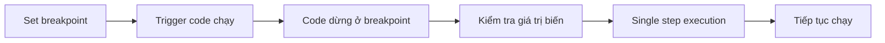

# 3.5.2 Code có chạy không——Console debug

### Tóm tắt một câu

Console là cửa sổ đối thoại giữa bạn và code——print biến, trace thực thi, bắt lỗi.

### Giá trị cốt lõi

Khi code không hoạt động như kỳ vọng, bạn cần biết: đoạn code này đã chạy chưa? Giá trị biến là gì? Lỗi ở đâu? Panel Console có thể trả lời tất cả những câu hỏi này.

### Các phương thức log Console

```tsx
// Log cơ bản
console.log('Thông tin bình thường', data)

// Warning (màu vàng)
console.warn('Đây là warning')

// Error (màu đỏ)
console.error('Đây là error')

// Hiển thị array/object dạng bảng
console.table([{ id: 1, name: 'Nguyễn Văn A' }, { id: 2, name: 'Trần Thị B' }])

// Group log
console.group('Thao tác user')
console.log('Đã click button')
console.log('Đã gửi request')
console.groupEnd()

// Đo thời gian
console.time('Xử lý data')
// ... thao tác tốn thời gian
console.timeEnd('Xử lý data') // Output: Xử lý data: 123.45ms

// Conditional log (chỉ output khi điều kiện false)
console.assert(user !== null, 'User không nên null')
```

### Đọc hiểu thông tin lỗi

Khi JavaScript báo lỗi, Console sẽ hiển thị thông tin lỗi màu đỏ:

```
Uncaught TypeError: Cannot read properties of undefined (reading 'name')
    at UserProfile (UserProfile.tsx:15:23)
    at renderWithHooks (react-dom.development.js:16305:18)
    at mountIndeterminateComponent (react-dom.development.js:20074:13)
```

**Phân tích thông tin lỗi**:

| Phần | Ý nghĩa |
|------|------|
| `Uncaught TypeError` | Loại lỗi: type error |
| `Cannot read properties of undefined` | Cố đọc property của undefined |
| `(reading 'name')` | Cụ thể là đọc property `name` khi lỗi |
| `at UserProfile (UserProfile.tsx:15:23)` | Vị trí lỗi: file dòng 15 cột 23 |

**Loại lỗi thường gặp**:

| Loại lỗi | Ý nghĩa | Tình huống thường gặp |
|----------|------|----------|
| `TypeError` | Type error | Gọi method trên undefined/null |
| `ReferenceError` | Reference error | Dùng biến chưa khai báo |
| `SyntaxError` | Syntax error | Vấn đề cú pháp code |
| `RangeError` | Range error | Recursion tràn, độ dài array không hợp lệ |

### Kỹ thuật debug

**Kỹ thuật 1: Định vị code có chạy không**

```tsx
function handleClick() {
  console.log('1. Hàm bắt đầu chạy')

  if (someCondition) {
    console.log('2. Vào nhánh if')
    // ...
  }

  console.log('3. Hàm chạy xong')
}
```

**Kỹ thuật 2: Kiểm tra giá trị biến**

```tsx
function processData(data) {
  console.log('Data nhận được:', data)
  console.log('Kiểu data:', typeof data)
  console.log('Có phải array:', Array.isArray(data))

  // Nếu là object, mở rộng xem tất cả property
  console.dir(data)
}
```

**Kỹ thuật 3: Trace call stack**

```tsx
function problematicFunction() {
  console.trace('Trace call stack') // Hiển thị ai đã gọi hàm này
}
```

### Sử dụng breakpoint debug

Mạnh hơn `console.log` là breakpoint debugging:

1. Mở DevTools → Panel Sources
2. Tìm source file tương ứng
3. Click số dòng để set breakpoint
4. Refresh trang hoặc trigger thao tác liên quan



**Control buttons của breakpoint panel**:

| Button | Chức năng |
|------|------|
| ▶️ Resume | Tiếp tục chạy đến breakpoint tiếp theo |
| ⏭️ Step Over | Chạy dòng hiện tại, không vào trong hàm |
| ⬇️ Step Into | Vào trong hàm |
| ⬆️ Step Out | Nhảy ra khỏi hàm hiện tại |

**Conditional breakpoint**:

Chuột phải click số dòng → Add conditional breakpoint

```javascript
// Chỉ dừng khi userId là 5
userId === 5
```

### Console debug trong React

**Debug Props**:

```tsx
function UserCard({ user }) {
  console.log('UserCard nhận props:', { user })

  return <div>{user.name}</div>
}
```

**Debug State update**:

```tsx
function Counter() {
  const [count, setCount] = useState(0)

  useEffect(() => {
    console.log('count update thành:', count)
  }, [count])

  // ...
}
```

**Debug useEffect execution**:

```tsx
useEffect(() => {
  console.log('Effect chạy, giá trị dependency:', { userId })

  return () => {
    console.log('Effect cleanup')
  }
}, [userId])
```

### Hướng dẫn cộng tác AI

**Ý định cốt lõi**: Truyền đạt chính xác thông tin lỗi cho AI.

**Cách mô tả hiệu quả**:

```
Code của tôi báo lỗi:

Thông tin lỗi:
TypeError: Cannot read properties of undefined (reading 'map')
    at ProductList (ProductList.tsx:12:18)

Code liên quan:
function ProductList({ products }) {
  return products.map(p => <div>{p.name}</div>)
}

// Cách gọi
<ProductList products={data?.products} />
```

**Thuật ngữ chính**: `TypeError`, `undefined`, `Call stack`, `Breakpoint`, `Single step execution`

### Hướng dẫn tránh hố

1. **Production environment xóa console.log**: Dùng ESLint rule hoặc tự động xóa khi build
2. **Không log thông tin nhạy cảm**: Password, token không nên print ra console
3. **Log phải có ý nghĩa**: `console.log(1)` không bằng `console.log('Trước khi gửi request:', payload)`
4. **Dùng group**: Flow phức tạp dùng `console.group()` tổ chức log

### Checklist nghiệm thu

- [ ] Có thể dùng console.log output giá trị biến
- [ ] Có thể hiểu thông tin lỗi và định vị file và dòng vấn đề
- [ ] Biết cách set breakpoint để debug
- [ ] Có thể dùng single step execution để trace code flow
