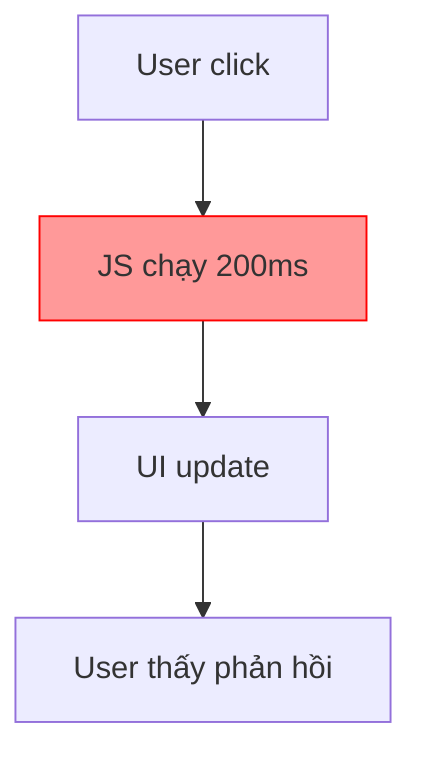

# 3.5.3 Sao trang lại lag thế này——Performance analysis

### Tóm tắt một câu

Khi trang cảm thấy "lag", panel Performance có thể cho bạn biết thời gian đã dùng vào đâu.

### Giá trị cốt lõi

User rất nhạy cảm với lag——độ trễ phản hồi trên 100ms sẽ bị cảm nhận. Panel Performance cho bạn thấy browser đang làm gì ở mỗi mili giây, từ đó tìm ra nút thắt cổ chai performance.

### Record performance data

1. Mở DevTools → Panel Performance
2. Click nút **Record** (hoặc Ctrl+E)
3. Thực hiện thao tác bạn muốn phân tích (như scroll trang, click button)
4. Click **Stop** kết thúc recording

### Hiểu flame chart

Sau khi record xong, bạn sẽ thấy "flame chart":

```
Main Thread
├── Task (200ms) ← Long task!
│   ├── Function Call: heavyCalculation (150ms)
│   └── Function Call: updateDOM (50ms)
├── Task (16ms)
│   └── Render (16ms)
└── Task (8ms)
    └── Paint (8ms)
```

**Khái niệm then chốt**:

| Thuật ngữ | Ý nghĩa |
|------|------|
| **Main Thread** | Main thread, JS execution và UI render đều ở đây |
| **Task** | Một execution task |
| **Long Task** | Task trên 50ms (đánh dấu màu đỏ) |
| **Frame** | Một frame render (mục tiêu 16.67ms = 60fps) |

### Nhận diện vấn đề performance

**Vấn đề 1: Long task blocking**



Long task sẽ block main thread, khiến trang không phản hồi.

**Phương án tối ưu**:
- Tách long task thành nhiều small task
- Dùng `requestAnimationFrame` xử lý theo frame
- Chuyển tính toán sang Web Worker

```tsx
// Code vấn đề: xử lý đồng bộ data lớn
function processAllItems(items) {
  items.forEach(item => heavyProcess(item)) // Block 200ms
}

// Tối ưu: xử lý theo batch
async function processItemsInChunks(items) {
  const chunkSize = 100
  for (let i = 0; i < items.length; i += chunkSize) {
    const chunk = items.slice(i, i + chunkSize)
    chunk.forEach(item => heavyProcess(item))
    await new Promise(resolve => setTimeout(resolve, 0)) // Nhả main thread
  }
}
```

**Vấn đề 2: Repaint/Reflow thường xuyên**

Layout (reflow) và Paint (repaint) là thao tác đắt:

```tsx
// Vấn đề: đọc-ghi xen kẽ dẫn đến forced reflow
elements.forEach(el => {
  const height = el.offsetHeight // Đọc
  el.style.height = height + 10 + 'px' // Ghi
})

// Tối ưu: đọc hàng loạt, ghi hàng loạt
const heights = elements.map(el => el.offsetHeight) // Đọc hàng loạt
elements.forEach((el, i) => {
  el.style.height = heights[i] + 10 + 'px' // Ghi hàng loạt
})
```

**Vấn đề 3: Memory leak**

Chuyển sang panel Memory kiểm tra:

1. Click **Take heap snapshot**
2. Thực hiện vài thao tác (như mở/đóng popup)
3. Lại **Take heap snapshot**
4. So sánh hai snapshot, xem có object chưa giải phóng không

**Tình huống memory leak thường gặp**:

```tsx
// Leak: event listener chưa cleanup
useEffect(() => {
  window.addEventListener('resize', handleResize)
  // Quên return cleanup function!
}, [])

// Đúng: cleanup event listener
useEffect(() => {
  window.addEventListener('resize', handleResize)
  return () => window.removeEventListener('resize', handleResize)
}, [])
```

### React performance optimization

**1. Tránh re-render không cần thiết**

Dùng `React.memo` bao bọc pure component:

```tsx
const ExpensiveComponent = React.memo(function ExpensiveComponent({ data }) {
  // Chỉ re-render khi data thay đổi
  return <div>{/* Render phức tạp */}</div>
})
```

**2. Dùng useMemo cache kết quả tính toán**

```tsx
const sortedList = useMemo(() => {
  return items.sort((a, b) => a.name.localeCompare(b.name))
}, [items]) // Chỉ re-sort khi items thay đổi
```

**3. Dùng useCallback ổn định callback reference**

```tsx
const handleClick = useCallback(() => {
  doSomething(id)
}, [id]) // Chỉ tạo function mới khi id thay đổi
```

### Chỉ số performance

| Chỉ số | Ý nghĩa | Giá trị mục tiêu |
|------|------|--------|
| **FCP** | First Contentful Paint | < 1.8s |
| **LCP** | Largest Contentful Paint | < 2.5s |
| **FID** | First Input Delay | < 100ms |
| **CLS** | Cumulative Layout Shift | < 0.1 |
| **TTI** | Time to Interactive | < 3.8s |

Dùng panel Lighthouse có thể tự động đo các chỉ số này.

### Hướng dẫn cộng tác AI

**Ý định cốt lõi**: Dùng performance data giúp AI định vị điểm tối ưu.

**Cách mô tả hiệu quả**:

```
Trang lag khi scroll, Performance recording hiển thị:
- Main Thread có nhiều long task 200ms+
- Long task chủ yếu từ hàm `renderList`
- List có 1000 item

Xin hỏi làm sao tối ưu?
```

**Thuật ngữ chính**: `Long Task`, `Layout`, `Paint`, `React.memo`, `Virtual scrolling`

### Hướng dẫn tránh hố

1. **Không tối ưu quá sớm**: Xác nhận vấn đề tồn tại trước, rồi mới tối ưu
2. **Đo lường ở production mode**: Development mode React chậm hơn rất nhiều
3. **Quan tâm chỉ số real user**: Dùng RUM monitor trải nghiệm user thật
4. **Ưu tiên tối ưu critical path**: First screen render quan trọng hơn tương tác phụ

### Checklist nghiệm thu

- [ ] Có thể record và phân tích Performance data
- [ ] Có thể nhận diện long task trong flame chart
- [ ] Biết cách kiểm tra memory leak
- [ ] Hiểu các phương pháp tối ưu performance thường dùng của React
