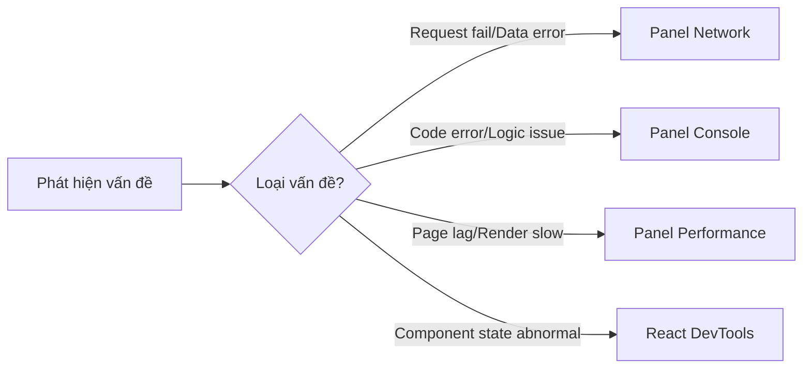

# 3.5 Đừng đoán để tìm Bug——Debug thực chiến

### Tóm tắt một câu

Debugging không phải huyền học, mà là khoa học——dùng công cụ đúng, ở vị trí đúng, quan sát dữ liệu đúng.

### Định vị phần này

Khi code không hoạt động như kỳ vọng, người mới thường rơi vào vòng lặp "đoán-sửa-cầu nguyện". Còn cao thủ sẽ mở DevTools, dùng dữ liệu nói lên sự thật. Phần này sẽ dạy bạn nắm vững bốn panel cốt lõi của Chrome DevTools, khiến vấn đề không còn chỗ ẩn náu.

### Mô hình tư duy debugging

Debugging hiệu quả tuân theo vòng lặp **định vị-quan sát-xác minh**:

| Giai đoạn | Hành động | Công cụ |
|------|------|------|
| **Định vị** | Thu hẹp phạm vi vấn đề | Binary search comment code |
| **Quan sát** | Thu thập runtime data | Các panel DevTools |
| **Xác minh** | Xác nhận giả thuyết đúng hay không | Sửa code và test |

### Chuẩn bị trước khi debug

Trước khi bắt đầu debug, đảm bảo môi trường development đã config đúng:

1. **Development mode**: Đảm bảo chạy `npm run dev` chứ không phải production build
2. **Source Maps**: Đảm bảo source map của TypeScript/JavaScript đã bật
3. **React DevTools**: Cài đặt Chrome extension
4. **Disable cache**: Trong panel Network tick "Disable cache"

### Điều hướng phần này

| Mục | Chủ đề | Giải quyết vấn đề gì |
|------|------|--------------|
| **3.5.1** | Panel Network | Request fail, data format error, API chậm |
| **3.5.2** | Console debug | Code error, logic check, kiểm tra giá trị biến |
| **3.5.3** | Performance analysis | Page lag, render performance, memory leak |
| **3.5.4** | React DevTools | Component state, Props truyền, vấn đề re-render |

### Bảng tra cứu nhanh vấn đề thường gặp

| Hiện tượng | Nguyên nhân có thể | Công cụ kiểm tra | Điểm cần kiểm tra |
|------|----------|----------|----------|
| Màn hình trắng | JS error | Console | Thông tin lỗi màu đỏ |
| Data không hiển thị | Request fail | Network | Status code, response body |
| Page lag | Render performance | Performance | Long task, repaint |
| State không update | React state | React DevTools | Component state, Props |

### Hướng dẫn cộng tác AI

**Ý định cốt lõi**: Khi gặp Bug, dùng DevTools thu thập thông tin trước, rồi mới để AI giúp phân tích.

**Cách cầu cứu hiệu quả**:
- "Network hiển thị request trả về 500, response body là [paste response], đây là vấn đề gì?"
- "Console báo lỗi [paste error stack], lỗi này nghĩa là gì?"
- "Performance recording hiển thị hàm này chạy 200ms, làm sao tối ưu?"

**Cách cầu cứu không hiệu quả**:
- "Màn hình trắng rồi, làm sao?" (thiếu thông tin)
- "Code không hoạt động" (không có mô tả cụ thể)

### Góc nhìn Vibe Coding

Trong hệ thống Vibe Coding, khả năng debug quyết định bạn có thể nghiệm thu hiệu quả code AI generate hay không. Khi code do AI viết không hoạt động, bạn cần:

1. **Dùng DevTools định vị vấn đề**: Thay vì mù quáng để AI "sửa một chút"
2. **Đưa feedback chính xác cho AI**: Cung cấp thông tin lỗi, screenshot network request
3. **Xác minh sửa chữa của AI**: Xác nhận vấn đề thực sự giải quyết, chứ không phải tạo vấn đề mới

### Checklist nghiệm thu

- [ ] Biết cách mở Chrome DevTools (F12 hoặc Cmd+Option+I)
- [ ] Có thể tìm request trong panel Network và xem response
- [ ] Có thể hiểu thông tin lỗi trong panel Console
- [ ] Đã cài React Developer Tools extension
