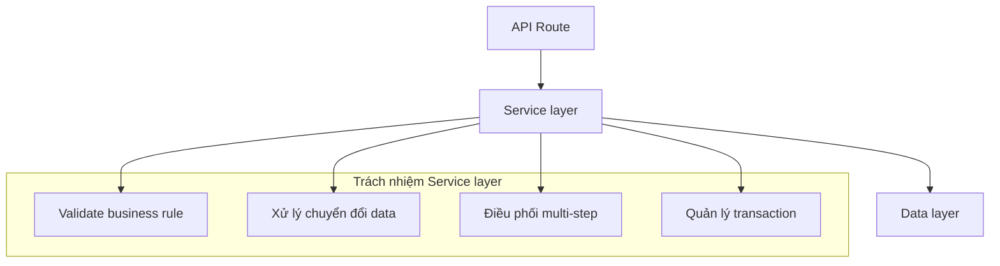

# 3.6.3 Business logic đặt ở đâu——Thiết kế Service layer

### Tóm tắt một câu

Service layer là nơi ở của business rule, giữ API Route gọn gàng, logic có thể test và tái sử dụng.

### Giá trị cốt lõi

Khi business logic rải rác khắp API Route, code rất khó tái sử dụng và khó test. Service layer tách biệt "làm gì" với "nhận request như thế nào", khiến code rõ ràng hơn.

### Trách nhiệm của Service layer



| Nên ở Service layer | Không nên ở Service layer |
|-------------|---------------|
| Phán đoán business rule | Parse HTTP request |
| Chuyển đổi xử lý data | Xây dựng response format |
| Điều phối multi-table operation | Kiểm tra auth/permission |
| Gọi third-party service | Set cache header |

### Cấu trúc Service cơ bản

```tsx
// services/postService.ts

import { prisma } from '@/lib/prisma'
import { CreatePostInput, UpdatePostInput } from '@/lib/validations/post'
import { NotFoundError, ConflictError } from '@/lib/errors'

export const postService = {
  async findAll(options: { page: number; limit: number; status?: string }) {
    const { page, limit, status } = options
    const skip = (page - 1) * limit

    const [posts, total] = await Promise.all([
      prisma.post.findMany({
        where: status ? { status } : undefined,
        skip,
        take: limit,
        orderBy: { createdAt: 'desc' },
      }),
      prisma.post.count({ where: status ? { status } : undefined }),
    ])

    return { posts, total, page, limit }
  },

  async findById(id: string) {
    const post = await prisma.post.findUnique({ where: { id } })
    if (!post) {
      throw new NotFoundError('Bài viết không tồn tại')
    }
    return post
  },

  async create(data: CreatePostInput) {
    const slug = this.generateSlug(data.title)

    const existing = await prisma.post.findUnique({ where: { slug } })
    if (existing) {
      throw new ConflictError('Tiêu đề đã được sử dụng')
    }

    return prisma.post.create({
      data: { ...data, slug },
    })
  },

  async update(id: string, data: UpdatePostInput) {
    await this.findById(id)

    if (data.title) {
      const slug = this.generateSlug(data.title)
      const existing = await prisma.post.findFirst({
        where: { slug, NOT: { id } },
      })
      if (existing) {
        throw new ConflictError('Tiêu đề đã được sử dụng')
      }
      data = { ...data, slug }
    }

    return prisma.post.update({ where: { id }, data })
  },

  async delete(id: string) {
    await this.findById(id)
    return prisma.post.delete({ where: { id } })
  },

  generateSlug(title: string) {
    return title
      .toLowerCase()
      .trim()
      .replace(/\s+/g, '-')
      .replace(/[^\w\-]+/g, '')
  },
}
```

### Sử dụng trong API Route

```tsx
// app/api/posts/route.ts
import { postService } from '@/services/postService'
import { createPostSchema, queryPostsSchema } from '@/lib/validations/post'
import { handleError } from '@/lib/errorHandler'

export async function GET(request: Request) {
  const { searchParams } = new URL(request.url)
  const result = queryPostsSchema.safeParse(Object.fromEntries(searchParams))

  if (!result.success) {
    return Response.json({ error: result.error.flatten() }, { status: 400 })
  }

  try {
    const data = await postService.findAll(result.data)
    return Response.json({ data })
  } catch (error) {
    return handleError(error)
  }
}

export async function POST(request: Request) {
  const body = await request.json()
  const result = createPostSchema.safeParse(body)

  if (!result.success) {
    return Response.json({ error: result.error.flatten() }, { status: 400 })
  }

  try {
    const post = await postService.create(result.data)
    return Response.json({ data: post }, { status: 201 })
  } catch (error) {
    return handleError(error)
  }
}
```

### Ví dụ Business phức tạp

**Tình huống**: Publish bài viết cần: kiểm tra quyền tác giả, generate slug, gửi notification

```tsx
// services/postService.ts
async publish(postId: string, userId: string) {
  const post = await this.findById(postId)

  if (post.authorId !== userId) {
    throw new ForbiddenError('Chỉ được publish bài viết của mình')
  }

  if (post.status === 'published') {
    throw new ConflictError('Bài viết đã publish')
  }

  const updatedPost = await prisma.post.update({
    where: { id: postId },
    data: {
      status: 'published',
      publishedAt: new Date(),
    },
  })

  await notificationService.notifyFollowers(userId, {
    type: 'new_post',
    postId: updatedPost.id,
  })

  return updatedPost
}
```

### Xử lý Transaction

Khi nhiều database operation cần tính nguyên tử, dùng transaction:

```tsx
async createOrder(userId: string, items: OrderItem[]) {
  return prisma.$transaction(async (tx) => {
    const order = await tx.order.create({
      data: { userId, status: 'pending' },
    })

    for (const item of items) {
      const product = await tx.product.findUnique({
        where: { id: item.productId },
      })

      if (!product || product.stock < item.quantity) {
        throw new Error(`Sản phẩm ${item.productId} không đủ hàng`)
      }

      await tx.product.update({
        where: { id: item.productId },
        data: { stock: { decrement: item.quantity } },
      })

      await tx.orderItem.create({
        data: {
          orderId: order.id,
          productId: item.productId,
          quantity: item.quantity,
          price: product.price,
        },
      })
    }

    const total = await tx.orderItem.aggregate({
      where: { orderId: order.id },
      _sum: { price: true },
    })

    return tx.order.update({
      where: { id: order.id },
      data: { total: total._sum.price || 0 },
      include: { items: true },
    })
  })
}
```

### Cấu trúc thư mục gợi ý

```
src/
├── app/
│   └── api/
│       └── posts/
│           └── route.ts       # Chỉ xử lý HTTP
├── services/
│   ├── postService.ts         # Business logic bài viết
│   ├── userService.ts         # Business logic user
│   └── notificationService.ts # Notification service
├── repositories/              # Optional, tách thêm data access
│   └── postRepository.ts
└── lib/
    ├── prisma.ts              # Prisma client
    └── errors.ts              # Custom error class
```

### Hướng dẫn cộng tác AI

**Ý định cốt lõi**: Để AI giúp thiết kế Service layer với business logic rõ ràng.

**Công thức định nghĩa yêu cầu**:
- Mô tả chức năng: Implement service method cho [business scenario]
- Business rule: [quy tắc 1], [quy tắc 2], [quy tắc 3]
- Yêu cầu kỹ thuật: Sử dụng Prisma, throw custom error

**Thuật ngữ chính**: `Service`, `Transaction`, `$transaction`, Business rule, Error handling

**Ví dụ Prompt**:

```
Vui lòng implement service đăng ký user:
1. Kiểm tra email đã đăng ký chưa
2. Kiểm tra username đã được dùng chưa
3. Mã hóa password lưu trữ
4. Sau khi tạo user gửi email chào mừng
5. Trả về thông tin user (không chứa password)
Sử dụng Prisma transaction đảm bảo tính nhất quán
```

### Hướng dẫn tránh hố

1. **Không phụ thuộc Request/Response trong Service layer**: Giữ Service layer thuần túy
2. **Throw error có ngữ nghĩa**: Dùng custom error class, không dùng Error chung
3. **Single responsibility**: Một service method chỉ làm một việc
4. **Tránh circular dependency**: Cẩn thận khi service gọi nhau

### Checklist nghiệm thu

- [ ] Service layer không phụ thuộc HTTP-related object
- [ ] Business rule tập trung ở Service layer
- [ ] Sử dụng transaction xử lý multi-step operation
- [ ] Throw error message có ý nghĩa
