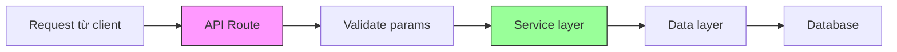

# 3.6 Đừng xây bếp trong phòng khách——API Route và tách tầng service

### Tóm tắt một câu

API Route là cổng giao tiếp ứng dụng với bên ngoài, nhưng business logic nên ở service layer, không phải trong route handler.

### Định vị phần này

Trong Next.js App Router, bạn có thể dùng Route Handlers tạo backend API. Nhưng nếu không phân tầng tốt, rất nhanh sẽ biến thành "bếp và phòng khách nối liền nhau"——logic rối, khó bảo trì.



### Nguyên tắc cốt lõi kiến trúc phân tầng

| Tầng | Trách nhiệm | Không nên làm |
|------|------|------------|
| **API Route** | Nhận request, validate param, trả response | Business logic, database operation |
| **Service layer** | Business logic, validate quy tắc | HTTP handling, database detail |
| **Data layer** | Database operation, ORM call | Business rule, HTTP response |

### Tại sao cần phân tầng?

**Tình huống**: Giả sử bạn cần implement chức năng "tạo bài viết".

**Không phân tầng (tất cả logic nhét vào Route Handler)**:

```tsx
// Code vấn đề: nấu chung một nồi
export async function POST(request: Request) {
  const body = await request.json()

  // Logic validation
  if (!body.title || body.title.length < 3) {
    return Response.json({ error: 'Tiêu đề quá ngắn' }, { status: 400 })
  }

  // Business logic
  const slug = body.title.toLowerCase().replace(/ /g, '-')
  const existingPost = await prisma.post.findUnique({ where: { slug } })
  if (existingPost) {
    return Response.json({ error: 'slug đã tồn tại' }, { status: 409 })
  }

  // Database operation
  const post = await prisma.post.create({
    data: { title: body.title, slug, content: body.content }
  })

  return Response.json(post, { status: 201 })
}
```

**Có phân tầng (trách nhiệm rõ ràng)**:

```tsx
// app/api/posts/route.ts - API layer
export async function POST(request: Request) {
  const body = await request.json()
  const result = createPostSchema.safeParse(body)
  if (!result.success) {
    return Response.json({ error: result.error }, { status: 400 })
  }

  try {
    const post = await postService.createPost(result.data)
    return Response.json(post, { status: 201 })
  } catch (error) {
    return handleError(error)
  }
}

// services/postService.ts - Service layer
export async function createPost(data: CreatePostInput) {
  const slug = generateSlug(data.title)
  const existing = await postRepository.findBySlug(slug)
  if (existing) {
    throw new ConflictError('slug đã tồn tại')
  }
  return postRepository.create({ ...data, slug })
}

// repositories/postRepository.ts - Data layer
export async function create(data: PostData) {
  return prisma.post.create({ data })
}
```

### Điều hướng phần này

| Mục | Chủ đề | Nội dung cốt lõi |
|------|------|----------|
| **3.6.1** | Cấu trúc API Route | Xử lý GET/POST/PUT/DELETE |
| **3.6.2** | Validate request | Zod param validation, type safety |
| **3.6.3** | Thiết kế Service layer | Đóng gói và tái sử dụng business logic |
| **3.6.4** | Error handling | Cơ chế xử lý exception thống nhất |

### Hướng dẫn cộng tác AI

**Ý định cốt lõi**: Để AI giúp thiết kế API với phân tầng rõ ràng.

**Công thức định nghĩa yêu cầu**:
- Mô tả chức năng: Tôi cần CRUD API cho [resource]
- Yêu cầu kỹ thuật: Sử dụng Next.js Route Handler + Zod + Prisma
- Yêu cầu phân tầng: API layer chỉ làm routing, business logic ở service layer

**Thuật ngữ chính**: `Route Handler`, `Service`, `Repository`, `Zod`, `Error handling`

### Checklist nghiệm thu

- [ ] API Route chỉ xử lý request và response
- [ ] Business logic đóng gói trong Service layer
- [ ] Sử dụng Zod để validate param
- [ ] Có cơ chế error handling thống nhất
