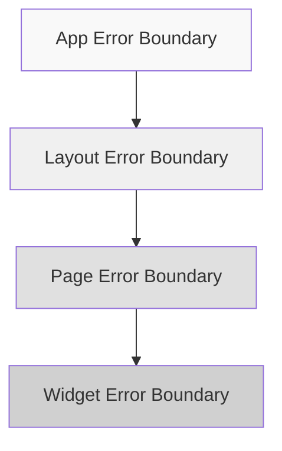

# 3.7.1 Error Boundary

### Tóm tắt một câu

Error Boundary là cầu chì của React, khi một component chập mạch, bảo vệ các component khác tiếp tục hoạt động.

### Giá trị cốt lõi

Lỗi JavaScript không nên làm toàn bộ ứng dụng sập. Error Boundary có thể bắt lỗi trong subtree component, hiển thị fallback UI thay vì màn trắng.

### Implement cơ bản

```tsx
// components/ErrorBoundary.tsx
'use client'

import { Component, ReactNode } from 'react'

interface Props {
  children: ReactNode
  fallback?: ReactNode
  onError?: (error: Error, errorInfo: React.ErrorInfo) => void
}

interface State {
  hasError: boolean
  error: Error | null
}

export class ErrorBoundary extends Component<Props, State> {
  constructor(props: Props) {
    super(props)
    this.state = { hasError: false, error: null }
  }

  static getDerivedStateFromError(error: Error): State {
    return { hasError: true, error }
  }

  componentDidCatch(error: Error, errorInfo: React.ErrorInfo) {
    console.error('ErrorBoundary caught an error:', error, errorInfo)
    this.props.onError?.(error, errorInfo)
  }

  render() {
    if (this.state.hasError) {
      return this.props.fallback || <DefaultFallback error={this.state.error} />
    }

    return this.props.children
  }
}

function DefaultFallback({ error }: { error: Error | null }) {
  return (
    <div className="p-4 border border-red-200 rounded-lg bg-red-50">
      <h2 className="text-red-800 font-medium">Có lỗi xảy ra</h2>
      <p className="text-red-600 text-sm mt-1">
        {error?.message || 'Xảy ra lỗi không rõ'}
      </p>
    </div>
  )
}
```

### Cách sử dụng

**Sử dụng cơ bản**:

```tsx
<ErrorBoundary>
  <RiskyComponent />
</ErrorBoundary>
```

**Custom Fallback**:

```tsx
<ErrorBoundary
  fallback={
    <div className="text-center py-8">
      <p>Chức năng này tạm không khả dụng</p>
      <button onClick={() => window.location.reload()}>
        Refresh trang
      </button>
    </div>
  }
>
  <WidgetComponent />
</ErrorBoundary>
```

**Có chức năng retry**:

```tsx
// components/ErrorBoundaryWithRetry.tsx
'use client'

import { Component, ReactNode } from 'react'

interface Props {
  children: ReactNode
  onRetry?: () => void
}

interface State {
  hasError: boolean
  error: Error | null
}

export class ErrorBoundaryWithRetry extends Component<Props, State> {
  constructor(props: Props) {
    super(props)
    this.state = { hasError: false, error: null }
  }

  static getDerivedStateFromError(error: Error): State {
    return { hasError: true, error }
  }

  handleRetry = () => {
    this.setState({ hasError: false, error: null })
    this.props.onRetry?.()
  }

  render() {
    if (this.state.hasError) {
      return (
        <div className="p-4 border rounded-lg bg-gray-50 text-center">
          <p className="text-gray-600 mb-4">Tải thất bại</p>
          <button
            onClick={this.handleRetry}
            className="px-4 py-2 bg-blue-500 text-white rounded"
          >
            Thử lại
          </button>
        </div>
      )
    }

    return this.props.children
  }
}
```

### Sử dụng trong Next.js

**Layout level error boundary**:

```tsx
// app/layout.tsx
import { ErrorBoundary } from '@/components/ErrorBoundary'

export default function RootLayout({ children }: { children: React.ReactNode }) {
  return (
    <html>
      <body>
        <ErrorBoundary fallback={<GlobalErrorPage />}>
          {children}
        </ErrorBoundary>
      </body>
    </html>
  )
}
```

**Page level error handling** (Next.js built-in):

```tsx
// app/dashboard/error.tsx
'use client'

export default function Error({
  error,
  reset,
}: {
  error: Error & { digest?: string }
  reset: () => void
}) {
  return (
    <div className="min-h-screen flex items-center justify-center">
      <div className="text-center">
        <h2 className="text-xl font-semibold mb-4">Có lỗi xảy ra</h2>
        <p className="text-gray-600 mb-4">{error.message}</p>
        <button
          onClick={reset}
          className="px-4 py-2 bg-blue-500 text-white rounded"
        >
          Thử lại
        </button>
      </div>
    </div>
  )
}
```

### Giới hạn của Error Boundary

Error Boundary **không thể bắt** các lỗi sau:

| Loại lỗi | Nguyên nhân | Giải pháp |
|---------|------|---------|
| Lỗi trong event handler | Không trong quá trình render | try-catch |
| Async code (setTimeout) | Thoát khỏi React call stack | try-catch |
| Server rendering error | Xảy ra trên server | error.tsx |
| Lỗi trong Error Boundary itself | Không thể tự bắt | Nested boundary |

```tsx
// Event handler cần xử lý thủ công
function Button() {
  const handleClick = () => {
    try {
      riskyOperation()
    } catch (error) {
      // Xử lý lỗi thủ công
      showToast('Thao tác thất bại')
    }
  }

  return <button onClick={handleClick}>Click</button>
}
```

### Error reporting

```tsx
// components/ErrorBoundary.tsx
componentDidCatch(error: Error, errorInfo: React.ErrorInfo) {
  reportError({
    error: {
      message: error.message,
      stack: error.stack,
    },
    componentStack: errorInfo.componentStack,
    url: window.location.href,
    timestamp: new Date().toISOString(),
  })
}

async function reportError(data: ErrorReport) {
  if (process.env.NODE_ENV === 'production') {
    await fetch('/api/error-report', {
      method: 'POST',
      body: JSON.stringify(data),
    })
  }
}
```

### Chiến lược boundary



Khuyến nghị set theo từng tầng:
- **Global level**: Bắt lỗi nghiêm trọng chưa dự liệu
- **Layout level**: Bảo vệ navigation bar và phần chung
- **Page level**: Cách ly lỗi giữa các trang
- **Component level**: Bảo vệ module chức năng độc lập

### Hướng dẫn cộng tác AI

**Ý định cốt lõi**: Để AI giúp implement hệ thống error boundary vững chắc.

**Công thức định nghĩa yêu cầu**:
- Mô tả chức năng: Tạo error boundary component có [tính năng]
- Fallback plan: Khi lỗi hiển thị [backup UI]
- Chức năng bổ sung: [retry/reporting/logging]

**Ví dụ Prompt**:

```
Vui lòng tạo Error Boundary component:
1. Bắt render error của child component
2. Hiển thị thông báo lỗi thân thiện và nút retry
3. Hỗ trợ error reporting đến backend
4. Development environment hiển thị error stack
```

### Checklist nghiệm thu

- [ ] Các module chức năng quan trọng có Error Boundary bảo vệ
- [ ] Có fallback UI phù hợp
- [ ] Hỗ trợ error retry
- [ ] Production environment có error reporting
