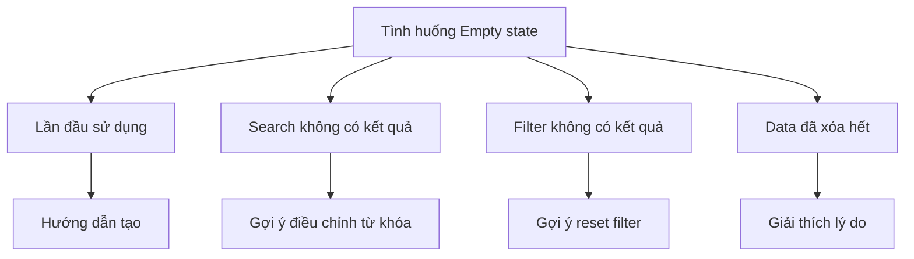

# 3.7.2 Empty state design

### Tóm tắt một câu

Trống không phải điểm kết, mà là cơ hội hướng dẫn user bắt đầu. Empty state tốt giúp user biết nên làm gì.

### Giá trị cốt lõi

Khi list trống, search không có kết quả, đừng chỉ hiển thị "Không có dữ liệu". Empty state page nên giải thích tại sao trống và hướng dẫn user bước tiếp theo.

### Các loại Empty state



| Tình huống | Tâm lý user | Điểm thiết kế |
|-----|---------|---------|
| Lần đầu sử dụng | Tò mò, kỳ vọng | Nhấn mạnh giá trị, hướng dẫn bắt đầu |
| Search không có kết quả | Hơi thất vọng | Đưa ra gợi ý thay thế |
| Filter không có kết quả | Hoang mang | Hiển thị nút reset |
| Data đã xóa hết | Có thể thao tác nhầm | Cung cấp đường khôi phục |

### Empty component cơ bản

```tsx
// components/Empty.tsx
import { ReactNode } from 'react'

interface EmptyProps {
  icon?: ReactNode
  title: string
  description?: string
  action?: ReactNode
}

export function Empty({ icon, title, description, action }: EmptyProps) {
  return (
    <div className="flex flex-col items-center justify-center py-12">
      {icon && (
        <div className="text-gray-400 mb-4">
          {icon}
        </div>
      )}
      <h3 className="text-lg font-medium text-gray-900 mb-2">
        {title}
      </h3>
      {description && (
        <p className="text-sm text-gray-500 mb-4 text-center max-w-sm">
          {description}
        </p>
      )}
      {action && (
        <div className="mt-4">
          {action}
        </div>
      )}
    </div>
  )
}
```

### Empty state theo tình huống

**Lần đầu sử dụng**:

```tsx
<Empty
  icon={<FileIcon className="w-12 h-12" />}
  title="Chưa có tài liệu nào"
  description="Tạo tài liệu đầu tiên để bắt đầu ghi lại ý tưởng của bạn"
  action={
    <Button onClick={openCreateDialog}>
      <PlusIcon className="w-4 h-4 mr-2" />
      Tạo tài liệu
    </Button>
  }
/>
```

**Search không có kết quả**:

```tsx
function SearchEmpty({ query }: { query: string }) {
  return (
    <Empty
      icon={<SearchIcon className="w-12 h-12" />}
      title={`Không tìm thấy nội dung liên quan đến "${query}"`}
      description="Thử từ khóa khác hoặc kiểm tra lỗi chính tả"
      action={
        <div className="space-y-2 text-center">
          <p className="text-sm text-gray-500">Bạn có thể thử:</p>
          <div className="flex gap-2 justify-center">
            <Button variant="outline" size="sm">React</Button>
            <Button variant="outline" size="sm">Next.js</Button>
            <Button variant="outline" size="sm">TypeScript</Button>
          </div>
        </div>
      }
    />
  )
}
```

**Filter không có kết quả**:

```tsx
function FilterEmpty({ onReset }: { onReset: () => void }) {
  return (
    <Empty
      icon={<FilterIcon className="w-12 h-12" />}
      title="Không có kết quả phù hợp"
      description="Không có dữ liệu khớp với điều kiện lọc hiện tại"
      action={
        <Button variant="outline" onClick={onReset}>
          Reset điều kiện lọc
        </Button>
      }
    />
  )
}
```

### Đóng gói List component

```tsx
// components/List.tsx
interface ListProps<T> {
  data: T[]
  loading?: boolean
  empty?: ReactNode
  renderItem: (item: T, index: number) => ReactNode
}

export function List<T>({ data, loading, empty, renderItem }: ListProps<T>) {
  if (loading) {
    return <ListSkeleton />
  }

  if (data.length === 0) {
    return empty || <Empty title="Chưa có dữ liệu" />
  }

  return (
    <ul className="divide-y">
      {data.map((item, index) => (
        <li key={index}>{renderItem(item, index)}</li>
      ))}
    </ul>
  )
}

// Sử dụng
<List
  data={posts}
  loading={isLoading}
  empty={
    <Empty
      title="Chưa có bài viết"
      action={<Button>Viết bài đầu tiên</Button>}
    />
  }
  renderItem={(post) => <PostCard post={post} />}
/>
```

### Empty state có illustration

```tsx
// components/EmptyWithIllustration.tsx
interface EmptyWithIllustrationProps {
  illustration: 'inbox' | 'search' | 'error' | 'success'
  title: string
  description?: string
  action?: ReactNode
}

const illustrations = {
  inbox: '/illustrations/empty-inbox.svg',
  search: '/illustrations/empty-search.svg',
  error: '/illustrations/error.svg',
  success: '/illustrations/success.svg',
}

export function EmptyWithIllustration({
  illustration,
  title,
  description,
  action,
}: EmptyWithIllustrationProps) {
  return (
    <div className="flex flex-col items-center py-16">
      
      <h3 className="text-xl font-medium mb-2">{title}</h3>
      {description && (
        <p className="text-gray-500 mb-6 text-center max-w-md">
          {description}
        </p>
      )}
      {action}
    </div>
  )
}
```

### Empty state động

Hiển thị Empty state khác nhau dựa theo context:

```tsx
function PostList({ category }: { category?: string }) {
  const { data: posts, isLoading } = usePosts({ category })

  const emptyState = useMemo(() => {
    if (category) {
      return (
        <Empty
          title={`Chưa có bài viết trong danh mục "${category}"`}
          action={
            <Link href="/posts">Xem tất cả bài viết</Link>
          }
        />
      )
    }

    return (
      <Empty
        title="Chưa có bài viết nào"
        description="Bắt đầu viết bài viết đầu tiên của bạn"
        action={
          <Button asChild>
            <Link href="/posts/new">Viết bài</Link>
          </Button>
        }
      />
    )
  }, [category])

  return (
    <List
      data={posts}
      loading={isLoading}
      empty={emptyState}
      renderItem={(post) => <PostCard post={post} />}
    />
  )
}
```

### Nguyên tắc thiết kế Empty state

**1. Giải thích lý do**: Cho user biết tại sao lại trống

```tsx
// Tệ
<p>Chưa có dữ liệu</p>

// Tốt
<p>Bạn chưa tạo dự án nào</p>
```

**2. Cung cấp lối thoát**: Đưa cho user một hành động rõ ràng

```tsx
// Tệ
<Empty title="Chưa có yêu thích" />

// Tốt
<Empty
  title="Chưa có yêu thích"
  action={<Link href="/explore">Khám phá nội dung</Link>}
/>
```

**3. Giữ nhất quán thương hiệu**: Dùng phong cách illustration và giọng điệu thống nhất

### Hướng dẫn cộng tác AI

**Ý định cốt lõi**: Để AI giúp thiết kế empty state page cho nhiều tình huống.

**Công thức định nghĩa yêu cầu**:
- Mô tả tình huống: Empty state design cho [trang/tính năng]
- Lý do trống: [lần đầu sử dụng/không có kết quả tìm kiếm/lọc trống]
- Mục tiêu hướng dẫn: Muốn user [thực hiện thao tác nào đó]

**Ví dụ Prompt**:

```
Vui lòng thiết kế empty state page cho giỏ yêu thích e-commerce:
1. Lần đầu sử dụng: hướng dẫn user đi xem sản phẩm
2. Hiển thị illustration và copy thân thiện
3. Cung cấp nút "Đi xem"
4. Có thể recommend sản phẩm hot
```

### Checklist nghiệm thu

- [ ] Tất cả list đều có xử lý empty state
- [ ] Empty state có hướng dẫn bước tiếp theo rõ ràng
- [ ] Search/filter có empty state tương ứng
- [ ] Phong cách empty state nhất quán với thương hiệu
