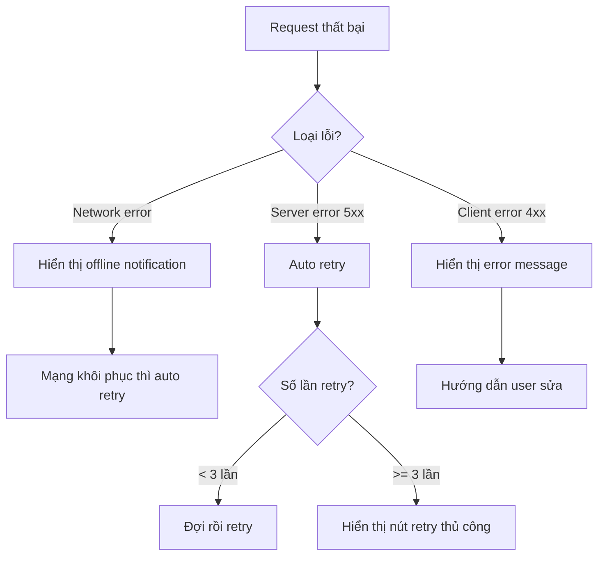

# 3.7.4 Error retry

### Tóm tắt một câu

Thất bại không đáng sợ, đáng sợ là user không biết làm sao retry. Cho user một nút bấm, thắng hơn câu "Vui lòng thử lại sau".

### Giá trị cốt lõi

Network request thất bại là chuyện bình thường. Error handling tốt phải: báo user chuyện gì xảy ra, cung cấp cách retry ngay lập tức, khi cần thì auto retry.

### Error state component

```tsx
// components/ErrorState.tsx
import { ReactNode } from 'react'

interface ErrorStateProps {
  title?: string
  message?: string
  onRetry?: () => void
  retrying?: boolean
  action?: ReactNode
}

export function ErrorState({
  title = 'Tải thất bại',
  message = 'Vui lòng kiểm tra kết nối mạng và thử lại',
  onRetry,
  retrying = false,
  action,
}: ErrorStateProps) {
  return (
    <div className="flex flex-col items-center justify-center py-12">
      <div className="w-16 h-16 mb-4 text-red-500">
        <AlertCircleIcon className="w-full h-full" />
      </div>

      <h3 className="text-lg font-medium text-gray-900 mb-2">
        {title}
      </h3>

      <p className="text-sm text-gray-500 mb-6 text-center max-w-sm">
        {message}
      </p>

      {action || (onRetry && (
        <button
          onClick={onRetry}
          disabled={retrying}
          className="px-4 py-2 bg-blue-500 text-white rounded hover:bg-blue-600 disabled:opacity-50"
        >
          {retrying ? 'Đang thử lại...' : 'Thử lại'}
        </button>
      ))}
    </div>
  )
}
```

### Sử dụng trong list

```tsx
function PostList() {
  const { data, error, isLoading, refetch, isRefetching } = usePosts()

  if (isLoading) {
    return <PostListSkeleton />
  }

  if (error) {
    return (
      <ErrorState
        title="Tải bài viết thất bại"
        message={error.message}
        onRetry={refetch}
        retrying={isRefetching}
      />
    )
  }

  if (data.length === 0) {
    return <Empty title="Chưa có bài viết" />
  }

  return (
    <ul className="space-y-4">
      {data.map((post) => (
        <PostCard key={post.id} post={post} />
      ))}
    </ul>
  )
}
```

### Auto retry

```tsx
// hooks/useAutoRetry.ts
import { useState, useCallback } from 'react'

interface UseAutoRetryOptions {
  maxRetries?: number
  retryDelay?: number
  onMaxRetriesReached?: () => void
}

export function useAutoRetry<T>(
  fetcher: () => Promise<T>,
  options: UseAutoRetryOptions = {}
) {
  const { maxRetries = 3, retryDelay = 1000, onMaxRetriesReached } = options

  const [data, setData] = useState<T | null>(null)
  const [error, setError] = useState<Error | null>(null)
  const [isLoading, setIsLoading] = useState(false)
  const [retryCount, setRetryCount] = useState(0)

  const execute = useCallback(async () => {
    setIsLoading(true)
    setError(null)

    let lastError: Error | null = null

    for (let i = 0; i <= maxRetries; i++) {
      try {
        const result = await fetcher()
        setData(result)
        setRetryCount(0)
        setIsLoading(false)
        return result
      } catch (e) {
        lastError = e as Error
        setRetryCount(i)

        if (i < maxRetries) {
          await new Promise((r) => setTimeout(r, retryDelay * (i + 1)))
        }
      }
    }

    setError(lastError)
    setIsLoading(false)
    onMaxRetriesReached?.()
    throw lastError
  }, [fetcher, maxRetries, retryDelay, onMaxRetriesReached])

  return { data, error, isLoading, retryCount, execute }
}
```

### Fetch có retry

```tsx
// lib/fetchWithRetry.ts
interface RetryOptions {
  retries?: number
  retryDelay?: number
  retryOn?: number[]
}

export async function fetchWithRetry(
  url: string,
  options?: RequestInit,
  retryOptions: RetryOptions = {}
) {
  const {
    retries = 3,
    retryDelay = 1000,
    retryOn = [500, 502, 503, 504]
  } = retryOptions

  let lastError: Error

  for (let i = 0; i <= retries; i++) {
    try {
      const response = await fetch(url, options)

      if (!response.ok && retryOn.includes(response.status)) {
        throw new Error(`HTTP ${response.status}`)
      }

      return response
    } catch (error) {
      lastError = error as Error

      if (i < retries) {
        await new Promise((r) => setTimeout(r, retryDelay * Math.pow(2, i)))
      }
    }
  }

  throw lastError!
}

// Sử dụng
const response = await fetchWithRetry('/api/posts', {}, {
  retries: 3,
  retryDelay: 1000,
  retryOn: [500, 502, 503, 504],
})
```

### Toast retry notification

```tsx
// hooks/useMutationWithRetry.ts
import { toast } from 'sonner'

export function useMutationWithRetry<TData, TVariables>(
  mutationFn: (variables: TVariables) => Promise<TData>
) {
  const [isLoading, setIsLoading] = useState(false)

  const mutate = async (variables: TVariables) => {
    setIsLoading(true)

    try {
      const result = await mutationFn(variables)
      toast.success('Thành công')
      return result
    } catch (error) {
      toast.error('Thất bại', {
        action: {
          label: 'Thử lại',
          onClick: () => mutate(variables),
        },
      })
      throw error
    } finally {
      setIsLoading(false)
    }
  }

  return { mutate, isLoading }
}

// Sử dụng
function SubmitButton() {
  const { mutate, isLoading } = useMutationWithRetry(submitForm)

  return (
    <Button onClick={() => mutate(formData)} loading={isLoading}>
      Gửi
    </Button>
  )
}
```

### Offline state handling

```tsx
// hooks/useOnlineStatus.ts
import { useState, useEffect } from 'react'

export function useOnlineStatus() {
  const [isOnline, setIsOnline] = useState(
    typeof navigator !== 'undefined' ? navigator.onLine : true
  )

  useEffect(() => {
    const handleOnline = () => setIsOnline(true)
    const handleOffline = () => setIsOnline(false)

    window.addEventListener('online', handleOnline)
    window.addEventListener('offline', handleOffline)

    return () => {
      window.removeEventListener('online', handleOnline)
      window.removeEventListener('offline', handleOffline)
    }
  }, [])

  return isOnline
}

// Offline notification component
export function OfflineBanner() {
  const isOnline = useOnlineStatus()

  if (isOnline) return null

  return (
    <div className="fixed bottom-4 left-4 right-4 bg-yellow-500 text-white p-4 rounded-lg shadow-lg">
      <p className="font-medium">Mạng đã mất</p>
      <p className="text-sm">Vui lòng kiểm tra kết nối mạng, khi khôi phục sẽ tự động retry</p>
    </div>
  )
}
```

### Auto retry khi online lại

```tsx
// hooks/useRetryOnReconnect.ts
import { useEffect, useRef } from 'react'
import { useOnlineStatus } from './useOnlineStatus'

export function useRetryOnReconnect(callback: () => void) {
  const isOnline = useOnlineStatus()
  const wasOffline = useRef(false)

  useEffect(() => {
    if (!isOnline) {
      wasOffline.current = true
    } else if (wasOffline.current) {
      wasOffline.current = false
      callback()
    }
  }, [isOnline, callback])
}

// Sử dụng
function PostList() {
  const { refetch } = usePosts()

  useRetryOnReconnect(refetch)

  // ...
}
```

### Error recovery strategy



### Hướng dẫn cộng tác AI

**Ý định cốt lõi**: Để AI giúp implement cơ chế error retry vững chắc.

**Công thức định nghĩa yêu cầu**:
- Mô tả chức năng: Implement error retry cho [tình huống]
- Retry strategy: [auto/manual/hybrid]
- User feedback: [Toast/inline notification/page state]

**Ví dụ Prompt**:

```
Vui lòng implement data fetching Hook có retry:
1. Auto retry 3 lần, mỗi lần cách nhau gấp đôi (exponential backoff)
2. Chỉ retry với 5xx error và network error
3. Hiển thị số lần retry hiện tại
4. Khi mạng khôi phục thì auto retry
```

### Checklist nghiệm thu

- [ ] Request thất bại có error message rõ ràng
- [ ] Cung cấp nút retry thủ công
- [ ] Request quan trọng có auto retry
- [ ] Offline state có notification
