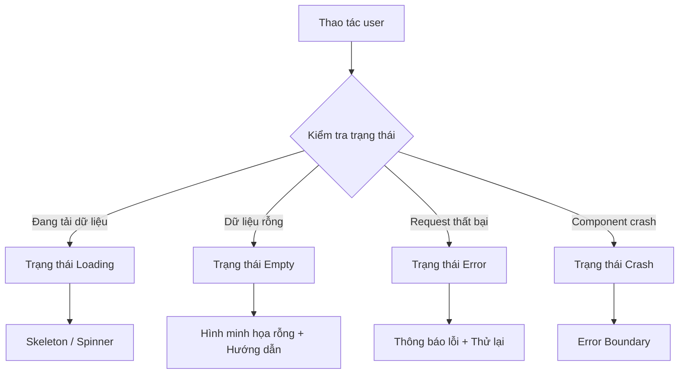

# 3.7 Thiết kế khả dụng

### Giải thích một câu

User không sợ chờ đợi, mà sợ không biết chuyện gì đang xảy ra. Thiết kế khả dụng tốt cho mỗi trạng thái phản hồi phù hợp.

### Giá trị cốt lõi

Một ứng dụng sẽ gặp bốn trạng thái không bình thường: đang tải, dữ liệu rỗng, request thất bại, component bị crash. Xử lý tốt bốn trạng thái này, trải nghiệm người dùng sẽ không tệ.

### Toàn cảnh trạng thái



### So sánh bốn trạng thái

| Trạng thái | Cảm nhận user | Giải pháp | Mục trong chương |
|-----|---------|---------|-------|
| Loading | Lo lắng khi chờ | Skeleton giảm thời gian cảm nhận | 3.7.3 |
| Empty | Bối rối lạc lối | Hướng dẫn thao tác tiếp theo | 3.7.2 |
| Error | Thất vọng tức giận | Cung cấp thử lại và trợ giúp | 3.7.4 |
| Crash | Hoảng loạn bất lực | Giảm thiểu ảnh hưởng, bảo vệ toàn cục | 3.7.1 |

### Mục tiêu chương này

1. Học cách dùng Error Boundary để cách ly crash của component
2. Thiết kế trang trạng thái rỗng có tính hướng dẫn
3. Dùng Skeleton để nâng cao trải nghiệm tải
4. Thực hiện cơ chế thử lại lỗi thân thiện với người dùng

### Nguyên tắc thiết kế

**1. Luôn cho user biết chuyện gì đang xảy ra**
```tsx
// Kém: Không có phản hồi gì
{loading && null}

// Tốt: Phản hồi trạng thái rõ ràng
{loading && <Skeleton />}
```

**2. Cung cấp bước tiếp theo có thể thao tác**
```tsx
// Kém: Chỉ hiển thị thông báo lỗi
<p>Request thất bại</p>

// Tốt: Cung cấp giải pháp
<ErrorState
  message="Request thất bại"
  action={<Button onClick={retry}>Thử lại</Button>}
/>
```

**3. Giảm thiểu ảnh hưởng chứ không sập toàn bộ**
```tsx
// Kém: Một component lỗi, toàn trang màn trắng
<App />

// Tốt: Lỗi được cách ly
<ErrorBoundary fallback={<ErrorFallback />}>
  <RiskyComponent />
</ErrorBoundary>
```

### Thư viện component trạng thái

Đề xuất dùng thư viện component trạng thái thống nhất để quản lý các trạng thái:

```tsx
// components/states/index.ts
export { Loading, Skeleton } from './Loading'
export { Empty } from './Empty'
export { ErrorState } from './Error'
export { ErrorBoundary } from './ErrorBoundary'
```

### Nội dung chương này

- [3.7.1 Error Boundary](./3.7.1-error-boundary.md) - Cách ly crash của component
- [3.7.2 Thiết kế trạng thái rỗng](./3.7.2-empty-state.md) - Hướng dẫn thao tác user
- [3.7.3 Trạng thái tải](./3.7.3-loading-state.md) - Giảm lo lắng khi chờ
- [3.7.4 Thử lại khi lỗi](./3.7.4-retry.md) - Xử lý thất bại một cách ưu nhã
