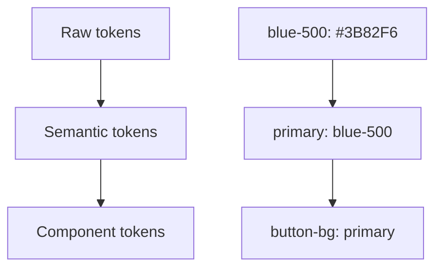

# 3.8.2 Design tokens

### Tóm tắt một câu

Design tokens là "biến" của design system, cho phép quản lý thống nhất màu sắc, font, khoảng cách và chuyển đổi theme.

### Giá trị cốt lõi

Giá trị màu hard-code rải rác khắp code, đổi một màu chính cần sửa cả chục file. Design tokens trừu tượng hóa design decision thành biến, khiến maintain và switch theme dễ dàng.

### Token hierarchy



| Cấp độ | Vai trò | Ví dụ |
|-----|------|-----|
| Raw tokens | Giá trị màu/kích thước cơ bản | `blue-500`, `16px` |
| Semantic tokens | Thể hiện mục đích | `primary`, `error` |
| Component tokens | Style component cụ thể | `button-background` |

### Định nghĩa trong Tailwind

```js
// tailwind.config.js
module.exports = {
  theme: {
    extend: {
      colors: {
        // Raw tokens
        blue: {
          50: '#eff6ff',
          100: '#dbeafe',
          500: '#3b82f6',
          600: '#2563eb',
          900: '#1e3a8a',
        },
        // Semantic tokens
        primary: {
          DEFAULT: '#3b82f6',
          hover: '#2563eb',
          light: '#dbeafe',
        },
        secondary: {
          DEFAULT: '#6b7280',
          hover: '#4b5563',
        },
        success: '#10b981',
        warning: '#f59e0b',
        error: '#ef4444',
        // Background và foreground
        background: {
          DEFAULT: '#ffffff',
          secondary: '#f9fafb',
        },
        foreground: {
          DEFAULT: '#111827',
          muted: '#6b7280',
        },
      },
      spacing: {
        // Spacing tokens
        xs: '0.25rem',  // 4px
        sm: '0.5rem',   // 8px
        md: '1rem',     // 16px
        lg: '1.5rem',   // 24px
        xl: '2rem',     // 32px
      },
      fontSize: {
        // Font tokens
        xs: ['0.75rem', { lineHeight: '1rem' }],
        sm: ['0.875rem', { lineHeight: '1.25rem' }],
        base: ['1rem', { lineHeight: '1.5rem' }],
        lg: ['1.125rem', { lineHeight: '1.75rem' }],
        xl: ['1.25rem', { lineHeight: '1.75rem' }],
      },
      borderRadius: {
        sm: '0.25rem',
        md: '0.375rem',
        lg: '0.5rem',
        full: '9999px',
      },
    },
  },
}
```

### CSS Variables approach

```css
/* styles/tokens.css */
:root {
  /* Màu sắc */
  --color-primary: #3b82f6;
  --color-primary-hover: #2563eb;
  --color-secondary: #6b7280;
  --color-success: #10b981;
  --color-warning: #f59e0b;
  --color-error: #ef4444;

  /* Background và foreground */
  --color-background: #ffffff;
  --color-background-secondary: #f9fafb;
  --color-foreground: #111827;
  --color-foreground-muted: #6b7280;

  /* Spacing */
  --space-1: 0.25rem;
  --space-2: 0.5rem;
  --space-3: 0.75rem;
  --space-4: 1rem;
  --space-6: 1.5rem;
  --space-8: 2rem;

  /* Font */
  --font-size-sm: 0.875rem;
  --font-size-base: 1rem;
  --font-size-lg: 1.125rem;

  /* Border radius */
  --radius-sm: 0.25rem;
  --radius-md: 0.375rem;
  --radius-lg: 0.5rem;

  /* Shadow */
  --shadow-sm: 0 1px 2px rgba(0, 0, 0, 0.05);
  --shadow-md: 0 4px 6px rgba(0, 0, 0, 0.1);
}

/* Dark theme */
[data-theme="dark"] {
  --color-background: #111827;
  --color-background-secondary: #1f2937;
  --color-foreground: #f9fafb;
  --color-foreground-muted: #9ca3af;
}
```

### Kết hợp với Tailwind

```js
// tailwind.config.js
module.exports = {
  theme: {
    extend: {
      colors: {
        primary: 'var(--color-primary)',
        secondary: 'var(--color-secondary)',
        background: 'var(--color-background)',
        foreground: 'var(--color-foreground)',
      },
    },
  },
}
```

```tsx
// Sử dụng
<button className="bg-primary text-white">
  Button
</button>

<div className="bg-background text-foreground">
  Content
</div>
```

### Dark mode toggle

```tsx
// hooks/useTheme.ts
'use client'

import { useEffect, useState } from 'react'

export function useTheme() {
  const [theme, setTheme] = useState<'light' | 'dark'>('light')

  useEffect(() => {
    const stored = localStorage.getItem('theme') as 'light' | 'dark' | null
    const systemPrefers = window.matchMedia('(prefers-color-scheme: dark)').matches

    setTheme(stored || (systemPrefers ? 'dark' : 'light'))
  }, [])

  useEffect(() => {
    document.documentElement.setAttribute('data-theme', theme)
    localStorage.setItem('theme', theme)
  }, [theme])

  const toggle = () => setTheme(theme === 'light' ? 'dark' : 'light')

  return { theme, toggle }
}

// Toggle button
function ThemeToggle() {
  const { theme, toggle } = useTheme()

  return (
    <button onClick={toggle} aria-label={`Chuyển sang chế độ ${theme === 'light' ? 'tối' : 'sáng'}`}>
      {theme === 'light' ? '🌙' : '☀️'}
    </button>
  )
}
```

### Component-level tokens

```tsx
// components/Button.tsx
const buttonVariants = {
  primary: 'bg-primary text-white hover:bg-primary-hover',
  secondary: 'bg-secondary text-white hover:bg-secondary-hover',
  outline: 'border border-primary text-primary hover:bg-primary/10',
  ghost: 'text-foreground hover:bg-background-secondary',
}

const buttonSizes = {
  sm: 'px-3 py-1.5 text-sm',
  md: 'px-4 py-2 text-base',
  lg: 'px-6 py-3 text-lg',
}

interface ButtonProps extends React.ButtonHTMLAttributes<HTMLButtonElement> {
  variant?: keyof typeof buttonVariants
  size?: keyof typeof buttonSizes
}

export function Button({
  variant = 'primary',
  size = 'md',
  className,
  ...props
}: ButtonProps) {
  return (
    <button
      className={cn(
        'rounded-md font-medium transition-colors',
        buttonVariants[variant],
        buttonSizes[size],
        className
      )}
      {...props}
    />
  )
}
```

### Design tokens documentation

```tsx
// Token showcase page
function DesignTokensDoc() {
  const colors = [
    { name: 'primary', value: '#3b82f6' },
    { name: 'secondary', value: '#6b7280' },
    { name: 'success', value: '#10b981' },
    { name: 'warning', value: '#f59e0b' },
    { name: 'error', value: '#ef4444' },
  ]

  return (
    <div>
      <h2>Color tokens</h2>
      <div className="grid grid-cols-5 gap-4">
        {colors.map((color) => (
          <div key={color.name}>
            <div
              className="w-full h-16 rounded-lg"
              style={{ backgroundColor: color.value }}
            />
            <p className="text-sm mt-1">{color.name}</p>
            <p className="text-xs text-muted">{color.value}</p>
          </div>
        ))}
      </div>
    </div>
  )
}
```

### Hướng dẫn cộng tác AI

**Ý định cốt lõi**: Để AI giúp xây dựng hệ thống design tokens.

**Công thức định nghĩa yêu cầu**:
- Loại dự án: [enterprise app/e-commerce/social]
- Brand color: [màu chính/màu phụ]
- Yêu cầu chức năng: [dark mode/multi-theme]

**Ví dụ Prompt**:

```
Vui lòng tạo hệ thống design tokens cho sản phẩm SaaS của tôi:
1. Màu chính: Blue (#3B82F6)
2. Bao gồm màu success/warning/error status
3. Hỗ trợ chuyển đổi theme sáng/tối
4. Dùng CSS variables + Tailwind config
5. Bao gồm spacing, font, border radius tokens
```

### Checklist nghiệm thu

- [ ] Màu sắc dùng semantic tokens
- [ ] Hỗ trợ dark mode toggle
- [ ] Spacing/font dùng tokens thống nhất
- [ ] Có token documentation hoặc showcase page
