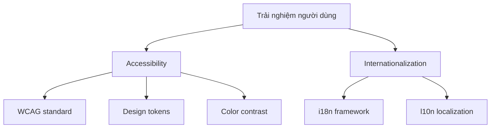

# 3.8 Accessibility và Internationalization

### Tóm tắt một câu

Accessibility không phải tùy chọn, mà là yêu cầu cơ bản để nhiều người hơn có thể dùng sản phẩm của bạn. Internationalization giúp sản phẩm của bạn đến với thế giới.

### Giá trị cốt lõi

15% dân số có một dạng khuyết tật nào đó, và còn nhiều người hơn nữa đang trong tình trạng bất tiện tạm thời (ví dụ bế con chỉ có thể dùng một tay). Thiết kế accessibility giúp sản phẩm thân thiện với mọi người. Internationalization giúp sản phẩm chạm tới user toàn cầu.

### Toàn cảnh chương này



### Accessibility vs Internationalization

| Khái niệm | Mục tiêu | Điểm quan tâm |
|-----|------|-------|
| Accessibility (a11y) | Cho user khuyết tật có thể dùng | Khiếm thị/khiếm thính/khó vận động/nhận thức |
| Internationalization (i18n) | Hỗ trợ đa ngôn ngữ | Dịch thuật/ngày tháng/định dạng tiền tệ |
| Localization (l10n) | Thích nghi văn hóa địa phương | Thói quen/pháp lý/văn hóa khác biệt |

### Tại sao cần quan tâm

**Giá trị kinh doanh**:
- 1 tỷ+ người khuyết tật toàn cầu là user tiềm năng
- Hỗ trợ đa ngôn ngữ mở thị trường quốc tế
- Nhiều khu vực có yêu cầu pháp lý compliance

**Giá trị kỹ thuật**:
- Semantic HTML có lợi cho SEO
- Design tokens nâng cao hiệu suất phát triển
- Kiến trúc i18n giúp code modular hơn

### Mục tiêu chương này

1. Hiểu yêu cầu cốt lõi WCAG 2.1
2. Xây dựng hệ thống design tokens
3. Đảm bảo color contrast đạt chuẩn
4. Implement hỗ trợ đa ngôn ngữ
5. Nắm vững localization best practices

### Tự kiểm tra nhanh

```bash
# Keyboard accessibility test
# Mở website của bạn, rút chuột ra, chỉ dùng keyboard

# Screen reader test
# macOS: Bật VoiceOver (Cmd+F5)
# Windows: Dùng NVDA (miễn phí)

# Color contrast check
# Chrome DevTools > Elements > chọn element > Accessibility
```

### Nội dung chương này

- [3.8.1 WCAG standard](./3.8.1-wcag.md) - Yêu cầu cơ bản về accessibility
- [3.8.2 Design tokens](./3.8.2-design-tokens.md) - Quản lý design hệ thống
- [3.8.3 Color contrast](./3.8.3-contrast.md) - Thiết kế thân thiện khiếm thị
- [3.8.4 Internationalization i18n](./3.8.4-i18n.md) - Hỗ trợ đa ngôn ngữ
- [3.8.5 Localization l10n](./3.8.5-l10n.md) - Thích nghi văn hóa
