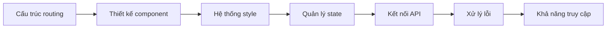

# 3 ｜Frontend đến Backend (Chạy được giao diện)

### Tóm tắt một câu

Frontend không phải là "vẽ giao diện", mà là xây dựng giao diện người dùng có thể tương tác và bảo trì được bằng tư duy component hóa.

### Định vị chương này

Sau khi hoàn thành việc lựa chọn công nghệ và thiết kế kiến trúc, cuối cùng chúng ta sẽ bắt tay vào viết code. Nhưng trong hệ thống Vibe Coding, ý nghĩa của "viết code" đã thay đổi căn bản - bạn không còn là lập trình viên gõ code từng dòng nữa, mà là **kiến trúc sư chỉ huy AI xây dựng giao diện**.

Chương này sẽ đưa bạn làm chủ toàn bộ quy trình phát triển frontend với Next.js App Router:

### Điều hướng chương

| Chương | Chủ đề | Năng lực cốt lõi |
|------|------|----------|
| **3.1** | App Router Routing | File system routing, Dynamic routes, Route groups, Data fetching |
| **3.2** | Khối xây dựng Component | Props, State, Effects, Custom Hooks |
| **3.3** | Tích hợp Figma | Quy trình cộng tác AI từ design đến code |
| **3.4** | Tailwind + shadcn | Hệ thống thiết kế thống nhất và thư viện component |
| **3.5** | Debug thực chiến | Network, Console, Performance, DevTools |
| **3.6** | API Route | Tách biệt service layer, Request validation, Error handling |
| **3.7** | Thiết kế khả dụng | Error Boundary, Empty state, Loading state |
| **3.8** | Khả năng truy cập và Quốc tế hóa | WCAG, Design tokens, i18n/l10n |

### Góc nhìn Vibe Coding

Trong phát triển truyền thống, kỹ sư frontend cần đồng thời nắm vững cấu trúc HTML, style CSS, logic JavaScript. Nhưng trong hệ thống Vibe Coding, nhiệm vụ cốt lõi của bạn trở thành:

1. **Định nghĩa ranh giới**: Cho AI biết input/output của component là gì
2. **Mô tả tương tác**: Dùng ngôn ngữ tự nhiên mô tả hành vi người dùng và phản hồi hệ thống
3. **Nghiệm thu kết quả**: Kiểm tra code AI sinh ra có đáp ứng kỳ vọng không

Sự chuyển đổi này không có nghĩa là hạ thấp rào cản kỹ thuật, mà ngược lại đặt ra yêu cầu cao hơn về **tư duy kiến trúc** và **năng lực nghiệm thu** của bạn. Chỉ khi thực sự hiểu được component hóa, quản lý state, chiến lược rendering và các khái niệm cốt lõi, bạn mới có thể chỉ huy AI hiệu quả và kịp thời sửa chữa khi nó "nói sai".

### Gợi ý học tập

1. **Chạy được trước, tối ưu sau**: Mỗi tiểu mục đều có "code khả thi tối thiểu", hãy chạy được nó trước
2. **Vừa học vừa làm**: Mở project của bạn, thực hành từng bước theo hướng dẫn
3. **Dùng tốt checklist nghiệm thu**: Cuối mỗi mục đều có Checklist, hoàn thành rồi mới chuyển sang mục tiếp
