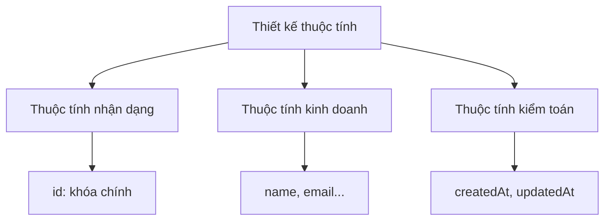

# 4.1.1 Những thành phần chính của dữ liệu của bạn — Nhận dạng thực thể: Trừu tượng hóa đối tượng kinh doanh và xác định thuộc tính

### Một câu giải thích

Thực thể chính là những đối tượng cốt lõi mà kinh doanh cần "nhớ" — tìm đúng thực thể, thiết kế cơ sở dữ liệu đã thành công nửa chặng đường.

### Thực thể là gì?

**Thực thể** là những sự vật có tính độc lập và có ý nghĩa tồn tại trong lĩnh vực kinh doanh. Nó có thể là:

- **Những người hoặc sự vật cụ thể**: người dùng, sản phẩm, đơn hàng
- **Những khái niệm trừu tượng**: vai trò, quyền hạn, phân loại
- **Những sự kiện xảy ra**: ghi chép giao dịch, nhật ký hoạt động

### Làm cách nào để nhận dạng thực thể từ nhu cầu?

**Phương pháp một: Trích xuất danh từ**

Trích xuất những danh từ cốt lõi từ mô tả nhu cầu:

> "Người dùng có thể đăng bài viết, những người dùng khác có thể bình luận và thích bài viết"

Những danh từ được trích xuất: `người dùng`, `bài viết`, `bình luận`, `thích`

**Phương pháp hai: Xác minh bằng hỏi đáp**

Hỏi ba câu hỏi về mỗi ứng cử viên thực thể:

1. Nó có cần được lưu trữ độc lập không?
2. Nó có những thuộc tính riêng của nó không?
3. Nó có bị các thực thể khác tham chiếu không?

| Ứng cử viên | Lưu trữ độc lập | Có thuộc tính | Bị tham chiếu | Kết luận |
|------|----------|--------|--------|------|
| người dùng | ✓ | ✓ | ✓ | Thực thể |
| bài viết | ✓ | ✓ | ✓ | Thực thể |
| bình luận | ✓ | ✓ | ✓ | Thực thể |
| thích | ✓ | ✓ | ✗ | Thực thể hoặc bảng quan hệ |

### Thiết kế thuộc tính của thực thể

Mỗi thực thể đều có nhiều thuộc tính, thiết kế thuộc tính cần xem xét:



**Thuộc tính nhận dạng**: Nhận dạng duy nhất một bản ghi

```typescript
// Khuyến nghị sử dụng CUID hoặc UUID
id: string  // cuid() hoặc uuid()
```

**Thuộc tính kinh doanh**: Mô tả các đặc trưng cốt lõi của thực thể

```typescript
// Thuộc tính kinh doanh của thực thể người dùng
email: string     // bắt buộc, duy nhất
name: string      // bắt buộc
avatar?: string   // tùy chọn
bio?: string      // tùy chọn
```

**Thuộc tính kiểm toán**: Ghi lại lịch sử thay đổi dữ liệu

```typescript
createdAt: DateTime  // thời gian tạo
updatedAt: DateTime  // thời gian cập nhật
deletedAt?: DateTime // thời gian xóa mềm (tùy chọn)
```

### Định nghĩa thực thể trong Prisma

```prisma
model User {
  // Thuộc tính nhận dạng
  id        String   @id @default(cuid())

  // Thuộc tính kinh doanh
  email     String   @unique
  name      String
  avatar    String?
  bio       String?

  // Thuộc tính kiểm toán
  createdAt DateTime @default(now())
  updatedAt DateTime @updatedAt

  // Quan hệ (sẽ được giới thiệu chi tiết trong phần tiếp theo)
  posts     Post[]
  comments  Comment[]
}
```

### Các mẫu thiết kế thực thể phổ biến

**Liên quan đến người dùng**:
- `User`: Thông tin cơ bản của người dùng
- `Profile`: Chi tiết thông tin người dùng (một-một)
- `Account`: Tài khoản đăng nhập bên thứ ba (một-nhiều)

**Liên quan đến nội dung**:
- `Post`: Bài viết/bài đăng
- `Comment`: Bình luận
- `Tag`: Thẻ
- `Category`: Phân loại

**Liên quan đến giao dịch**:
- `Order`: Đơn hàng
- `OrderItem`: Mục đơn hàng
- `Payment`: Ghi chép thanh toán

### Hướng dẫn tránh lỗi

1. **Không biến mọi thứ thành thực thể**: Nếu một "thứ" chỉ là thuộc tính của một thực thể khác (như địa chỉ của người dùng), hãy xem xét nhúng nó vào thực thể cha.

2. **Không thiết kế quá mức**: Đáp ứng nhu cầu hiện tại trước, có thể mở rộng thông qua di chuyển sau này.

3. **Đặt tên nhất quán**: Chọn số ít (`User`) hoặc số nhiều (`Users`) rồi duy trì thống nhất, khuyến nghị dùng số ít.

### Hướng dẫn hợp tác với AI

Khi yêu cầu AI giúp nhận dạng thực thể, bạn có thể hỏi như sau:

```
Tôi muốn xây dựng một ứng dụng [loại kinh doanh], các chức năng chính bao gồm:
1. [Chức năng 1]
2. [Chức năng 2]
3. [Chức năng 3]

Vui lòng giúp tôi xác định những thực thể cốt lõi nào cần thiết, và liệt kê những thuộc tính chính của mỗi thực thể.
```

### Tóm tắt phần này

- Thực thể là những đối tượng cốt lõi cần lưu trữ độc lập trong kinh doanh
- Nhận dạng thực thể thông qua "trích xuất danh từ + xác minh bằng hỏi đáp"
- Mỗi thực thể nên có ba loại thuộc tính: nhận dạng, kinh doanh, kiểm toán
- Sử dụng mô hình Prisma để định nghĩa thực thể
