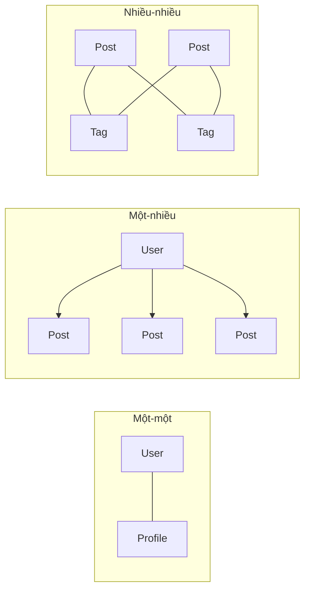
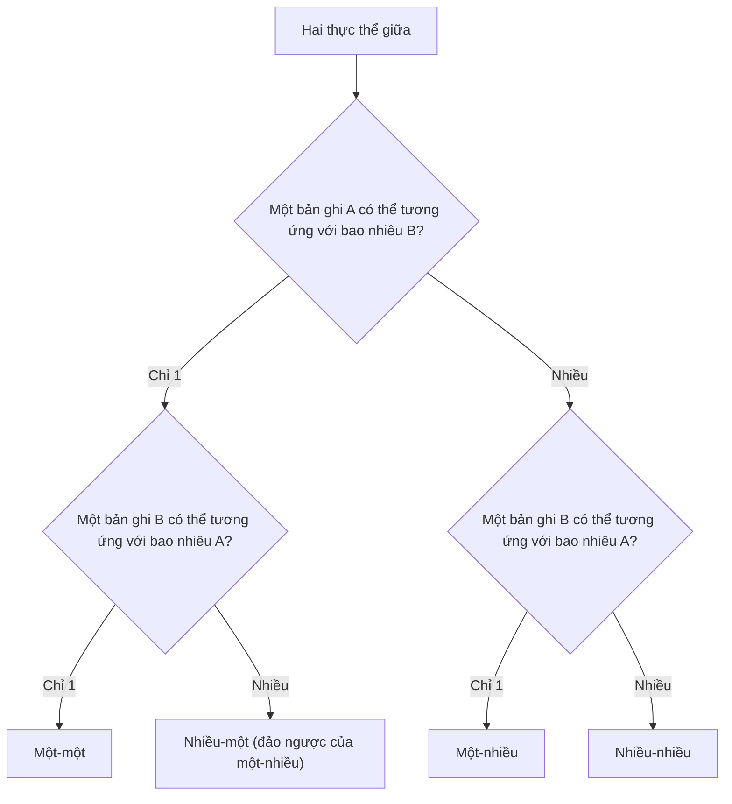

# 4.1.2 Các quan hệ giữa những thành phần — Thiết kế quan hệ: Một-một / Một-nhiều / Nhiều-nhiều

### Một câu giải thích

Các quan hệ giữa các thực thể quyết định cách liên kết dữ liệu — chọn đúng loại quan hệ, truy vấn mới vừa nhanh vừa chính xác.

### Ba loại quan hệ cơ bản



| Loại quan hệ | Giải thích | Trường hợp điển hình |
|----------|------|----------|
| **Một-một** | A chỉ có thể tương ứng với một B, B cũng chỉ có thể tương ứng với một A | người dùng-chi tiết, đơn hàng-thanh toán |
| **Một-nhiều** | A có thể tương ứng với nhiều B, nhưng B chỉ có thể tương ứng với một A | người dùng-bài viết, phân loại-sản phẩm |
| **Nhiều-nhiều** | A có thể tương ứng với nhiều B, B cũng có thể tương ứng với nhiều A | bài viết-thẻ, sinh viên-khóa học |

### Quan hệ một-một

**Trường hợp**: người dùng và chi tiết người dùng lưu trữ trong các bảng riêng (bảng chính nhẹ, bảng chi tiết chứa các trường lớn)

```prisma
model User {
  id       String   @id @default(cuid())
  email    String   @unique
  name     String
  profile  Profile?  // Quan hệ một-một tùy chọn
}

model Profile {
  id       String  @id @default(cuid())
  bio      String?
  avatar   String?
  userId   String  @unique  // Khóa ngoài phải duy nhất
  user     User    @relation(fields: [userId], references: [id])
}
```

**Ví dụ truy vấn**:

```typescript
// Truy vấn người dùng kèm chi tiết
const user = await prisma.user.findUnique({
  where: { id: userId },
  include: { profile: true }
})
```

### Quan hệ một-nhiều

**Trường hợp**: một người dùng có thể đăng nhiều bài viết

```prisma
model User {
  id     String @id @default(cuid())
  email  String @unique
  posts  Post[] // Một người dùng có nhiều bài viết
}

model Post {
  id       String @id @default(cuid())
  title    String
  content  String
  authorId String          // Khóa ngoài
  author   User   @relation(fields: [authorId], references: [id])
}
```

**Ví dụ truy vấn**:

```typescript
// Truy vấn bài viết của người dùng
const userWithPosts = await prisma.user.findUnique({
  where: { id: userId },
  include: { posts: true }
})

// Truy vấn bài viết kèm thông tin tác giả
const post = await prisma.post.findUnique({
  where: { id: postId },
  include: { author: true }
})
```

### Quan hệ nhiều-nhiều

**Trường hợp**: bài viết có thể có nhiều thẻ, một thẻ có thể được sử dụng ở nhiều bài viết

**Cách một: Quan hệ nhiều-nhiều ẩn (Prisma tự động tạo bảng trung gian)**

```prisma
model Post {
  id    String @id @default(cuid())
  title String
  tags  Tag[]  // Quan hệ nhiều-nhiều
}

model Tag {
  id    String @id @default(cuid())
  name  String @unique
  posts Post[] // Quan hệ nhiều-nhiều
}
```

**Cách hai: Quan hệ nhiều-nhiều rõ ràng (Bảng trung gian tùy chỉnh, có thể lưu các trường bổ sung)**

```prisma
model Post {
  id       String    @id @default(cuid())
  title    String
  postTags PostTag[]
}

model Tag {
  id       String    @id @default(cuid())
  name     String    @unique
  postTags PostTag[]
}

// Bảng trung gian, có thể lưu trữ thông tin bổ sung
model PostTag {
  postId    String
  tagId     String
  createdAt DateTime @default(now())  // Trường bổ sung

  post Post @relation(fields: [postId], references: [id])
  tag  Tag  @relation(fields: [tagId], references: [id])

  @@id([postId, tagId])  // Khóa chính ghép
}
```

### Làm cách nào chọn loại quan hệ?



### Thực tiễn tốt nhất của thiết kế quan hệ

1. **Quy tắc đặt tên khóa ngoài**: Sử dụng `tên mô hình liên kết + Id`, như `authorId`、`categoryId`

2. **Xóa theo tầng**: Cấu hình hành động xóa trong Prisma
   ```prisma
   author User @relation(fields: [authorId], references: [id], onDelete: Cascade)
   ```

3. **Tối ưu hóa chỉ mục**: Các trường khóa ngoài tự động tạo chỉ mục, nhưng các truy vấn phức tạp có thể cần chỉ mục bổ sung

4. **Tránh phụ thuộc vòng**: A tham chiếu B, B tham chiếu C, C lại tham chiếu A sẽ gây ra vấn đề

### Hướng dẫn tránh lỗi

- **Chọn ẩn hay rõ ràng cho nhiều-nhiều**: Nếu quan hệ trung gian không cần thuộc tính bổ sung, hãy dùng ẩn; nếu cần ghi lại "thời gian liên kết" vân vân, hãy dùng rõ ràng

- **Quan hệ tự tham chiếu**: Ví dụ như "người dùng theo dõi người dùng", cần xử lý đặc biệt
  ```prisma
  model User {
    id        String @id
    followers User[] @relation("UserFollows")
    following User[] @relation("UserFollows")
  }
  ```

### Tóm tắt phần này

- Một-một: cả hai đầu duy nhất, khóa ngoài cộng `@unique`
- Một-nhiều: quan hệ phổ biến nhất, một bên có mảng, nhiều bên có khóa ngoài
- Nhiều-nhiều: có thể ẩn (đơn giản) hoặc rõ ràng (linh hoạt)
- Chọn loại quan hệ phù hợp dựa trên nhu cầu kinh doanh
