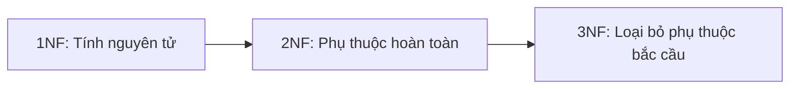

# 4.1.3 Quy tắc thiết kế bảng dữ liệu — Lý thuyết chuẩn hóa: Quá trình chuẩn hóa 1NF/2NF/3NF

### Một câu giải thích

Chuẩn hóa là "tiêu chuẩn vệ sinh" của thiết kế cơ sở dữ liệu — tuân theo nó có thể tránh lặp dữ liệu và bất thường cập nhật.

### Tại sao cần chuẩn hóa?

**Thiết kế bảng không chuẩn hóa sẽ gây ra ba vấn đề lớn**:

| Vấn đề | Giải thích | Ví dụ |
|------|------|------|
| **Lặp dữ liệu** | Thông tin giống nhau được lưu trữ lặp lại | Mỗi đơn hàng đều lưu trữ địa chỉ khách hàng đầy đủ |
| **Bất thường cập nhật** | Sửa đổi dữ liệu cần thay đổi ở nhiều nơi | Khách hàng đổi địa chỉ, phải cập nhật tất cả đơn hàng liên quan |
| **Bất thường xóa** | Xóa dữ liệu có thể mất thông tin hữu ích | Xóa đơn hàng duy nhất, thông tin khách hàng cũng mất |

### Tổng quan ba chuẩn hóa chính



| Chuẩn hóa | Yêu cầu cốt lõi | Giải thích dễ hiểu |
|------|----------|----------|
| **1NF** | Trường không thể chia nhỏ hơn | Một ô chỉ chứa một giá trị |
| **2NF** | Các trường không phải khóa chính phụ thuộc hoàn toàn vào khóa chính | Tất cả trường đều trực tiếp liên quan đến khóa chính |
| **3NF** | Loại bỏ phụ thuộc bắc cầu | Các trường không nên "lồng nhau" phụ thuộc |

### Chuẩn hóa thứ nhất: Tính nguyên tử

**Quy tắc**: Giá trị của mỗi trường phải là giá trị nguyên tử không thể chia nhỏ hơn.

**Ví dụ sai**:

| ID Đơn hàng | Danh sách sản phẩm |
|--------|----------|
| 001 | Táo,Chuối,Cam |

**Cách làm đúng**:

| ID Đơn hàng | Sản phẩm |
|--------|------|
| 001 | Táo |
| 001 | Chuối |
| 001 | Cam |

Hoặc sử dụng bảng liên kết:

```prisma
model Order {
  id    String      @id
  items OrderItem[]
}

model OrderItem {
  id       String @id
  orderId  String
  product  String
  quantity Int
  order    Order  @relation(fields: [orderId], references: [id])
}
```

### Chuẩn hóa thứ hai: Phụ thuộc hoàn toàn

**Quy tắc**: Các trường không phải khóa chính phải phụ thuộc hoàn toàn vào khóa chính, không thể chỉ phụ thuộc vào một phần của khóa chính.

**Ví dụ sai** (trường hợp khóa chính ghép):

| ID Sinh viên | ID Khóa học | Tên sinh viên | Tên khóa học | Điểm |
|--------|--------|----------|----------|------|
| S001 | C001 | Trần Anh | Toán | 90 |

Vấn đề: `Tên sinh viên` chỉ phụ thuộc vào `ID Sinh viên`, `Tên khóa học` chỉ phụ thuộc vào `ID Khóa học`.

**Cách làm đúng**: Tách thành ba bảng

```prisma
model Student {
  id      String   @id
  name    String
  scores  Score[]
}

model Course {
  id      String   @id
  name    String
  scores  Score[]
}

model Score {
  studentId String
  courseId  String
  score     Int
  student   Student @relation(fields: [studentId], references: [id])
  course    Course  @relation(fields: [courseId], references: [id])

  @@id([studentId, courseId])
}
```

### Chuẩn hóa thứ ba: Loại bỏ phụ thuộc bắc cầu

**Quy tắc**: Các trường không phải khóa chính không thể phụ thuộc vào các trường không phải khóa chính khác.

**Ví dụ sai**:

| ID Nhân viên | Tên nhân viên | ID Phòng | Tên phòng | Địa chỉ phòng |
|--------|----------|--------|----------|----------|
| E001 | Trần Anh | D001 | Bộ phận Kỹ thuật | Tầng 3 |

Vấn đề: `Tên phòng` và `Địa chỉ phòng` phụ thuộc vào `ID Phòng`, không phải trực tiếp vào `ID Nhân viên`.

**Cách làm đúng**:

```prisma
model Employee {
  id           String     @id
  name         String
  departmentId String
  department   Department @relation(fields: [departmentId], references: [id])
}

model Department {
  id        String     @id
  name      String
  location  String
  employees Employee[]
}
```

### Hiệu quả thực tế của chuẩn hóa

**Trước chuẩn hóa**: Bảng đơn hàng lưu trữ thông tin khách hàng lặp lại

```
Bảng đơn hàng:
| ID Đơn hàng | ID Khách hàng | Tên khách hàng | Địa chỉ khách hàng | Sản phẩm | Giá |
```

**Sau chuẩn hóa**:

```prisma
model Order {
  id         String   @id
  customerId String
  customer   Customer @relation(fields: [customerId], references: [id])
  items      OrderItem[]
  total      Decimal
}

model Customer {
  id      String  @id
  name    String
  address String
  orders  Order[]
}
```

### Danh sách kiểm tra chuẩn hóa

Khi thiết kế bảng, kiểm tra lần lượt:

- [ ] **1NF**: Tất cả các trường đều là giá trị nguyên tử? Không có mảng hoặc giá trị phân cách bằng dấu phẩy?
- [ ] **2NF**: Tất cả các trường không phải khóa chính đều phụ thuộc hoàn toàn vào khóa chính?
- [ ] **3NF**: Các trường không phải khóa chính không phụ thuộc vào trường không phải khóa chính khác?

### Cân nhắc trong phát triển thực tế

Lý thuyết chuẩn hóa là **trạng thái lý tưởng**, phát triển thực tế cần cân nhắc:

| Tuân theo chặt chẽ chuẩn hóa | Có thể vi phạm chuẩn hóa một chút |
|--------------|--------------|
| Tính nhất quán dữ liệu tốt | Hiệu suất truy vấn cao hơn |
| Không gian lưu trữ nhỏ | Giảm hoạt động JOIN |
| Dễ cập nhật | Mã đơn giản hơn |

**Đề xuất**: Trước tiên thiết kế theo chuẩn hóa, gặp vấn đề hiệu suất rồi xem xét phản chuẩn hóa (sẽ mô tả ở phần tiếp theo).

### Tóm tắt phần này

- 1NF: Giá trị trường không thể chia nhỏ
- 2NF: Các trường không phải khóa chính phụ thuộc hoàn toàn vào khóa chính
- 3NF: Loại bỏ phụ thuộc bắc cầu
- Tuân theo chuẩn hóa có thể tránh lặp dữ liệu và bất thường cập nhật
- Phát triển thực tế cần cân nhắc giữa chuẩn hóa và hiệu suất
